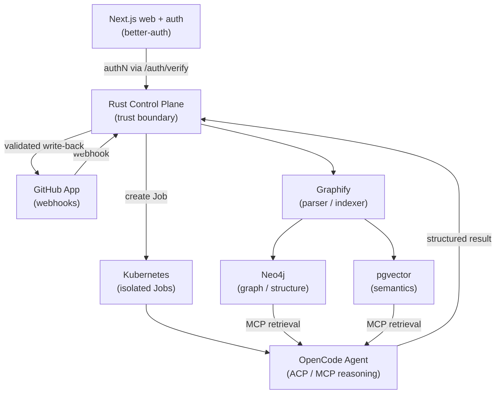

# Lightbridge Code Intelligence

[](https://opensource.org/licenses/MIT)
[](https://github.com/apps)

Lightbridge is a GitHub App for **intelligent code review and repository Q&A**. It listens for
GitHub webhook events, creates task records in a Rust control plane, and runs the requested work in
isolated Kubernetes Jobs — backed by repository-aware retrieval over a Neo4j knowledge graph
(structure) and pgvector (semantics), with reasoning performed by OpenCode agents over ACP/MCP.
The Rust control plane is the trust boundary: the agent proposes, the control plane validates and
writes back.

## Architecture



See [docs/architecture.md](docs/architecture.md) for diagrams and the full picture, including the
web & auth tier and the schema-first control plane.

## Monorepo layout

This is a pnpm + Turborepo monorepo with a Cargo `xtask` for Rust automation
([ADR-0009](docs/adr/0009-pnpm-turborepo-monorepo.md)).

| Path | What it is |
|---|---|
| `apps/web` | Next.js (App Router) web console; better-auth with a `rust-backend` plugin |
| `packages/auth` | Shared auth client / better-auth wiring |
| `packages/tsconfig` | Shared TypeScript configs |
| `services/control-plane` | Rust (Axum) control plane; schema-first via cratestack |
| `xtask` | Cargo `xtask` for Rust automation (`cargo xtask ci`, etc.) |
| `docs/` | Documentation set, ADRs, RFCs, ways of working |
| `deploy/` | Kubernetes / Helm / Kustomize manifests (planned) |

### Kubernetes namespaces

| Namespace | Purpose |
|-----------|---------|
| `lightbridge-system` | Control plane, webhook handlers |
| `lightbridge-indexing` | Indexing jobs, Graphify runs |
| `lightbridge-agents` | OpenCode agent containers |
| `lightbridge-data` | Neo4j, PostgreSQL/pgvector |

## Prerequisites

- **Node ≥ 22** (pinned in `.nvmrc`)
- **pnpm**
- **Rust** (stable toolchain + `cargo`)
- **just** (task runner)
- **docker** (for the local data plane via docker compose)

Optional: `cargo-nextest` (test runner), `multipass` (tentative local k3s cluster).

## Quick start

Using `just` (the single human-facing entrypoint):

```bash
just setup   # pnpm install + cargo fetch
just up      # docker compose up -d  (Postgres+pgvector, Neo4j)
just dev     # run web + control plane via Turborepo
```

Raw equivalents (if you prefer not to use `just`):

```bash
pnpm install && cargo fetch          # just setup
docker compose up -d                 # just up
pnpm dev                             # just dev

# Run only one side:
cargo run -p control-plane           # just dev-backend
pnpm --filter @lightbridge/web dev   # just dev-web
```

## Quality gates

Run these locally **before pushing** (shift-left):

```bash
just lint   # pnpm lint + cargo clippy --all-targets -- -D warnings
just test   # pnpm test + cargo nextest run
just fmt    # biome + rustfmt
```

`just ci` runs the full local gate (lint, build, `cargo xtask ci`).

## How we work

We follow **XP + Lean + DevOps with shift-left** delivery, under the ADORSYS-GIS **AI Governance**
framework (Definition of Ready/Done, AI usage declarations). See
[ways of working](docs/ways-of-working/engineering-practices.md) and
[OKRs](docs/ways-of-working/okrs.md).

## Documentation

- [Documentation index](docs/INDEX.md)
- [Architecture Decision Records](docs/adr/README.md)
- [RFCs](docs/rfc/README.md)
- [Contributing](CONTRIBUTING.md)

## Development status

🚧 **Early development.** The architecture and decisions are documented; implementation is
in progress. See the [Issues](https://github.com/vymalo/lightbridge-code-intelligence/issues) for
the roadmap.

## License

MIT — see [LICENSE](LICENSE).

## Acknowledgments

- [Graphify](https://github.com/safishamsi/graphify) — multi-modal graph extraction
- [OpenCode](https://opencode.ai) — agent reasoning framework
- [Neo4j](https://neo4j.com/) — graph database
- [pgvector](https://github.com/pgvector/pgvector) — PostgreSQL vector extension
- [better-auth](https://better-auth.com) — web authentication
