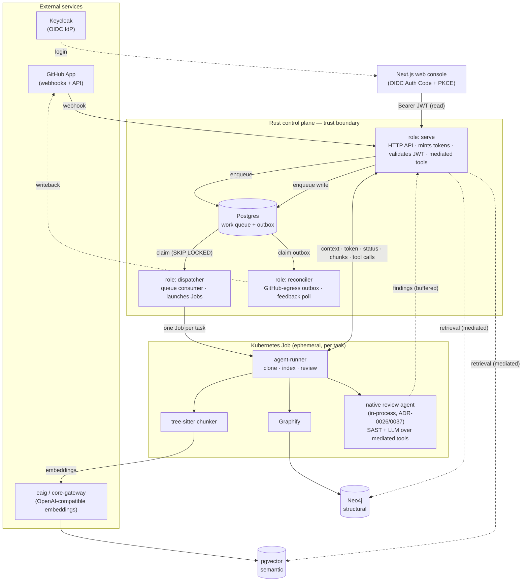
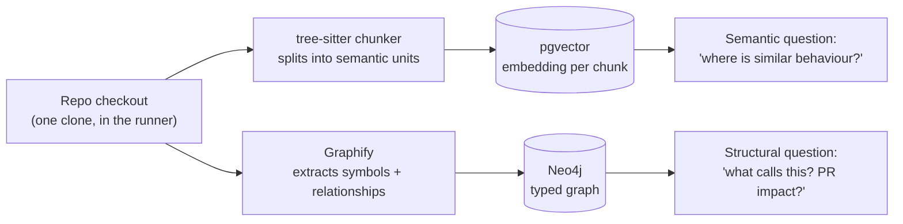
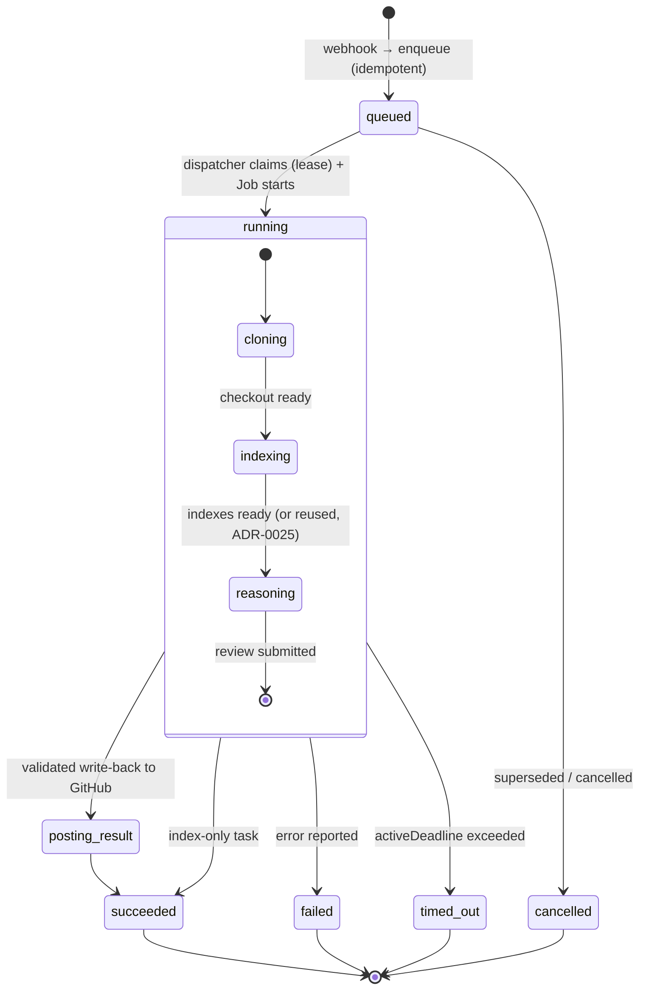
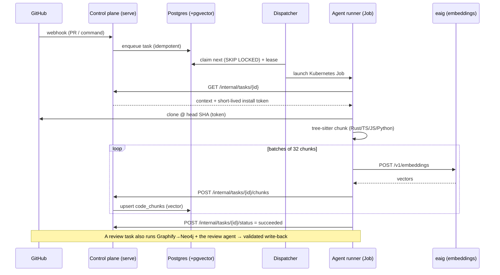

# Lightbridge Code Intelligence

[](https://opensource.org/licenses/MIT)
[](https://github.com/apps/lightbridge-assistant)

Lightbridge is a GitHub App for **intelligent code review and repository Q&A**. It listens for
GitHub webhook events, records work in a Rust control plane, and runs each task in an isolated,
short-lived Kubernetes Job. The work is backed by **repository-aware retrieval** over two
complementary indexes — a Neo4j knowledge graph (structure) and pgvector (semantics) — with reasoning
performed by a **native Rust review agent** that acts through mediated write tools
([ADR-0026](docs/adr/0026-native-review-agent.md),
[ADR-0037](docs/adr/0037-agent-acts-via-mediated-tools.md)).

Reviews run in **two tiers** ([ADR-0062](docs/adr/0062-two-tier-review-fast-auto-deep-on-demand.md)): a
**fast** automatic pass on every opened PR — deterministic [SAST](docs/adr/0061-sast-deterministic-finding-source.md)
plus a lean, diff-only LLM pass with no retrieval — and a **deep**, repo-aware review on `@mention`
(full graph + vector retrieval, multi-turn). See [docs/review-pipeline.md](docs/review-pipeline.md).

The Rust control plane is the **trust boundary**: it holds the GitHub App private key and mints
short-lived, per-task installation tokens — the App key itself never reaches a Job. The agent only
proposes; the control plane validates results and is the **sole writer** to GitHub — every write flows
through one outbox drained by the `reconciler` role
([ADR-0059](docs/adr/0059-reconciler-owns-all-github-egress.md)).

---

## System architecture

One control-plane binary runs in three roles (`serve`, `dispatcher`, and `reconciler` —
[ADR-0058](docs/adr/0058-rename-poller-role-to-reconciler.md)); the actual repository work runs in
disposable per-task Jobs. `serve` handles the HTTP API + reads, `dispatcher` consumes the work queue
and launches Jobs, and `reconciler` drains the GitHub-egress outbox (the single writer to GitHub) and
polls feedback. A Job never receives the GitHub App key — it bootstraps a short-lived installation
token at runtime — but it **is** injected with the shared runner bearer (`AGENT_RUNNER_TOKEN`) and the
embeddings API key it needs to do its work (see [Secrets a Job holds](#secrets-a-job-holds)).



> The full flow — clone → dual index → review → validated write-back — is **implemented and deployed**.
> The review agent is the **native in-process Rust loop** ([ADR-0026](docs/adr/0026-native-review-agent.md),
> [ADR-0037](docs/adr/0037-agent-acts-via-mediated-tools.md)); OpenCode has been retired. Reviews are
> two-tier ([ADR-0062](docs/adr/0062-two-tier-review-fast-auto-deep-on-demand.md)) and a deterministic
> SAST pass rides the same channel ([ADR-0061](docs/adr/0061-sast-deterministic-finding-source.md)).

See [docs/architecture.md](docs/architecture.md), [docs/jobs-and-lifecycle.md](docs/jobs-and-lifecycle.md),
and [docs/INDEX.md](docs/INDEX.md) for the full picture.

---

## Why two indexers? (tree-sitter chunker **and** Graphify)

This is the most common point of confusion, so it's worth being explicit: the Rust tree-sitter
chunker and Graphify are **not** doing the same job twice. They feed **two different stores that
answer two different kinds of question** — the dual-retrieval design
([ADR-0003](docs/adr/0003-dual-retrieval-neo4j-pgvector.md),
[ADR-0010](docs/adr/0010-graphify-treesitter-indexing-baseline.md)). A good code review needs both
kinds of recall, and no single store does both well.



| | **tree-sitter chunker → pgvector** | **Graphify → Neo4j** |
|---|---|---|
| Kind of recall | **Semantic** (vector similarity) | **Structural** (graph traversal) |
| Question it answers | "where is similar code / behaviour?", natural-language search | "what calls this function?", "what does this PR touch?", containment, test ownership |
| What it emits | embedding-sized chunks with stable source ranges | nodes (symbols, files) + edges (defines, calls, imports) |
| Why this tool | purpose-built, lightweight, in-process Rust we control; chunk boundaries are a *chunking* concern | specialised multi-modal graph extractor; relationships are a *graph* concern |
| Can the other store answer it? | ❌ a graph can't rank by semantic similarity | ❌ vector search can't enumerate exact callers |
| Status | ✅ built (slice 2) | ✅ built (slice 3) |

Both run in the **same runner Job over the same checkout** — one indexes for *fuzzy* retrieval, the
other for *exact* retrieval. The reasoning agent (slice 5) then queries each store via MCP for the
question it's best at.

---

## Task lifecycle

A task is created from a webhook, parked in the Postgres queue, claimed by a dispatcher under a
lease, and executed in a Job. Statuses below are the ones the runner reports back to the control
plane.



> There are **two job kinds**: an `index` task (on repo approval / default-branch push) and a `review`
> task. A review carries a **tier** ([ADR-0062](docs/adr/0062-two-tier-review-fast-auto-deep-on-demand.md)):
> `fast` on PR-opened, `deep` on `@mention`. A warm review **reuses the base index**
> ([ADR-0025](docs/adr/0025-review-reuses-base-index.md)). The authoritative state machine, cancellation,
> and data-purge flows live in [docs/jobs-and-lifecycle.md](docs/jobs-and-lifecycle.md).

---

## Indexing flow (sequence)

How a single task gets from a webhook to stored vectors. Note the runner never holds the GitHub App
key — it borrows a short-lived installation token from the control plane just-in-time
([ADR-0002](docs/adr/0002-rust-control-plane-trust-boundary.md),
[ADR-0017](docs/adr/0017-agent-runner-control-plane-bootstrap.md)).



### Secrets a Job holds

The trust boundary is specifically about the **GitHub App private key**, which never leaves the
control plane — a Job mints a short-lived (~1h), installation-scoped token at runtime instead. A Job
is **not** credential-free, though. Today the dispatcher injects into every runner pod
([`k8s.rs`](services/control-plane/src/integrations/k8s.rs)):

| Secret | Source | Lifetime | Notes |
|---|---|---|---|
| GitHub installation token | minted per task by `serve` | ~1h, auto-expires | the only GitHub credential a Job sees |
| `AGENT_RUNNER_TOKEN` | plaintext env in the pod spec | long-lived, **shared** across all Jobs | bearer for the internal API; a hardening target (move to a `secretKeyRef`, per-task scoping) |
| `EMBEDDINGS_API_KEY` | `secretKeyRef` → `lightbridge-agent-secrets` | long-lived, shared | the embeddings gateway key ([ADR-0018](docs/adr/0018-openai-compatible-embeddings.md)) |
| internal-CA cert | mounted from a Secret | n/a | trusts the internal HTTPS embeddings gateway |

So "no long-lived secrets in the Job" is **not** accurate — only the GitHub App key is withheld.
Narrowing the shared `AGENT_RUNNER_TOKEN`'s exposure (secret ref + per-task scoping) is tracked as a
follow-up.

---

## Monorepo layout

A pnpm + Turborepo monorepo with a Cargo workspace and an `xtask` for Rust automation
([ADR-0009](docs/adr/0009-pnpm-turborepo-monorepo.md)). Three language stacks live side by side:
**TypeScript** (`apps/`, `packages/`), **Rust** (`services/`, `xtask/`), and **Python** (`tools/`).

| Path | Stack | What it is |
|---|---|---|
| `apps/web` | TS | Next.js (App Router) web console; OIDC Auth Code + PKCE login against Keycloak ([ADR-0014](docs/adr/0014-keycloak-oidc-resource-server.md)). [README](apps/web/README.md) |
| `packages/auth` | TS | Shared OIDC/JWT helpers (token verification, claims, session cookie) |
| `packages/tsconfig` | TS | Shared TypeScript configs |
| `services/control-plane` | Rust | Axum control plane; Postgres via hand-written SQLx (cratestack deferred — [ADR-0005](docs/adr/0005-cratestack-schema-first-control-plane.md)). Runs as `serve`, `dispatcher`, or `reconciler` ([ADR-0058](docs/adr/0058-rename-poller-role-to-reconciler.md)). [README](services/control-plane/README.md) |
| `services/agent-runner` | Rust | Per-task Job: bootstraps from the control plane, clones, indexes (pgvector + Neo4j), and runs the native review agent + SAST. [README](services/agent-runner/README.md) |
| `services/config` | Rust | Shared config loader: one JSON file + `{env:VAR:-default}` substitution, used by both Rust services. [README](services/config/README.md) |
| `xtask` | Rust | Cargo `xtask` workspace automation — the Rust side of `just` (`cargo xtask ci\|fmt\|lint\|test\|build`) |
| `tools/dashboard-gen` | Python | Generates the Grafana dashboards-as-code into the Helm chart. [README](tools/dashboard-gen/README.md) |
| `docs/` | — | Documentation set, ADRs, RFCs, ways of working |
| `deploy/` | — | Observability dashboards/chart + Keycloak realm export for the `ai-helm` deployment. Production image tags live in [`adorsys-gis/ai-helm-values`](https://github.com/adorsys-gis/ai-helm-values) (promoted by argocd-image-updater, GitOps). See [docs/kubernetes-deployment.md](docs/kubernetes-deployment.md). |

### Kubernetes layout

The control plane (`serve` + `dispatcher` + `reconciler`) and the web console run in the platform
namespace; each task runs as a Job in a dedicated **agents** namespace (`AGENT_NAMESPACE`, default
`lightbridge-agents`); the data stores (Postgres/pgvector, Neo4j) are managed services. Delivery is
GitOps (the `ai-helm` chart + per-env `ai-helm-values`, promoted by argocd-image-updater). See
[docs/kubernetes-deployment.md](docs/kubernetes-deployment.md).

---

## Prerequisites

- **Node ≥ 22** (pinned in `.nvmrc`)
- **pnpm**
- **Rust** (stable toolchain + `cargo`)
- **just** (task runner)
- **docker** (for the local data plane via docker compose)

Optional: `cargo-nextest` (test runner), `multipass` (tentative local k3s cluster).

## Quick start

Using `just` (the single human-facing entrypoint):

```bash
just setup   # pnpm install + cargo fetch
just up      # docker compose up -d  (Postgres+pgvector, Neo4j)
just dev     # run web + control plane via Turborepo
```

Raw equivalents (if you prefer not to use `just`):

```bash
pnpm install && cargo fetch          # just setup
docker compose up -d                 # just up
pnpm dev                             # just dev

# Run only one side / role:
cargo run -p control-plane           # serve role (default)
cargo run -p control-plane dispatcher # dispatcher role
pnpm --filter @lightbridge/web dev   # just dev-web
```

## Quality gates

Run these locally **before pushing** (shift-left):

```bash
just lint   # pnpm lint + cargo clippy --all-targets -- -D warnings
just test   # pnpm test + cargo nextest run
just fmt    # biome + rustfmt
```

`just ci` runs the full local gate (lint, build, `cargo xtask ci`).

## How we work

We follow **XP + Lean + DevOps with shift-left** delivery, under the ADORSYS-GIS **AI Governance**
framework (Definition of Ready/Done, AI usage declarations). See
[ways of working](docs/ways-of-working/engineering-practices.md) and
[OKRs](docs/ways-of-working/okrs.md).

## Documentation

- [Documentation index](docs/INDEX.md)
- [Architecture Decision Records](docs/adr/README.md)
- [RFCs](docs/rfc/README.md)
- [Contributing](CONTRIBUTING.md)

## Development status

**Core shipped and running in production.** The end-to-end path is live: webhooks → Postgres work
queue + dispatcher → per-task Job → dual index (pgvector + Neo4j) → **native review agent** → validated
write-back through the `reconciler` outbox, plus the admin/governance web console (repo approval gate,
permission-based authz, runs + insights). Deployment is GitOps (per-env Helm values → the `ai-helm`
chart → ArgoCD).

Shipped since the initial cut: the **native Rust review agent** (OpenCode retired,
[ADR-0026](docs/adr/0026-native-review-agent.md)/[ADR-0037](docs/adr/0037-agent-acts-via-mediated-tools.md)),
**two-tier review** ([ADR-0062](docs/adr/0062-two-tier-review-fast-auto-deep-on-demand.md)), a
deterministic **SAST** pass ([ADR-0061](docs/adr/0061-sast-deterministic-finding-source.md)), the
single-egress **reconciler** ([ADR-0058](docs/adr/0058-rename-poller-role-to-reconciler.md)/[ADR-0059](docs/adr/0059-reconciler-owns-all-github-egress.md)),
and finding verification/refute + feedback memory. See the
[Issues](https://github.com/vymalo/lightbridge-code-intelligence/issues) for the roadmap.

## License

MIT — see [LICENSE](LICENSE).

## Acknowledgments

- [Graphify](https://github.com/safishamsi/graphify) — multi-modal graph extraction
- [tree-sitter](https://tree-sitter.github.io/) — syntax-aware parsing / chunking
- [OpenCode](https://opencode.ai) — agent reasoning framework (used in the original review agent; since retired for the native loop, [ADR-0026](docs/adr/0026-native-review-agent.md))
- [Neo4j](https://neo4j.com/) — graph database
- [pgvector](https://github.com/pgvector/pgvector) — PostgreSQL vector extension
- [Keycloak](https://www.keycloak.org/) — OIDC identity provider
