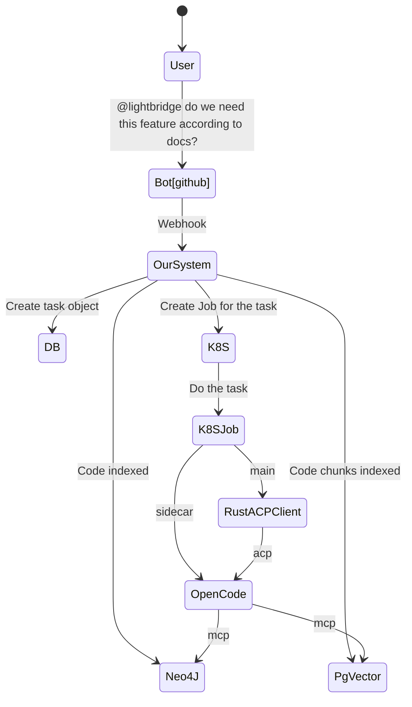
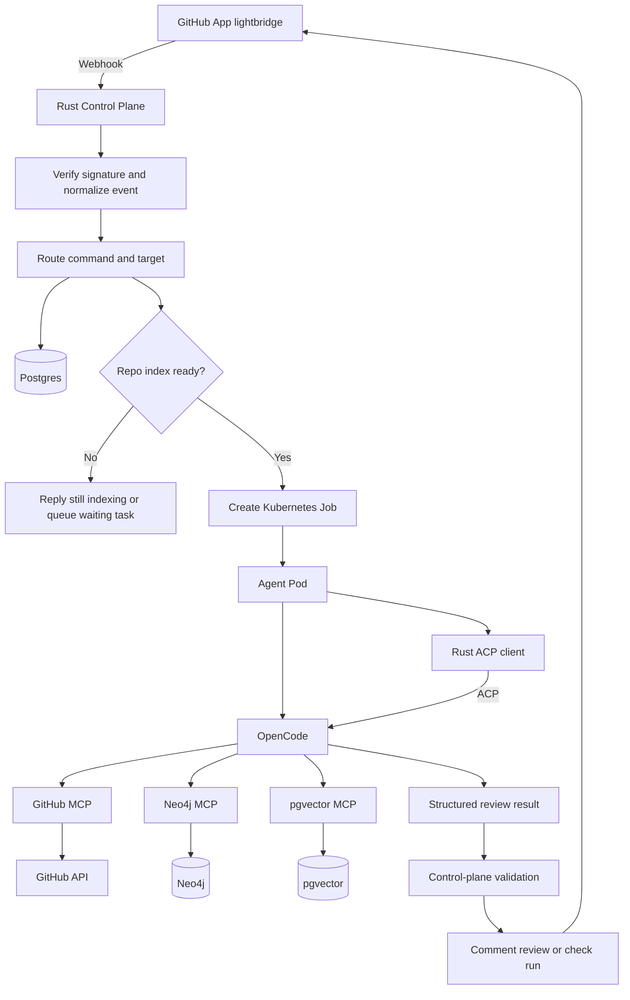
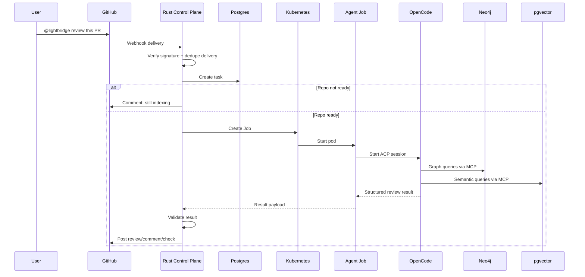
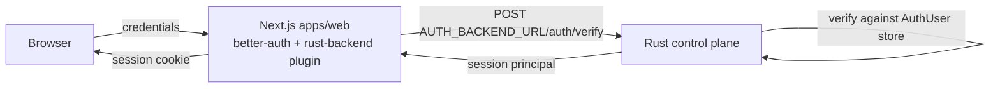

# Architecture Overview

## System context

Lightbridge is a webhook-first GitHub App that turns mentions such as `@lightbridge` into review
or Q&A tasks. The Rust control plane receives the event, verifies and normalizes it, persists task
state in Postgres, and launches a task-specific Kubernetes Job. That Job runs OpenCode in a
constrained environment with MCP access to graph, vector, and GitHub tooling.

## Provided concept diagram

## Refined flowchart

## Review sequence

## Design-option comparisons

| Topic | Option | Pros | Cons | Recommendation |
|---|---|---|---|---|
| Bot identity | GitHub App | Least privilege, webhooks, installation scoping | Slightly more setup | Use |
| Bot identity | PAT-backed bot account | Fast to prototype | Weak trust boundary, broad tokens | Avoid |
| Retrieval backend | Neo4j only | Fewer moving parts | Graph store not ideal as sole semantic store | Avoid for MVP |
| Retrieval backend | pgvector only | Easy operationally | Loses relationships and topology | Avoid for full design |
| Execution | Shared worker pool | Lower startup overhead | Weaker isolation, harder debugging | Optional later |
| Execution | Per-task Job | Isolation, cleanup, per-task creds | Startup latency | Use |
| GitHub output | Comment only | Simple | Harder to summarize status | Start here |
| GitHub output | Checks + comments | Rich UX | More moving parts | Add after MVP |

## Trust boundary

The agent can inspect, reason, and propose. The Rust control plane decides what gets persisted,
posted, retried, or rejected. See [ADR-0002](adr/0002-rust-control-plane-trust-boundary.md).

## Web & auth tier

A Next.js (App Router) web console lives under `apps/web`. It gives operators a UI over the
control plane: repository onboarding, task history, index status, and audit trails. The web app
uses [**better-auth**](adr/0007-better-auth-rust-backend-plugin.md) for session management.

Authentication (**authN**) is not implemented inside Next.js. It is delegated to Lightbridge's
**own standalone, portable Rust backend** — the control plane — via a custom better-auth plugin
named `rust-backend`. That plugin POSTs submitted credentials to
`${AUTH_BACKEND_URL}/auth/verify`; the Rust backend validates them against its `AuthUser` store
and returns a session principal. Because the backend is standalone and portable, the same authN
surface can be reused outside the web app.

> **authN is NOT authZ.** The path above is *authentication only* — proving who a web user is.
> Gateway **authorization** (decides what a caller may do at the API edge) is a separate concern
> handled by **Envoy** together with **Authorino** and the standalone
> [`ADORSYS-GIS/lightbridge-authz`](https://github.com/ADORSYS-GIS/lightbridge-authz) component.
> `lightbridge-authz` is **not** this project's auth backend, and our better-auth Rust backend is
> **not** the gateway authorizer. Keep the two cleanly separated. See
> [ADR-0007](adr/0007-better-auth-rust-backend-plugin.md) and the
> [FAQ](faq.md#how-does-authentication-authn-differ-from-authorization-authz).

## Control-plane implementation note

The control plane is built in **Rust (Axum)** and is **schema-first via
[cratestack](adr/0005-cratestack-schema-first-control-plane.md)**. The single source of truth is
`services/control-plane/schema/control-plane.cstack`, from which cratestack is intended to generate
the Axum + SQLx server, typed clients, and policy enforcement.

Codegen wiring is a **follow-up**: until the cratestack 0.4.x grammar is pinned, hand-written types
in `services/control-plane/src/types.rs` mirror the `.cstack` schema so the modelling work is
captured and reviewable now. The `.cstack` file and the hand-written types must be kept in sync
until codegen is enabled. See [ADR-0005](adr/0005-cratestack-schema-first-control-plane.md).
