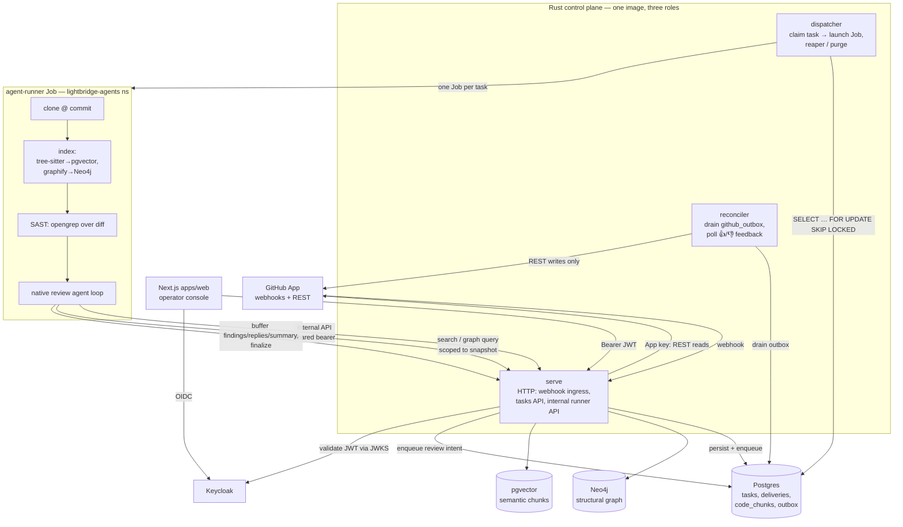
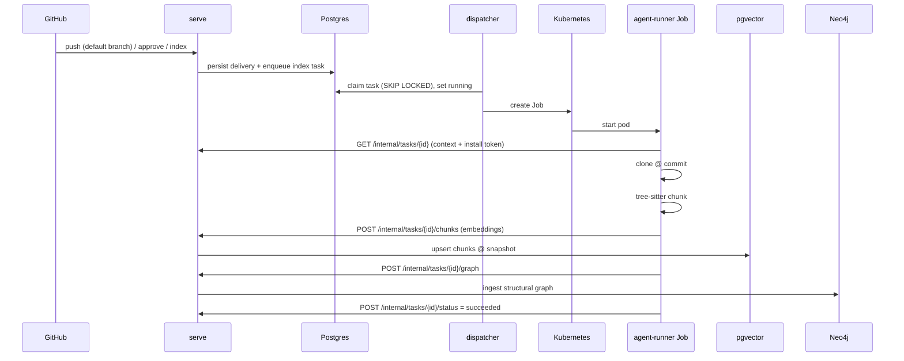
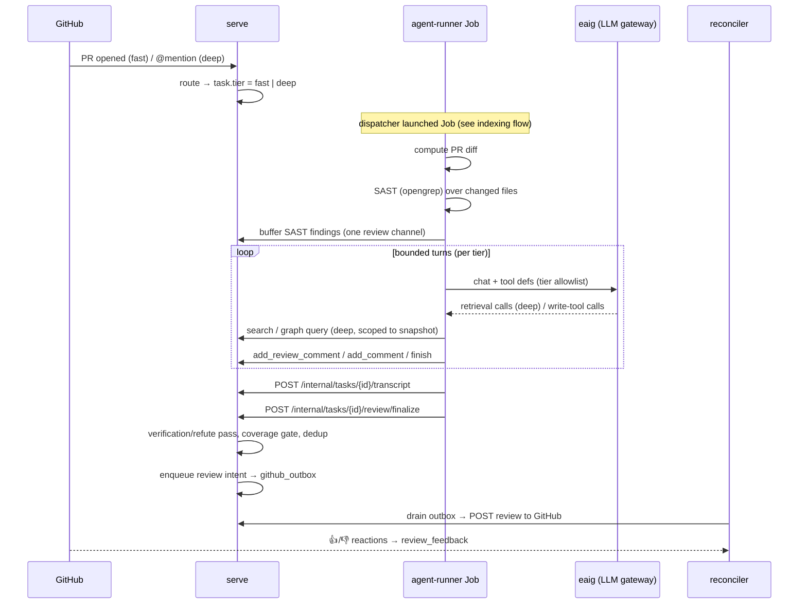

# Architecture overview

> **Current state (2026-06).** This document reflects the system as it runs today. The review agent is
> a **native, in-process Rust loop** ([ADR-0026](adr/0026-native-review-agent.md)) that acts through
> **mediated write tools** ([ADR-0037](adr/0037-agent-acts-via-mediated-tools.md)); the earlier
> OpenCode/ACP/MCP-subprocess shape and the review fallback model are **gone**
> ([ADR-0053](adr/0053-remove-review-fallback-model.md)). Review now runs in **two tiers**
> ([ADR-0062](adr/0062-two-tier-review-fast-auto-deep-on-demand.md)). For the per-subsystem detail see
> the cross-links throughout and [INDEX.md](INDEX.md).

## System context

Lightbridge is a webhook-first GitHub App that turns pull-request activity into automated code review.
The Rust **control plane** receives each GitHub webhook, verifies and persists it, decides whether a
task should run, and enqueues it. A separate dispatcher claims the task and launches a per-task
Kubernetes **Job** ([ADR-0004](adr/0004-one-k8s-job-per-task.md)); that Job is the **agent-runner**,
which clones the repo, builds (or reuses) the dual index, and runs the review agent. All writes back to
GitHub flow out through a single **reconciler** role
([ADR-0059](adr/0059-reconciler-owns-all-github-egress.md)). The control plane is the trust boundary
([ADR-0002](adr/0002-rust-control-plane-trust-boundary.md)): the agent inspects, reasons, and
*proposes*; the control plane decides what gets posted.

## High-level topology

## The tiers

### GitHub App + webhooks

The bot is a GitHub App ([ADR-0001](adr/0001-use-github-app.md)) so it gets least-privilege,
installation-scoped credentials and webhook delivery. The `serve` role verifies each delivery's
`X-Hub-Signature-256` HMAC, dedupes on `X-GitHub-Delivery` (atomically via the `github_deliveries`
primary key when a database is configured), persists the raw delivery, then routes a small set of
events (`services/control-plane/src/http/webhook.rs`):

| Event | Action |
|---|---|
| `pull_request` `opened` | create a **fast**-tier review task (the automatic first review) |
| `pull_request` `closed` | cancel the PR's active tasks (reaper stops their Jobs) |
| `pull_request` `synchronize` / `reopened` | nothing — re-review is via `@mention` |
| `push` to the **default branch** | create a re-index task (keep the base index fresh) |
| `issue_comment` `created`, body leads with `@<handle>` | **deep**-tier re-review (on a PR) or an issue answer |
| `installation` / `installation_repositories` | register repos as **pending** / disable them |

Repos start **pending** and require admin approval before any review or index runs (Epic #75); the
gate is enforced in `webhook.rs` (`approved_or_skip`).

### Rust control plane — one binary, three roles

The control plane is **Rust (Axum)**, schema-first via cratestack
([ADR-0005](adr/0005-cratestack-schema-first-control-plane.md)) with hand-written SQLx types mirroring
`services/control-plane/schema/control-plane.cstack` until codegen is pinned. A single binary selects
its role from the first CLI arg or `CONTROL_PLANE_ROLE` (`services/control-plane/src/main.rs`), and
each role is its own Deployment so they scale independently ([RFC-0001](rfc/0001-horizontally-scalable-control-plane.md)):

- **`serve`** — the HTTP surface. Public-ish routes: `/github/webhook`, `/tasks*`, `/repositories`,
  `/admin/*`, health and `/metrics`. The OIDC-protected tasks/admin routes are a resource server
  (below). The **internal runner API** (`/internal/tasks/{id}/*`) is authenticated by a shared bearer
  (`AGENT_RUNNER_TOKEN`), not OIDC — it serves the Job's context fetch, chunk/graph ingest, scoped
  retrieval (`/search`, `/graph/query`), transcript submission, and the mediated review write actions
  (`/review/inline`, `/review/comment`, `/review/summary`, `/review/finalize`). `serve` holds the
  GitHub App key for **reads only**.
- **`dispatcher`** — the queue consumer (`services/control-plane/src/queue/`). It claims a queued task
  and creates exactly one Kubernetes Job for it (`integrations/k8s.rs`), runs the **reaper**
  (Job GC + cancellation + data-purge reconciler), and the index sweeper. It has no main HTTP server,
  just a `/metrics` sidecar listener.
- **`reconciler`** — a **single replica** that owns **all GitHub egress**
  ([ADR-0058](adr/0058-rename-poller-role-to-reconciler.md),
  [ADR-0059](adr/0059-reconciler-owns-all-github-egress.md)): it drains the `github_outbox` table and
  performs each buffered write (review, reply, reaction, failure notice), and polls 👍/👎 reactions
  back into `review_feedback` ([ADR-0035](adr/0035-review-feedback-signal.md)). Running it as one
  replica keeps egress from double-posting. (`poller` is accepted as a legacy alias for the role
  string during the rename rollout.)

Producers shape every outbound write in `services/control-plane/src/outbox.rs`
(`enqueue_review` / `enqueue_reply` / `enqueue_reaction` / `enqueue_failure_notice`), each idempotent
on a `dedup_key`; the reconciler just ships the bytes. This is the single PR output channel
([ADR-0056](adr/0056-control-plane-owns-the-posted-output.md)).

### Data stores

- **Postgres** — task queue and lifecycle, `github_deliveries`, the `github_outbox`, review findings
  and feedback, agent transcripts, and the semantic chunk table. Migrations under
  `services/control-plane/migrations/` (latest: `0021_task_tier.sql`). Dual retrieval
  ([ADR-0003](adr/0003-dual-retrieval-neo4j-pgvector.md)) uses pgvector for embeddings.
- **pgvector** — semantic code chunks with their embeddings. Embeddings come from an OpenAI-compatible
  internal gateway (**eaig**), model `qwen3-embedding-8b` at **4096 dims** with **no ANN index**
  ([ADR-0018](adr/0018-openai-compatible-embeddings.md)); the control plane reconciles the configured
  dimension against the live column at startup (`db::reconcile_embedding_dimension`).
- **Neo4j** — the structural code graph built by graphify/tree-sitter
  ([ADR-0010](adr/0010-graphify-treesitter-indexing-baseline.md),
  [ADR-0019](adr/0019-graphify-cli-structural-graph.md)). The untrusted Job never holds Neo4j creds; it
  POSTs the graph through the internal API and queries it via `/graph/query`.

### Agent-runner Jobs

The agent-runner (`services/agent-runner/src/main.rs`) is the per-task Job. It holds **no** GitHub App
key — it reads its task id + callback wiring from env, fetches task context (repo coordinates + a
short-lived installation token minted by the control plane) over the internal API, and reports a
terminal status back. Its lifecycle: **clone → semantic index → structural index → SAST → review →
report**. Indexing is required; the structural graph, SAST, and the review are best-effort and
non-fatal (a failed review still leaves a posted artifact unless the gateway was unreachable). The Job
self-cancels promptly on SIGTERM or when it observes its own task gone terminal upstream.

### Web & auth tier

`apps/web` is a Next.js (App Router) operator console (`app/dashboard`, `app/api`, `middleware.ts`)
over the control plane: repository onboarding/approval, task history, index status, transcripts, audit.
Authentication is delegated to **Keycloak** OIDC ([ADR-0014](adr/0014-keycloak-oidc-resource-server.md)) —
the web app is an OIDC client (Authorization-Code + PKCE) that stores the access token in an httpOnly
cookie; the control plane is a pure OAuth2 **resource server** that validates the bearer JWT against
Keycloak's JWKS (`services/control-plane/src/jwt.rs`) and reads identity from claims. Authorization is
**permission-based**, per-capability, fail-closed: endpoints authorize on a permissions claim
(`PERMISSIONS_CLAIM`, default `permissions`), not on roles
([ADR-0023](adr/0023-db-backed-rbac.md)).

> **authN is not authZ.** The OIDC flow above proves who a *web user* is. Gateway authorization at the
> API edge is a separate concern handled by Envoy + Authorino and the standalone `lightbridge-authz`
> component — not this project's control plane. Both validate the same Keycloak-issued JWTs via JWKS.

## End-to-end: indexing flow

A review on an **already-indexed** repo reuses the latest indexed snapshot rather than re-indexing
([ADR-0025](adr/0025-review-reuses-base-index.md),
[ADR-0050](adr/0050-retrieval-pins-to-latest-indexed-snapshot.md)); snapshots are pruned
([ADR-0052](adr/0052-index-snapshot-pruning.md)). The runner re-indexes only for an `index` task or a
cold repo (`main.rs` `needs_index`). Incremental/layered indexing is future work
([RFC-0002](rfc/0002-incremental-layered-indexing.md)).

## End-to-end: review flow (two tiers)

A review task carries a **`tier`** column ([ADR-0062](adr/0062-two-tier-review-fast-auto-deep-on-demand.md)),
set by the webhook router and used by the runner to pick a per-tier config (`ReviewConfig::resolve_tiers`,
`ReviewConfigs::for_tier`):

| | **Fast** (auto on `pull_request opened`) | **Deep** (on `@mention`) |
|---|---|---|
| Model | cheap, operator-tuned (**churns — read it live**) | strong, operator-tuned |
| Retrieval | none (diff-only) | full dual retrieval |
| Tools | small per-tier allowlist (`review.fast.tools`) | full tool surface |
| Turns | small cap | large cap, long timeout |
| SAST | yes | yes |
| Prompt | lean diff-only (`review-system-fast.md`) | full persona (`review-system.md`) |

The per-tier tool allowlist is a **closed enum** `ReviewTool`
(`services/agent-runner/src/bootstrap/config.rs`) — an unknown name in `review.<tier>.tools` fails at
deserialize, and a sync test asserts it can't drift from the actual tool surface in
`services/agent-runner/src/review/native/tools.rs`.

The native loop (`services/agent-runner/src/review/native/agent.rs`) returns an outcome — `Finished`
(model called `finish`), `Exhausted` (turn budget ran out with findings possibly buffered), or
`Aborted(reason)` — and **only a true transport failure returns `Err`**. Finalize flushes the buffered
findings as **one grouped review**; an empty fast run gets a control-plane-rendered "quick pass" banner
(with the real GitHub App `@handle`) pointing at the deep `@mention` path.

Reviews layer several quality controls, all in `services/control-plane/src/review.rs` and the runner's
review module:

- **SAST** ([ADR-0061](adr/0061-sast-deterministic-finding-source.md)) — a deterministic opengrep scan
  over the diff; findings ride the **same** review channel (no second poster), LLM-aware but not gated.
- **Finding verification / refute** ([ADR-0043](adr/0043-review-finding-verification.md)) — a pass
  that drops findings the agent can't substantiate.
- **Full-diff coverage gate** ([ADR-0041](adr/0041-full-diff-coverage-gate.md)) and **risk-first
  batching + read budgets** ([ADR-0042](adr/0042-risk-first-review-and-parallel-batching.md)).
- **Re-review reads prior findings** ([ADR-0040](adr/0040-re-review-reads-prior-findings.md)) and
  **feedback memory M1** ([ADR-0044](adr/0044-feedback-memory-m1.md)).
- **Context-window budget** ([ADR-0045](adr/0045-context-window-budget.md)) and **reasoning capture**
  ([ADR-0060](adr/0060-capture-model-reasoning-and-glm-5-2-latency-finding.md)).
- **Repo-native instructions** ([ADR-0036](adr/0036-auto-read-agent-instruction-files.md)) — the
  repo's `AGENTS.md`/`CLAUDE.md` are folded into the prompt as untrusted context.

The single review model has retry/backoff/circuit-breaker resilience
([ADR-0039](adr/0039-agent-llm-resilience-and-observability.md)); the fallback model was removed
([ADR-0053](adr/0053-remove-review-fallback-model.md)).

## Deployment topology

GitOps continuous delivery: merging to the **ai-helm** chart's main makes it live; the chart is
genericized so all environment specifics live in the sibling **ai-helm-values** repo, and
argocd-image-updater writes `sha-<gitsha>` image tags. (Review only runs once the base index is ready —
[ADR-0055](adr/0055-review-waits-for-index-readiness.md).) File-based config (ConfigMaps) mount
`control-plane.json`, `agent.json`, `review-system.md`, and `review-system-fast.md`; `deny_unknown_fields`
forces a strict three-repo deploy order (runner image → chart → values).

There are **two physical clusters**: ArgoCD runs on a Talos cluster (kube context `admin@homeos`);
the LCI workloads run on a Hetzner cluster (context `hetzner-prod`, namespace `converse`), with the
per-task agent Jobs in namespace `lightbridge-agents`.

> The review LLM model is operator-tuned in ai-helm-values and **churns** — never treat a specific model
> name as permanent; read the live values.

## Trust boundary (recap)

The untrusted agent Job can read code (via scoped, control-plane-mediated retrieval) and *propose*
findings, but it never holds the GitHub App key, never writes to GitHub directly, and never touches
Neo4j credentials. The control plane mints short-lived per-task tokens, validates findings, and is the
sole egress to GitHub ([ADR-0002](adr/0002-rust-control-plane-trust-boundary.md),
[ADR-0037](adr/0037-agent-acts-via-mediated-tools.md),
[ADR-0059](adr/0059-reconciler-owns-all-github-egress.md)).

## See also

- [github-app-and-control-plane.md](github-app-and-control-plane.md) — webhook ingress + routing detail
- [control-plane-roles-and-github-egress.md](control-plane-roles-and-github-egress.md) — roles + outbox
- [jobs-and-lifecycle.md](jobs-and-lifecycle.md) — the Job/task state machine
- [indexing-and-storage.md](indexing-and-storage.md) — dual index + snapshots
- [review-pipeline.md](review-pipeline.md) — the two-tier review pipeline in depth
- [kubernetes-deployment.md](kubernetes-deployment.md) — cluster/GitOps topology
- [security-observability-testing-rollout.md](security-observability-testing-rollout.md)
