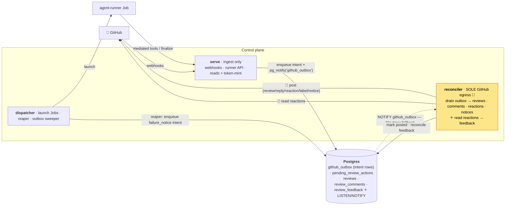

# Control-plane roles & GitHub egress

How the one control-plane binary splits into roles, and how **every** outbound write to GitHub flows
through a single transactional outbox. This is the as-built picture after the single-egress refactor
([ADR-0058](adr/0058-rename-poller-role-to-reconciler.md), [ADR-0059](adr/0059-reconciler-owns-all-github-egress.md),
live 2026-06-27).

## One binary, several roles

The control plane is a single image run as independent Deployments (RFC-0001), selected by the first
CLI arg or the `CONTROL_PLANE_ROLE` env var (`services/control-plane/src/main.rs`, `main()`). They
scale independently and hold different credentials.

| Role | Replicas | GitHub App key? | Responsibility |
|---|---|---|---|
| **serve** | many | yes — **reads / token-mint only**, never posts | HTTP surface: webhook ingress (HMAC + delivery dedup), the internal runner API (bootstrap + results/`finalize`), admin, `/me`, `/tasks`, `/metrics`. Mints the runner's clone token and fetches the PR diff to *shape* a review. |
| **dispatcher** | 1 | **no** | Claims `queued` tasks under a lease and launches one Kubernetes Job each; runs the **reaper** (Job GC + marks a stuck task `failed`), the index/purge reconciler, and the **outbox pruning sweeper**. |
| **reconciler** | 1 | yes | The **sole writer to GitHub** — drains the egress outbox and posts (ADR-0059) — and reads 👍/👎 reactions back into `review_feedback` (ADR-0035). Formerly `poller`. |

The role match in `main()` is `serve | dispatcher | reconciler`, with `poller` accepted as a legacy
alias for `reconciler`; any other value aborts startup. (`scheduler` is named in RFC-0001 but not yet a
role.)

Why the key sits where it does ([ADR-0002](adr/0002-rust-control-plane-trust-boundary.md)): the
dispatcher launches untrusted Jobs, so it deliberately holds **no** App key. serve keeps the key but
only for *reads* and *token minting* — `finalize_review` still mints a token to fetch the PR diff, but
it no longer calls any GitHub *write* API. That leaves the reconciler as the one place content is
posted. Both `run_reconciler` and `serve` require `state.github` (the App key); the dispatcher does
not touch it.

> **Role rename (ADR-0058).** `poller → reconciler`, because the role now reconciles GitHub state in
> *both* directions (reads reactions in, posts the outbox out) — "poller" only named the inbound half.
> The role string **dual-accepts** `poller` and `reconciler`, and `run_reconciler` reads `RECONCILER_*`
> then falls back to `POLLER_*` (`RECONCILER_INTERVAL_SECS`/`POLLER_INTERVAL_SECS` default 300s;
> `RECONCILER_WINDOW_DAYS`/`POLLER_WINDOW_DAYS` default 14, clamped to ≥1), so the binary and the
> Deployment can be renamed in either order.

## Why a single egress

Before this refactor, two roles posted to GitHub: serve posted reviews/replies/reactions synchronously
in the `finalize` request path, and the reconciler posted the uncatchable-kill failure notice. Two
writers caused three problems — a settle buffer existed purely to stop them racing a double-post; a
GitHub outage **blocked the runner's `finalize` call**; and retry/dedup/ordering logic plus the
rate-limit budget were split across both. Consolidating to one writer removes all three.

## The egress outbox

Every outbound **content** write becomes an *intent* row in `github_outbox`
(`services/control-plane/migrations/0020_github_outbox.sql`); the reconciler is the only consumer that
turns intents into GitHub API calls.



### Producers — enqueue, never post

A producer **fully shapes** the payload at produce time (any GitHub *read* — e.g. the PR-diff fetch and
the inline/deferred validation `finalize` does — runs here and is baked into the row), then `INSERT`s the
intent and fires `pg_notify('github_outbox')`. The reconciler is a *dumb poster*: it ships bytes and
never parses a diff. The enqueue helpers live in `services/control-plane/src/outbox.rs`; all of them go
through `db::enqueue_github_post`.

| Producer (code) | Helper | Intent kind(s) | `dedup_key` |
|---|---|---|---|
| `finalize_review` (`http/internal.rs`) | `enqueue_review` | `review` (always — an empty buffer still enqueues a clean-review intent so a review/`@mention` is never silent) | `<task>:review` |
| `finalize_review` (`http/internal.rs`) | `enqueue_reply` | `reply` — a consolidated `ask`-on-PR/issue answer, kept **only** when the run posts no PR review (see ADR-0056 below) | `<task>:reply` |
| webhook ingress (serve) | `enqueue_reaction` | the 👀 `eyes` "seen" reaction | `<task>:reaction:eyes` |
| runner-reported failure (`http/internal.rs`, `report_failure`) | `enqueue_reaction` + `enqueue_failure_notice` | a 😕 `confused` reaction + the `failure_notice` | `<task>:reaction:confused`, `<task>:failure_notice` |
| the **reaper** (dispatcher) | `enqueue_failure_notice` | the `failure_notice` for an *uncatchable* kill. The keyless dispatcher can't *post*, but it can write an intent **row** — which closes the ADR-0057 silent-failure gap with no separate sweep | `<task>:failure_notice` |

`enqueue_review` propagates a JSON-serialization failure (returning an error so `finalize` 500s and the
runner re-finalizes) rather than enqueuing a `Null` payload that would silently dead-letter (#219). The
`dedup_key` prefix is the task id when present, falling back to `owner/repo#issue` for a task-less
reaction (`Target::key_prefix`).

> **Outcome labels are not a separate intent.** The `kind` CHECK constraint lists `label`, but no
> producer enqueues one today: outcome labels (`label_findings` / `label_error` flags on the
> `ReviewPayload`) ride the **`review`** intent and are applied by the reconciler as part of review
> delivery — keeping label writes on the outbox rather than re-introducing a second serve-side writer
> (#218).

### The reconciler — sole consumer

`run_outbox_drain` does `LISTEN github_outbox` with a 15s timer fallback (`DRAIN_FALLBACK`), the same
shape the dispatcher runs on `task_queued`; if the `LISTEN` connection drops it reconnects a fresh
listener (#219) while the timer fallback keeps draining, so a lost connection degrades latency, never
liveness. Each wake it claims a batch of up to `DRAIN_BATCH = 50` rows
(`claim_outbox_batch`: `WHERE status = 'pending' AND next_attempt_at <= now() ORDER BY created_at, id …
FOR UPDATE SKIP LOCKED`), mints **one installation token per installation per batch** (caching a mint
failure so it doesn't spin), posts each via `deliver`, and marks it `posted` (recording the GitHub id
for the feedback join) or backs it off `failed`. The feedback poll (`poll_once`, ADR-0035) runs on its
own spawned cadence alongside the drain.

`deliver` dispatches on `row.kind`:

- **`reaction`** → `add_reaction`, returns no id.
- **`reply`** / **`failure_notice`** → `create_issue_comment`; the posted id is recorded against the
  task (`record_comment`) for the feedback join.
- **`review`** (`deliver_review`) → `create_pr_review` with the pre-shaped body + validated inline
  comments (`side: "RIGHT"`), then the whole success bundle the old synchronous `finalize` did:
  `upsert_review` (persist the copy), `list_review_comments` to recover the inline comment ids the
  create-review response omits (stored for the feedback join), `add_labels` for the configured outcome
  labels, and the 🎉 `hooray` reaction when reactions are enabled. The post itself is fatal-on-error
  (backs the row off); every side-effect after it is best-effort and logged-but-non-fatal.

The reconciler holds the App key (ADR-0002) and runs as **one replica**, which is what makes "sole
consumer" literal and keeps the per-task ordering intact.

### Row lifecycle

Schema (`migrations/0020_github_outbox.sql`):

```
id BIGSERIAL PK · task_id? (FK tasks ON DELETE CASCADE) · installation_id · owner · repo
kind  TEXT CHECK (review | reply | reaction | label | failure_notice)
payload jsonb (fully shaped) · dedup_key TEXT UNIQUE
status TEXT CHECK (pending → posted | failed) DEFAULT 'pending'
attempts INT · last_error · next_attempt_at · created_at · posted_at · github_id
-- partial drain index on (next_attempt_at, created_at, id) WHERE status = 'pending'
```

- **Idempotent enqueue** — `INSERT … ON CONFLICT (dedup_key) DO NOTHING`, so a re-`finalize` or a retry
  never double-enqueues; the `NOTIFY` only fires when a row was actually inserted. Keys are per logical
  post: `<task>:review`, `<task>:reaction:eyes`, etc.
- **Ordering** — drained `(created_at, id)`. The `id` tie-breaker is load-bearing: rows enqueued in one
  transaction share `created_at` (`now()` is transaction-stable), so it alone is not a total order.
- **Single-replica invariant** — `FOR UPDATE SKIP LOCKED` only holds the lock for the *claim* statement
  (no enclosing transaction), so it does **not** protect the claim→post→mark gap; correctness rests on
  the reconciler running as exactly one replica (ADR-0058/0059), with `SKIP LOCKED` only avoiding a
  self-collision if a claim ever overlaps an in-flight one.
- **Backoff / dead-letter** — `mark_outbox_failed` bumps `attempts`, stashes `last_error`, and sets
  `next_attempt_at = now() + (attempts²) minutes`; once `attempts` reaches `OUTBOX_MAX_ATTEMPTS = 6`
  the row parks `failed`.
- **At-least-once, not exactly-once** — `dedup_key` prevents double-*enqueue*, but a crash between the
  GitHub POST and the `posted` mark can rarely re-post (GitHub exposes no idempotency key for
  reviews/comments). A duplicate is tolerated — it's recoverable; a *lost* review is not.
- **Failure-notice gate** — before posting a `failure_notice` the reconciler re-checks
  `db::has_responded_or_pending_content(task)`: a row in `reviews` or `review_comments`, **or** a
  `review`/`reply` intent still `pending`/`posted` in the outbox, suppresses the apology (a
  transiently-retrying review must not be raced by a "nothing was posted" notice). A dead-lettered
  (`failed`) review is excluded, so a genuinely-undeliverable review still yields a notice.
- **GC** — terminal rows are append-mostly (a bare 👀 reaction leaves a permanent `posted` row per PR,
  and every enqueue pays the `ON CONFLICT (dedup_key)` probe against the table), so the **dispatcher**
  runs the outbox pruning sweeper (`queue/outbox_sweeper.rs` → `db::prune_outbox`) alongside the index
  sweeper: `posted` rows are deleted `posted_retention_days` after `posted_at`; `failed` rows are kept
  longer (`failed_retention_days`, keyed off `created_at`) for post-mortem inspection; `pending` rows
  are never touched. A non-positive retention is treated as *skip that prune*, never "delete
  everything".

## Single PR output channel (ADR-0056)

`finalize_review` enforces the one-channel policy with `posts_pr_review(target_type, has_inline,
has_summary, buffer_empty)`. On a **pull request that posts a review** (inline findings, a verdict
summary, or the empty-buffer backstop), the buffered `add_comment` replies are **dropped** — the
verdict belongs solely in the grouped review, and the agent often buffers progress/verification
narration via `add_comment`. The reply intent is enqueued **only** when the run posts no PR review on
that PR (a pure `@mention` *question* whose answer is the `add_comment`) or the target is a non-PR
issue. The drop is gated on `post_pr_review`, not on a finding count, so a *clean* review (a summary
with zero findings) still suppresses the narration reply.

## Operating it

- **Deploy ordering.** Intents are durable, so a rollout is safe in any order — worst case is a brief
  posting delay while serve (new image) enqueues and the reconciler (still old) hasn't started draining;
  nothing is lost. Migration `0020_github_outbox` must apply before the new serve enqueues (migrations
  run on boot via `db::connect_from_env`).
- **No helm change required to ship.** The dual-accept role string means an existing `poller`
  Deployment runs the new reconciler logic; renaming the Deployment to `reconciler` is cosmetic.
- **Watching it.** The reconciler logs `reconciler: github-egress drain listening` on startup,
  `review posted` (with `outbox_id` + `pr`) per delivery, `outbox: retrying delivery` on a re-claim, and
  `outbox delivery failed (will back off)` on backoff. Healthy steady state: every enqueue drains to
  `posted`; `failed` rows mean a dead-letter worth inspecting (`last_error`). The dispatcher logs
  `outbox sweeper: pruned terminal rows` and emits the `outbox_prune_deleted` metric when it deletes.

## See also

- [ADR-0058](adr/0058-rename-poller-role-to-reconciler.md) — the role rename.
- [ADR-0059](adr/0059-reconciler-owns-all-github-egress.md) — the single-egress outbox (full rationale,
  consequences, the at-least-once analysis).
- [ADR-0056](adr/0056-control-plane-owns-the-posted-output.md) — the single PR output channel (review-vs-reply policy).
- [ADR-0057](adr/0057-poller-posts-failure-notice-on-uncatchable-kill.md) — the silent-failure gap the reaper's failure-notice intent closes.
- [ADR-0002](adr/0002-rust-control-plane-trust-boundary.md) — trust boundary & App-key placement.
- [ADR-0037](adr/0037-agent-acts-via-mediated-tools.md) — the agent's mediated-tool buffer that *is* the
  review outbox upstream of this one.
- [ADR-0035](adr/0035-review-feedback-signal.md) — the inbound reaction read the reconciler also does.
- [RFC-0001](rfc/0001-horizontally-scalable-control-plane.md) — the role-split / horizontal-scaling design.
- [Jobs and task lifecycle](jobs-and-lifecycle.md) · [GitHub App and control plane](github-app-and-control-plane.md).
