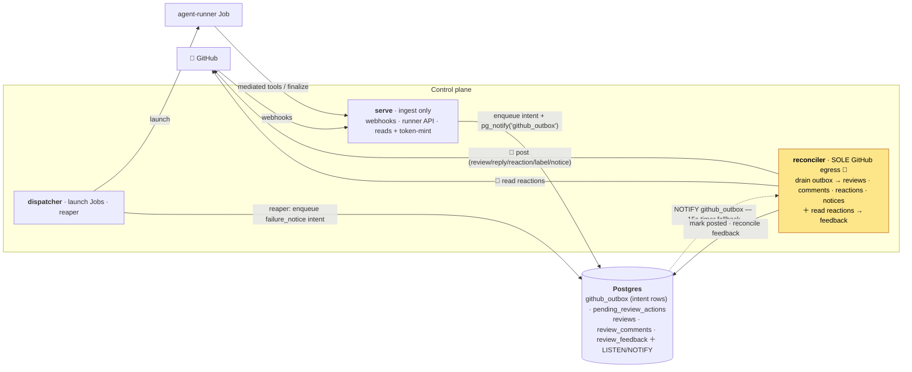

# Control-plane roles & GitHub egress

How the one control-plane binary splits into roles, and how **every** outbound write to GitHub flows
through a single transactional outbox. This is the as-built picture after the single-egress refactor
([ADR-0058](adr/0058-rename-poller-role-to-reconciler.md), [ADR-0059](adr/0059-reconciler-owns-all-github-egress.md),
live 2026-06-27).

## One binary, three roles

The control plane is a single image run as three independent Deployments (RFC-0001), selected by the
first CLI arg or `CONTROL_PLANE_ROLE`. They scale independently and hold different credentials.

| Role | Replicas | GitHub App key? | Responsibility |
|---|---|---|---|
| **serve** | many | yes — **reads / token-mint only**, never posts | HTTP surface: webhook ingress (HMAC + delivery dedup), the internal runner API (bootstrap + results/`finalize`), admin, `/metrics`. Mints the runner's clone token and resolves a repo's default branch. |
| **dispatcher** | 1 | **no** | Claims `queued` tasks under a lease and launches one Kubernetes Job each; runs the **reaper** (Job GC + marks a stuck task `failed`) and the purge reconciler. |
| **reconciler** | 1 | yes | The **sole writer to GitHub** — drains the egress outbox and posts (ADR-0059) — and reads 👍/👎 reactions back into `review_feedback` (ADR-0035). Formerly `poller`. |

Why the key sits where it does ([ADR-0002](adr/0002-rust-control-plane-trust-boundary.md)): the
dispatcher launches untrusted Jobs, so it deliberately holds **no** App key. serve keeps the key but
only for *reads* and *token minting* — it stops calling the GitHub write API entirely. That leaves the
reconciler as the one place content is posted.

> **Role rename (ADR-0058).** `poller → reconciler`, because the role now reconciles GitHub state in
> *both* directions (reads reactions in, posts the outbox out) — "poller" only named the inbound half.
> The role string **dual-accepts** `poller` and `reconciler`, and env reads `RECONCILER_*` then falls
> back to `POLLER_*`, so the binary and the Deployment can be renamed in either order.

## Why a single egress

Before this refactor, two roles posted to GitHub: serve posted reviews/replies/reactions synchronously
in the `finalize` request path, and the reconciler posted the uncatchable-kill failure notice. Two
writers caused three problems — a 2-minute *settle buffer* existed purely to stop them racing a
double-post; a GitHub outage **blocked the runner's `finalize` call**; and retry/dedup/ordering logic
plus the rate-limit budget were split across both. Consolidating to one writer removes all three.

## The egress outbox

Every outbound **content** write becomes an *intent* row in `github_outbox`; the reconciler is the only
consumer that turns intents into GitHub API calls.



### Producers — enqueue, never post

A producer **fully shapes** the payload at produce time (any GitHub *read* — e.g. the PR-diff fetch and
the inline/deferred validation `finalize` does — runs here and is baked into the row), then `INSERT`s the
intent and fires `pg_notify('github_outbox')`. The reconciler is a *dumb poster*: it ships bytes and
never parses a diff.

| Producer | Enqueues |
|---|---|
| `finalize_review` (serve) | the grouped `review` (always — an empty buffer still enqueues a clean-review intent so an @mention never goes silent) and the `reply` (`ask`-on-PR answer). |
| webhook ingress (serve) | the 👀 `reaction` ("seen"). |
| runner-reported failure (serve) | a 😕 `reaction` + the `failure_notice`. |
| the **reaper** (dispatcher) | the `failure_notice` for an *uncatchable* kill. The keyless dispatcher can't *post*, but it can write an intent **row** — which is what closes the ADR-0057 silent-failure gap with no separate sweep. |

### The reconciler — sole consumer

`LISTEN github_outbox` with a 15s timer fallback (the same shape the dispatcher runs on `task_queued`;
the listener reconnects if the connection drops). Each wake it claims a batch
`ORDER BY created_at, id FOR UPDATE SKIP LOCKED`, posts each via the App token, and marks it `posted`
(recording the GitHub id for the feedback join) or backs it off `failed`. Outcome labels and the 🎉
reaction are applied as part of the `review` delivery, so they ride the outbox too.

### Row lifecycle

```
id BIGSERIAL · task_id? · installation_id · owner · repo
kind (review | reply | reaction | label | failure_notice)
payload jsonb (fully shaped) · dedup_key UNIQUE
status (pending → posted | failed) · attempts · last_error · next_attempt_at
created_at · posted_at · github_id
```

- **Idempotent enqueue** — `ON CONFLICT (dedup_key) DO NOTHING`, so a re-`finalize` or a retry never
  double-enqueues. Keys are per logical post: `<task>:review`, `<task>:reaction:eyes`, etc.
- **Ordering** — drained `(created_at, id)`. The `id` tie-breaker is load-bearing: rows enqueued in one
  transaction share `created_at` (`now()` is transaction-stable), so it alone is not a total order.
- **Single-replica invariant** — "sole consumer" and the per-task ordering both rely on the reconciler
  running as exactly one replica.
- **Backoff / dead-letter** — a failed delivery bumps `attempts`, stashes `last_error`, and retries
  after `attempts²` minutes; at 6 attempts it parks `failed`.
- **At-least-once, not exactly-once** — `dedup_key` prevents double-*enqueue*, but a crash between the
  GitHub POST and the `posted` mark can rarely re-post (GitHub exposes no idempotency key for
  reviews/comments). A duplicate is tolerated — it's recoverable; a *lost* review is not.
- **Failure-notice gate** — before posting a `failure_notice` the reconciler checks
  `has_responded_or_pending_content`: anything already posted **or** a `review`/`reply` intent still
  `pending`/`posted` suppresses the apology (a transiently-retrying review must not be raced by a
  "nothing was posted" notice). A dead-lettered review is excluded, so a genuinely-undeliverable review
  still yields a notice.
- **GC** — `posted`/`failed` rows are append-only; a pruning sweeper deletes old ones on a retention
  window (the table would otherwise grow a permanent row per 👀).

## Operating it

- **Deploy ordering.** Intents are durable, so a rollout is safe in any order — worst case is a brief
  posting delay while serve (new image) enqueues and the reconciler (still old) hasn't started draining;
  nothing is lost. Migration `0020_github_outbox` must apply before the new serve enqueues (runs on boot).
- **No helm change required to ship.** The dual-accept role string means the existing `poller`
  Deployment runs the new reconciler logic; renaming the Deployment to `reconciler` is cosmetic.
- **Watching it.** The reconciler logs `github-egress drain listening` on startup, `review posted`
  (with `outbox_id` + `pr`) per delivery, and `outbox: retrying delivery` / `outbox delivery failed`
  on backoff. Healthy steady state: every enqueue drains to `posted`; `failed` rows mean a dead-letter
  worth inspecting (`last_error`).

## See also

- [ADR-0058](adr/0058-rename-poller-role-to-reconciler.md) — the role rename.
- [ADR-0059](adr/0059-reconciler-owns-all-github-egress.md) — the single-egress outbox (full rationale,
  consequences, the at-least-once analysis).
- [ADR-0002](adr/0002-rust-control-plane-trust-boundary.md) — trust boundary & App-key placement.
- [ADR-0037](adr/0037-agent-acts-via-mediated-tools.md) — the agent's mediated-tool buffer that *is* the
  review outbox upstream of this one.
- [ADR-0035](adr/0035-review-feedback-signal.md) — the inbound reaction read the reconciler also does.
- [RFC-0001](rfc/0001-horizontally-scalable-control-plane.md) — the role-split / horizontal-scaling design.
- [Jobs and task lifecycle](jobs-and-lifecycle.md) · [GitHub App and control plane](github-app-and-control-plane.md).
