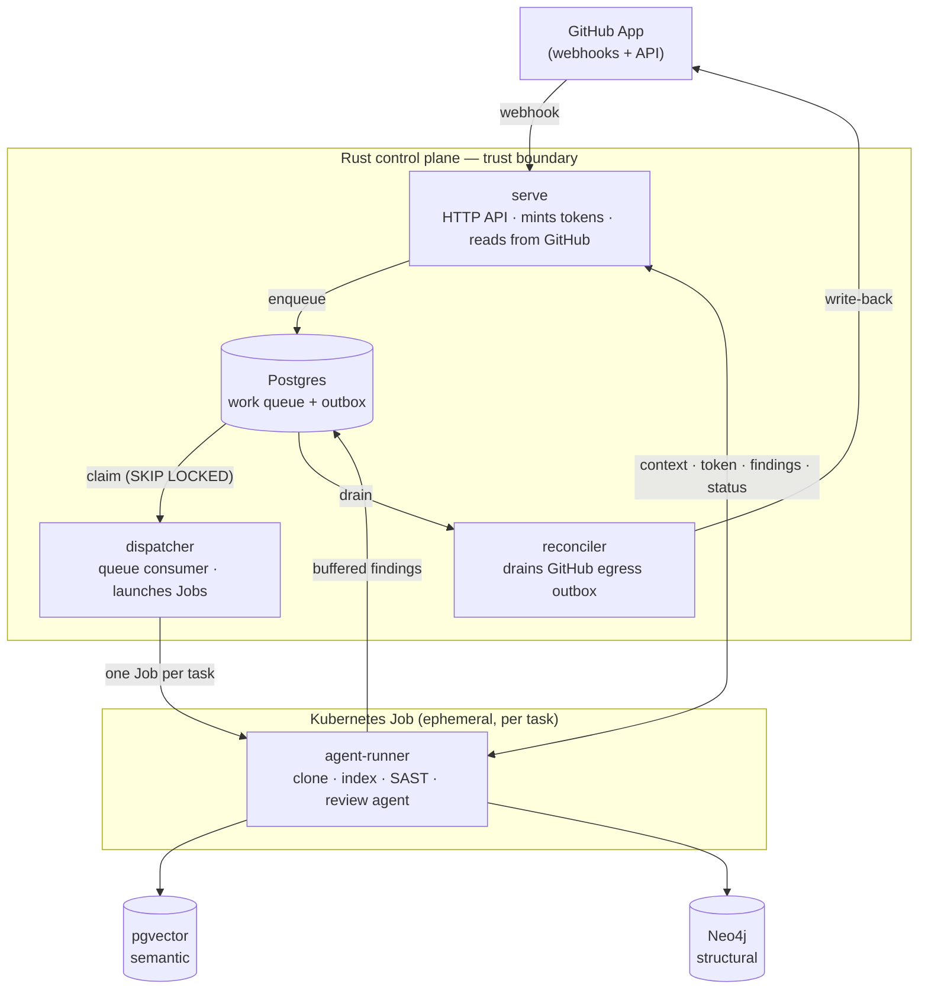

# Executive summary

**Lightbridge Code Intelligence** is a GitHub App for **intelligent code review and repository
Q&A**. It listens for GitHub webhooks, records each unit of work in a Rust control plane, and runs
the heavy lifting in isolated, short-lived Kubernetes Jobs. Reviews are **repository-aware**: they
draw on two complementary indexes — a Neo4j knowledge graph (structure) and pgvector (semantics) —
so the agent reasons about a change in the context of the whole codebase, not just the diff.

The system is **shipped and running in production**. The end-to-end path — webhook → work queue →
per-task Job → dual index → review → validated write-back — is live, alongside an admin/governance
web console.

## What it does

- **Reviews pull requests.** On every opened PR it posts a fast, deterministic-plus-light review;
  on a maintainer `@mention` it runs a deep, repo-aware review.
- **Answers questions.** A maintainer can `@mention` the App on an issue for a conversational,
  repo-grounded answer.
- **Indexes repositories.** Once a repo is approved, Lightbridge clones the default branch and
  builds the graph + vector indexes that all reviews draw on, re-indexing on default-branch pushes.

## How it works

1. **Webhook in.** A GitHub event (PR opened, `@mention`) hits the control plane, which enqueues an
   idempotent task in Postgres.
2. **Dispatch.** The `dispatcher` role claims the next task under a lease (`SELECT … SKIP LOCKED`)
   and launches **one Kubernetes Job per task** ([ADR-0004](adr/0004-one-k8s-job-per-task.md)).
3. **Work in isolation.** The `agent-runner` Job bootstraps from the control plane — fetching its
   task context and a **short-lived, installation-scoped GitHub token minted just-in-time** — then
   clones the repo, runs the indexers and SAST, and drives the review agent.
4. **Validated write-back.** The agent only *proposes* findings; the control plane validates every
   finding against the diff and is the single owner of what reaches the PR
   ([ADR-0056](adr/0056-control-plane-owns-the-posted-output.md)). All GitHub writes drain through
   one outbox owned by the `reconciler` role ([ADR-0059](adr/0059-reconciler-owns-all-github-egress.md)).

### Why two indexes

A good review needs two different kinds of recall, and no single store does both well
([ADR-0003](adr/0003-dual-retrieval-neo4j-pgvector.md)):

| | tree-sitter chunks → **pgvector** | Graphify → **Neo4j** |
|---|---|---|
| Kind of recall | **Semantic** (vector similarity) | **Structural** (graph traversal) |
| Answers | "where is similar code/behaviour?" | "what calls this? what does this PR touch?" |

Both run in the **same Job over the same checkout** ([ADR-0010](adr/0010-graphify-treesitter-indexing-baseline.md),
[ADR-0019](adr/0019-graphify-cli-structural-graph.md)). Embeddings are produced through an
OpenAI-compatible internal gateway ([ADR-0018](adr/0018-openai-compatible-embeddings.md)). Reviews
**reuse the base index** rather than re-indexing each time
([ADR-0025](adr/0025-review-reuses-base-index.md)), pinned to the latest indexed snapshot
([ADR-0050](adr/0050-retrieval-pins-to-latest-indexed-snapshot.md)).

## The review agent

The reviewer is a **native, in-process Rust loop** that calls an LLM with structured tool calling
([ADR-0026](adr/0026-native-review-agent.md)). It acts only through **mediated tools** — it proposes
findings and the control plane validates them at a tool boundary, never by scraping free text
([ADR-0037](adr/0037-agent-acts-via-mediated-tools.md)). It runs against a **single configured
model** with retry/backoff resilience (no fallback model;
[ADR-0053](adr/0053-remove-review-fallback-model.md)). Findings are verified/refuted before posting,
the full diff is covered, prior findings are read on re-review, and the agent's reasoning is
captured for observability.

### Two-tier review

Running the full heavyweight loop on every PR is too slow and too costly for the signal most PRs
need, so review is split into two tiers keyed solely by the trigger
([ADR-0062](adr/0062-two-tier-review-fast-auto-deep-on-demand.md)). The tier is carried on the task
(a `tier` column, default `deep`).

| | **Fast tier** | **Deep tier** |
|---|---|---|
| Trigger | automatic, on `pull_request opened` | manual, on any `@mention` |
| Backbone | **SAST** (deterministic) + a lean diff-only LLM pass (short turn cap) | full graph + vector retrieval, multi-turn |
| Retrieval | none (no retrieval tools registered) | full |
| Tools offered | a small per-tier allowlist (`add_review_comment`, `finish`, `abort`) | the full surface |
| Target | ≲ 2 min | async; long ceiling (2h acceptable) |

The fast tier turns the SAST findings plus the raw diff into a human-readable verdict and a cheap
sanity check; the deep tier delivers the full repo-aware review (or, on an issue, a conversational
answer). Each tier has an **independent config block** — its own model, prompt, reasoning budget,
and timeout — tuned by operators in deployment values; the model is **operator-tuned and changes
over time**, so it is never hardcoded. The fast tier uses a dedicated lean prompt that claims only
what the diff proves (raising unverifiable concerns as low-priority questions rather than
high-severity findings).

### Deterministic SAST

Static analysis ([opengrep](https://github.com/opengrep/opengrep)) runs in the Job, scoped to the
PR's changed files ([ADR-0061](adr/0061-sast-deterministic-finding-source.md)). Its findings ride
the **existing review channel** — there is no second poster — and are **LLM-aware but never
LLM-gated**: the agent sees a digest so it does not duplicate them, but a deterministic finding is
posted on its own merit. It is the backbone of the fast tier and a complement to the deep tier.

## Deployment

Lightbridge is delivered by **GitOps continuous delivery**: merging to the deployment repos' main
branch goes live. A generic Helm chart carries the application shape, while per-environment values
hold the specifics; argocd-image-updater promotes new image tags. Two physical clusters are involved
— ArgoCD runs on one, the Lightbridge workloads on another — with each task's Job running in a
dedicated agents namespace (see [kubernetes deployment](kubernetes-deployment.md)). Configuration is
file-based: ConfigMaps mount the control-plane, agent, and review-system prompt files (plus a
dedicated fast-tier prompt), with strict schema validation forcing an ordered, three-repo deploy
(runner image → chart → values).

## Security and governance

- **Trust boundary in Rust.** The control plane holds the GitHub App private key and mints
  short-lived, per-task installation tokens — the App key never reaches a Job
  ([ADR-0002](adr/0002-rust-control-plane-trust-boundary.md)). The `serve` role keeps the App key
  for **reads only**; all writes flow through the reconciler's outbox.
- **Isolation.** Each task is a disposable Kubernetes Job
  ([ADR-0004](adr/0004-one-k8s-job-per-task.md)).
- **Standards-based auth.** The web console authenticates via **Keycloak OIDC**
  ([ADR-0014](adr/0014-keycloak-oidc-resource-server.md)); access is **permission-based, per
  capability, and fail-closed** ([ADR-0023](adr/0023-db-backed-rbac.md)).
- **AI governance.** Lightbridge adopts the ADORSYS-GIS **AI Governance** framework
  ([ADR-0008](adr/0008-adopt-ai-governance-framework.md)): a shared Definition of Ready/Done, AI
  usage declarations, and an enforced PR gate. The doctrine is summed up in the repo's stance — *AI
  may accelerate the work, but humans own intent, verification, and consequences; AI output is
  reviewed as untrusted.*

## Roadmap

Architecture decisions are recorded as immutable [ADRs](adr/README.md); larger forward-looking
designs live as [RFCs](rfc/README.md). Notable in-flight direction: **incremental / layered
indexing** ([RFC-0002](rfc/0002-incremental-layered-indexing.md)) to avoid full re-indexes, and continued
hardening of horizontal scaling ([RFC-0001](rfc/0001-horizontally-scalable-control-plane.md)).

For the full picture, see the [documentation index](INDEX.md), the [architecture overview](architecture.md),
and [jobs and lifecycle](jobs-and-lifecycle.md).
