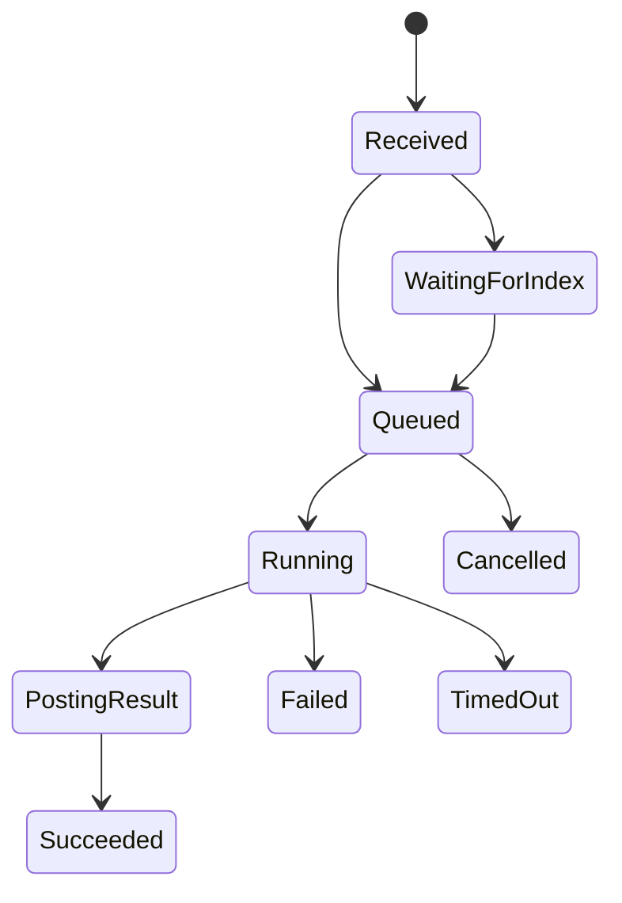

# GitHub App and Rust Control Plane

## GitHub App configuration

### Recommended repository permissions

| Permission | Level | Why |
|---|---|---|
| Metadata | Read | Basic repository context |
| Contents | Read | Clone/fetch and read repository content |
| Pull requests | Read/Write | Read PRs and post reviews/comments |
| Issues | Read/Write | Read/write issue comments |
| Checks | Read/Write | Create check runs later |
| Commit statuses | Read/Write | Optional lightweight status reporting |

> If Lightbridge ever needs to edit workflow files, add `Workflows` only at that time.

See [ADR-0001](adr/0001-use-github-app.md) for why a GitHub App is preferred over a PAT-backed bot.

### Recommended webhook subscriptions

- `installation`
- `installation_repositories`
- `issue_comment`
- `pull_request`
- `pull_request_review`
- `pull_request_review_comment`
- `pull_request_review_thread`
- optionally `check_suite` and `check_run`

## Webhook endpoint contract

### Route layout

| Method | Path | Purpose |
|---|---|---|
| `POST` | `/github/webhook` | GitHub webhook receiver |
| `GET` | `/healthz` | Liveness |
| `GET` | `/readyz` | Readiness |
| `GET` | `/metrics` | Prometheus/OTel-compatible export |
| `POST` | `/internal/tasks/{id}/cancel` | Internal admin action |
| `POST` | `/internal/repos/{id}/reindex` | Internal admin action |
| `GET` | `/me` | Returns the caller's verified identity claims (first authenticated endpoint) |

> The control plane is a pure OAuth2 **resource server**: it issues no tokens and stores no users.
> Protected endpoints (e.g. `GET /me`) require a **Bearer access token** issued by the OIDC provider
> (Keycloak), validated as an RS256 JWT against the provider's **JWKS** (`iss` / `aud` / `exp`).
> This is authentication only and is distinct from gateway authorization (Envoy/Authorino +
> `lightbridge-authz`). See [ADR-0014](adr/0014-keycloak-oidc-resource-server.md).

## Idempotency model

Use `X-GitHub-Delivery` as the natural deduplication key and persist the raw payload before
creating downstream tasks.

Rules:
- first write `github_deliveries`
- if duplicate delivery ID already exists, return 202 and do nothing
- create at most one task per normalized command + target + head SHA
- allow explicit re-run commands to create a new task version

## Secrets handling

- verify GitHub webhook signatures with the webhook secret
- store GitHub App private key and webhook secret in Kubernetes Secrets
- mint installation access tokens per task
- never hand the private key into the agent pod
- prefer short-lived installation tokens over long-lived credentials
- unspecified refresh buffer: **no specific constraint**

## Sample webhook handling in Rust

```rust
use axum::{extract::State, http::HeaderMap, response::IntoResponse};
use hmac::{Hmac, Mac};
use sha2::Sha256;

type HmacSha256 = Hmac<Sha256>;

pub async fn github_webhook(
    State(app): State<AppState>,
    headers: HeaderMap,
    body: bytes::Bytes,
) -> impl IntoResponse {
    let signature = headers
        .get("X-Hub-Signature-256")
        .and_then(|v| v.to_str().ok())
        .unwrap_or("");

    if !verify_signature(app.config.github_webhook_secret.as_bytes(), &body, signature) {
        return (axum::http::StatusCode::UNAUTHORIZED, "invalid signature");
    }

    let event = headers
        .get("X-GitHub-Event")
        .and_then(|v| v.to_str().ok())
        .unwrap_or("");

    let delivery_id = headers
        .get("X-GitHub-Delivery")
        .and_then(|v| v.to_str().ok())
        .unwrap_or("");

    if app.delivery_repo.exists(delivery_id).await.unwrap_or(false) {
        return (axum::http::StatusCode::ACCEPTED, "duplicate delivery");
    }

    app.delivery_repo.store(delivery_id, event, &body).await.unwrap();
    app.task_router.route(event, &body).await.unwrap();

    (axum::http::StatusCode::ACCEPTED, "accepted")
}

fn verify_signature(secret: &[u8], body: &[u8], signature: &str) -> bool {
    let mut mac = HmacSha256::new_from_slice(secret).expect("hmac key");
    mac.update(body);
    let expected = format!("sha256={}", hex::encode(mac.finalize().into_bytes()));
    subtle::ConstantTimeEq::constant_time_eq(expected.as_bytes(), signature.as_bytes()).into()
}
```

## Sample payload shape handling

```rust
#[derive(Debug, serde::Deserialize)]
pub struct IssueCommentEvent {
    pub action: String,
    pub installation: Option<InstallationRef>,
    pub repository: RepositoryRef,
    pub issue: IssueRef,
    pub comment: CommentRef,
    pub sender: UserRef,
}

#[derive(Debug, serde::Deserialize)]
pub struct InstallationRef {
    pub id: i64,
}

#[derive(Debug, serde::Deserialize)]
pub struct RepositoryRef {
    pub id: i64,
    pub full_name: String,
    pub default_branch: String,
}

#[derive(Debug, serde::Deserialize)]
pub struct IssueRef {
    pub number: i64,
    pub pull_request: Option<serde_json::Value>,
}

#[derive(Debug, serde::Deserialize)]
pub struct CommentRef {
    pub id: i64,
    pub body: String,
}
```

## Task lifecycle



## Review-posting rule

The OpenCode job never posts directly to GitHub. It returns a structured payload. The control
plane validates:
- file exists in target diff
- line number still matches
- no duplicate finding exists
- comment body passes size and policy checks
- write mode permitted for trust level

This separation — the agent proposes, the control plane disposes — is recorded in
[ADR-0002](adr/0002-rust-control-plane-trust-boundary.md).
