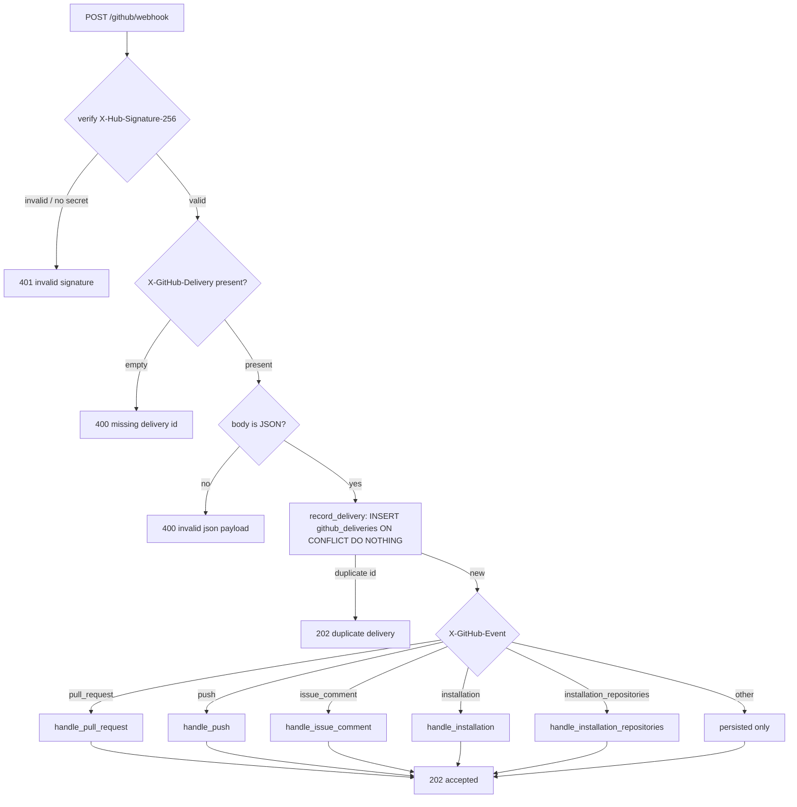
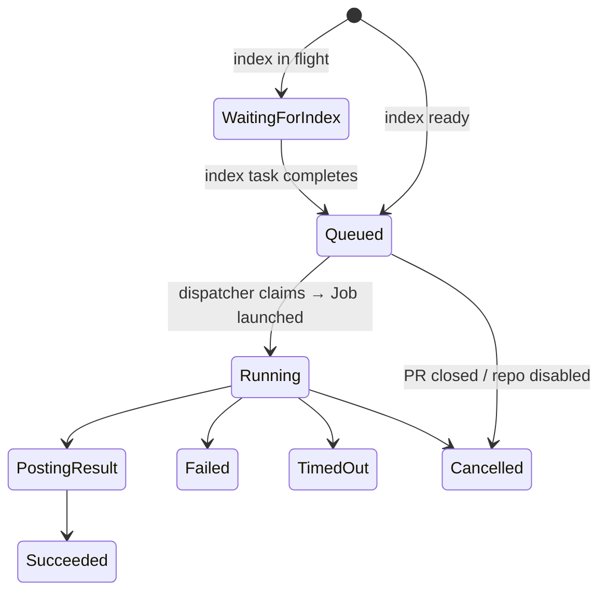

# GitHub App and control plane

The GitHub App is the **only** way work enters Lightbridge. Every PR review, re-review, issue
answer, and re-index starts as a webhook delivery to the Rust control plane, which verifies the
signature, persists the delivery, and turns a handful of event types into rows in the `tasks`
table. Everything downstream (dispatch → agent Job → posting) reads from those rows.

This document covers the inbound edge: the App configuration, the webhook receiver
(`services/control-plane/src/http/webhook.rs`), signature verification, the app-handle / mention
parsing, delivery persistence (`record_delivery`), and how each event becomes a task
(`create_task` / `create_explicit_task` / `create_index_task` in `services/control-plane/src/db.rs`).

See [ADR-0001](adr/0001-use-github-app.md) for why a GitHub App (not a PAT bot), and
[ADR-0002](adr/0002-rust-control-plane-trust-boundary.md) for the trust boundary.

## GitHub App configuration

### Repository permissions

| Permission | Level | Why |
|---|---|---|
| Metadata | Read | Basic repository context |
| Contents | Read | Clone/fetch for indexing and diff scoping |
| Pull requests | Read/Write | Read PRs; post reviews and inline comments |
| Issues | Read/Write | Read/write issue comments (the `@mention` answer path) |
| Checks | Read/Write | Optional check-run reporting |
| Commit statuses | Read/Write | Optional lightweight status reporting |

The control plane never hands the App private key to an agent pod; reads use the App key directly
(serve role), and all **writes** are minted as short-lived installation tokens by the reconciler
(see [Egress](#egress-roles-and-the-outbox)).

### Webhook subscriptions

The receiver acts on exactly five event types; everything else is persisted only.

| Event | Acted on because |
|---|---|
| `pull_request` | `opened` → automatic **fast** review; `closed` → cancel the PR's active tasks |
| `push` | a push to the **default branch** re-indexes the repo (keeps the base index fresh) |
| `issue_comment` | a `created` comment that leads with `@<handle>` → **deep** re-review / issue answer |
| `installation` | `created` registers the installed repos as pending; `deleted` disables + purges them |
| `installation_repositories` | repos added → pending; removed → disabled + purged |

`pull_request_review*` and `check_*` may be subscribed but are currently persisted without action.
A push subscription is **required for index freshness**: without it the base index only ever runs
once (on admin approval) and goes stale, so retrieval returns 0 hits on new code
([ADR-0050](adr/0050-retrieval-pins-to-latest-indexed-snapshot.md)).

## Webhook endpoint contract

### Routes (serve role)

Wired in `services/control-plane/src/main.rs`:

| Method | Path | Purpose |
|---|---|---|
| `POST` | `/github/webhook` | GitHub webhook receiver |
| `GET`  | `/healthz` | Liveness |
| `GET`  | `/readyz`  | Readiness (requires a DB ping unless `ALLOW_NO_DB`) |
| `GET`  | `/metrics` | Prometheus export |
| `GET`  | `/me` | Caller's verified OIDC claims (first authenticated endpoint) |
| `GET`  | `/tasks`, `/tasks/{id}`, `/tasks/{id}/review`, … | Dashboard task APIs |
| `POST` | `/admin/repositories/{id}/approve` \| `/deny` | Approval gate (Epic #75) |
| `POST` | `/internal/tasks/{id}/...` | Mediated agent tools (runner-token auth) |

The control plane is a pure OAuth2 **resource server**: protected endpoints require a Bearer access
token issued by Keycloak, validated as an RS256 JWT against the provider JWKS
([ADR-0014](adr/0014-keycloak-oidc-resource-server.md)); per-capability authorization derives from a
token claim, fail-closed ([ADR-0023](adr/0023-db-backed-rbac.md)). The `/github/webhook` route is
authenticated by **HMAC signature**, not a JWT.

## Receiving a webhook

`github_webhook` (`services/control-plane/src/http/webhook.rs`) runs a fixed pipeline. It is built
to return inside GitHub's ~10s delivery deadline, so anything that calls out to GitHub is spawned.



### 1. Signature verification

`verify_signature` does a constant-time HMAC-SHA256 over the **raw body** with the
`GITHUB_WEBHOOK_SECRET` and compares it to the `X-Hub-Signature-256` header
(`sha256=<hex>`). Two fail-closed properties matter:

- An **unset/empty secret rejects everything** (`if secret.is_empty() { return false }`) rather than
  accepting all traffic.
- Comparison uses `subtle::ConstantTimeEq` to avoid a timing oracle on the digest.

A failure increments a `webhook_signature_failure` metric, logs a warning, and returns
`401 invalid signature`. The secret lives in `AppState.github_webhook_secret`, read from the env at
startup (`services/control-plane/src/main.rs`).

### 2. Delivery id and JSON parse

The handler reads `X-GitHub-Delivery` (empty → `400 missing delivery id`) and parses the body as
JSON up front. A non-JSON body is rejected `400` and is **never persisted** — `record_delivery`
stores a real JSON value, never `null`.

### 3. Delivery persistence and dedup (`record_delivery`)

`record_delivery` (`services/control-plane/src/db.rs`) is the exactly-once guard. GitHub retries
deliveries, so dedup and persistence are one atomic statement keyed on the delivery id:

```sql
INSERT INTO github_deliveries (delivery_id, event_name, payload_json)
VALUES ($1, $2, $3) ON CONFLICT (delivery_id) DO NOTHING
```

It returns `rows_affected() > 0` — `true` for a first-seen delivery, `false` for a replay. A replay
short-circuits to `202 duplicate delivery` (and a `webhook_duplicate` metric) **before** any task
routing, so a redelivered webhook can never create a second task. Without a database (dev,
`ALLOW_NO_DB`) the same `is_new` boolean comes from an in-memory `HashSet` instead — single-replica
only.

A first-seen delivery increments `webhook_delivery(event)` and proceeds to routing. Routing only
runs when a database is configured (`state.db.is_some()`); the in-memory dev path persists/dedups
but does not create tasks.

## The app handle and mention parsing

The app's mention handle comes from `GITHUB_APP_HANDLE` (default `lightbridge-assistant`), held in
`AppState.app_handle` (`services/control-plane/src/main.rs`).

A comment is a command to us only when its **first non-space text is `@<handle>`**
(case-insensitive). `mentions_handle` enforces "the mention must lead":

- `@lightbridge-assistant please review` → command
- `  @Lightbridge-Assistant rerun` → command (leading space + case-insensitive)
- `cc @lightbridge-assistant` → **not** a command (mid-sentence reference)

When the comment is ours, `command_from_comment` carries the **whole** comment body (trimmed,
capped at `MAX_INSTRUCTION_CHARS = 2000`) into the task — the handle is **not** stripped (#138). The
agent knows its own name from the system prompt, so it interprets the full request — including
co-mentions like `@<handle> & /gemini please review this` that handle-stripping used to mangle. The
free text only steers reasoning; write-back is still diff-validated.

## Webhook → task: the per-event handlers

### `pull_request` → fast review or cancel (`handle_pull_request`)

Only `opened` and `closed` do anything (`synchronize`/`reopened` are ignored — a re-review is an
`@mention`). The repo is upserted (`upsert_repository`), recording the `installation.id` so the
index-on-approve path can later mint a clone token.

- **`opened`** — passes the **approval gate** (`approved_or_skip`; Epic #75) then creates a task with
  `command_text = "review"`, `run_epoch = 0`, and **`tier = "fast"`**. This is the automatic first
  review: SAST + a lean diff-only LLM pass, no retrieval, short turn cap (≤5 turns)
  ([ADR-0062](adr/0062-two-tier-review-fast-auto-deep-on-demand.md)). It goes through `create_task`,
  the **content-idempotent** path.
- **`closed`** — `cancel_active_tasks_for_pr` moves the PR's `queued`/`running`/`posting_result`
  tasks to `cancelled`; the reaper then stops their Jobs (the serve role has no Kubernetes client —
  trust boundary).

### `push` → re-index (`handle_push`)

Re-indexes when the **default branch** moves (e.g. a merged PR), keeping the semantic + graph index
fresh. Guards, in order:

1. skip branch/tag **deletions** (`payload.deleted == true`) — no commits to index;
2. only when `ref == refs/heads/<default_branch>` (feature/PR-branch pushes don't change the base
   index);
3. only **approved** repos (`approved_or_skip`, fail-closed);
4. `create_index_task` dedups against an in-flight index, so a burst of pushes collapses to one
   re-index.

`create_index_task` inserts a `command_text = 'index'`, `target_type = 'repository'` task guarded by
`WHERE NOT EXISTS (… index task in queued/running/posting_result …)`; it computes the next
`run_epoch` in the same statement and treats a concurrent unique-violation as a benign dedup
(returns `None`).

### `issue_comment` → deep re-review or issue answer (`handle_issue_comment`)

Only `created` comments that pass `mentions_handle`. The target type is decided by the payload:

- a **PR thread** carries an `issue.pull_request` object → `target_type = "pull_request"`: a
  diff-scoped re-review. The comment payload omits the SHAs, so the handler mints an installation
  token and fetches the PR's base/head SHAs (`pull_request_shas`).
- a **plain issue** → `target_type = "issue"`: no diff, so the agent answers against the default
  branch and finalize posts a single reply ([ADR-0033](adr/0033-inbound-command-parsing-and-run-kinds.md)).

After the approval gate, it builds a task with the full comment as `command_text` and
**`tier = "deep"`** (full retrieval, multi-turn, long timeout — [ADR-0062](adr/0062-two-tier-review-fast-auto-deep-on-demand.md)),
then inserts it via `create_explicit_task`.

An `@mention` is an explicit human command, so it **always** lands a task — it is **not**
content-deduped. True redeliveries are already collapsed upstream by the `github_deliveries`
PRIMARY KEY, so content-idempotency here would only drop legitimate re-requests (e.g. the same
wording on an unchanged head). `create_explicit_task` folds the next `run_epoch` into the INSERT
(`COALESCE(MAX(run_epoch), -1) + 1` over the natural key minus `run_epoch`) and **retries on the
`23505` unique violation** (bounded, 5 attempts) so concurrent mentions each land a fresh
non-colliding epoch.

### `installation` / `installation_repositories` → registration & purge

- `installation created` and `installation_repositories.repositories_added` →
  `register_pending` inserts each repo as **pending** approval (insert-only, so an already-approved
  repo is untouched), recording `installation_id` for index-on-approve. Repos start pending; nothing
  reviews or indexes until an admin approves (Epic #75).
- `installation deleted` and `…repositories_removed` → `disable_repos` marks each repo `disabled`
  and **spawns** an index purge (`queue::lifecycle::spawn_purge`: cancel in-flight tasks + delete
  `code_chunks` / Neo4j graph). The purge is spawned so it can't block the webhook deadline.

The installation payload's repo objects use `full_name` ("owner/name") and carry no
`default_branch`; `register_pending` stores a placeholder branch that the first PR/push webhook
fills in.

## Task creation: the three paths

| Path | Used by | Idempotency | Epoch |
|---|---|---|---|
| `create_task` | auto `pull_request opened`, `tier=fast` | `ON CONFLICT (repository_id, target_type, target_id, command_text, head_sha, run_epoch) DO NOTHING` → returns `None` on collision | passed in (`0`) |
| `create_explicit_task` | `@mention`, `tier=deep` | always inserts; retries `23505` | computed in INSERT |
| `create_index_task` | default-branch push, `index` | `WHERE NOT EXISTS (in-flight index)` | computed in INSERT |

All three set the initial status via `INITIAL_TASK_STATUS_SQL`: a non-`index` task starts
`waiting_for_index` when an `index` task is in flight for the same repo (so it isn't claimed against
a half-written snapshot — [ADR-0055](adr/0055-review-waits-for-index-readiness.md)); otherwise it
starts `queued` and notifies the dispatcher over `pg_notify(TASK_QUEUED_CHANNEL)`. A `NewTask`
carries `repository_id`, `installation_id`, `github_delivery_id`, `target_type`/`target_id`,
`command_text`, `base_sha`/`head_sha`, `run_epoch`, and `tier`.

On a real insert (any review path), the handler **spawns** `react_seen` — a best-effort 👀 reaction
on the PR — so the GitHub round-trip can't block the webhook. The reaction is **enqueued to the
egress outbox**, not posted inline.

## Egress: roles and the outbox

The control plane runs as three roles ([ADR-0058](adr/0058-rename-poller-role-to-reconciler.md)):
**serve** (HTTP, webhooks, reads via the App key), **dispatcher** (claims `queued` tasks → launches
one Kubernetes Job per task), and **reconciler**. **All GitHub writes flow through a single
`github_outbox` drained by the reconciler** ([ADR-0059](adr/0059-reconciler-owns-all-github-egress.md));
serve never posts. So a webhook-triggered 👀, and the eventual review, are both rows the reconciler
delivers (near-instant via a NOTIFY).

A run that posts a PR review uses a single output channel: buffered `add_comment` replies are
dropped in favor of one review ([ADR-0056](adr/0056-control-plane-owns-the-posted-output.md)). The
agent proposes; the control plane disposes — it validates the diff coverage and finding placement
before anything reaches GitHub ([ADR-0002](adr/0002-rust-control-plane-trust-boundary.md)).

## Task lifecycle (summary)



See [jobs-and-lifecycle.md](jobs-and-lifecycle.md) for dispatch, leasing, and the reaper.
