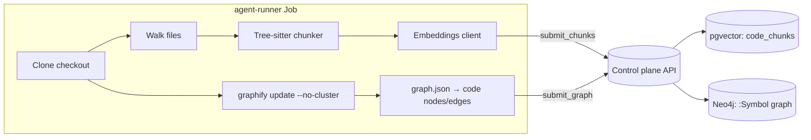

# Indexing and storage

How Lightbridge turns a checkout into the two retrieval surfaces a review reads: a **structural
graph** in Neo4j and a **semantic chunk store** in pgvector. The pipeline runs inside the
agent-runner Job; the control plane owns both datastores (the runner has no direct DB access and
submits everything over the internal API).

> **Dual retrieval, two stores.** Neo4j answers "what relates to what" (symbols, containment, calls);
> pgvector answers "what reads like this" (cosine-nearest chunks). They are complementary, not
> interchangeable — see [ADR-0003](adr/0003-dual-retrieval-neo4j-pgvector.md).

## Who builds what



Two independent indexers run in the same task:

- **Semantic** — our own tree-sitter chunker embeds each chunk and submits batches to the control
  plane, which upserts `code_chunks` rows (pgvector). Code: `services/agent-runner/src/indexer/mod.rs`,
  `services/agent-runner/src/indexer/chunker.rs`, `services/agent-runner/src/indexer/embeddings.rs`.
- **Structural** — Graphify (a bundled multi-grammar AST→graph extractor) emits `graph.json`; the
  runner keeps only the **code** nodes/edges and submits them; the control plane writes Neo4j. Code:
  `services/agent-runner/src/indexer/graph.rs`, `services/control-plane/src/integrations/neo4j.rs`.

The structural pass is **best-effort**: it runs after the semantic pass, and a Graphify failure (or
an unconfigured graph store returning 503) is logged, not fatal — the task still succeeds with a
populated pgvector index (`services/agent-runner/src/main.rs`).

## When indexing runs (and when it is skipped)

```rust
// services/agent-runner/src/main.rs
let needs_index = context.command == "index" || !context.repo_indexed;
```

- A standalone **`index`** task (target_type `repository`) — enqueued on admin approval and on every
  default-branch push.
- A review on a **cold** repo (no base index yet) — indexes first, then reviews.
- A review on an **already-indexed** repo — **reuses the base index** ([ADR-0025](adr/0025-review-reuses-base-index.md)).
  It searches related code via the retrieval tools and already carries the PR diff in its prompt, so
  the costly full re-index is skipped. (Skipping it is why a review no longer takes as long as an
  index every time.)

### Re-index on default-branch push

The base index is kept fresh on the default branch. `handle_push`
(`services/control-plane/src/http/webhook.rs`) ignores branch/tag deletions and any ref that is not
`refs/heads/<default_branch>`, applies the approval gate, then calls `create_index_task`. Each push
enqueues a fresh `index` task; `create_index_task` (`services/control-plane/src/db.rs`) skips when one
is already in flight so a burst of pushes doesn't pile up duplicates.

> `index` tasks share an idempotency tuple `(repo, 'repository', repo, 'index', NULL head_sha,
> run_epoch)` under a `NULLS NOT DISTINCT` unique index, so `run_epoch` is computed as
> `COALESCE(MAX(run_epoch), -1) + 1` over those columns. Hardcoding `run_epoch = 0` was a real bug —
> the *second* index for a repo collided with the first and was silently dropped.

## Semantic index (pgvector)

### Chunking — `chunker.rs`

Syntax-aware first, windowed fallback second ([ADR-0010](adr/0010-graphify-treesitter-indexing-baseline.md)).

- For languages we ship a grammar for — **Rust, TypeScript, JavaScript, Python** (`language::has_grammar`)
  — tree-sitter walks the full tree and extracts named items. The recursion descends into `impl`/class
  bodies so methods are independently indexed. Captured node kinds → `chunk_type`:
  - Rust: `function`, `impl`, `struct`, `enum`, `trait`, `module`, `type`
  - TS/JS: `function` (declarations, expressions, arrow fns), `class`, `method`
  - Python: `function`, `class`, decorated definitions
- Tree-sitter is **error-tolerant**: the chunker deliberately does *not* bail on `root.has_error()`,
  so one bad expression doesn't dump an entire file into the windowed fallback.
- A structured chunk spanning more than `MAX_CHUNK_LINES` (150) is split by recursing into interesting
  children; a large leaf with no nested items (e.g. a 200-line function) is emitted as one chunk and
  the embedding API truncates if needed.
- **Fallback** (`window_chunks`): everything else — `text`/markdown/config files, and grammar-less
  languages — gets fixed line windows (`WINDOW_SIZE` 100, `WINDOW_STEP` 50, so 50-line overlap),
  `chunk_type` `window`.

Guards: binary content (a null byte in the first 512 bytes) is skipped; files over 5 MiB are skipped;
`.git`, `node_modules`, `target`, `.next`, `dist`, `.venv`/`venv`, `__pycache__`, `build` directories
are pruned during the walk (`mod.rs`). Language detection is by extension only (`language.rs`).

Each `Chunk` carries `file_path` (forward-slashed, OS-independent), `language`, `chunk_type`,
optional `symbol_name`, `start_line`/`end_line`, and the raw `content`.

### Embeddings — `embeddings.rs`

An OpenAI-compatible client ([ADR-0018](adr/0018-openai-compatible-embeddings.md)) posting to
`POST {base}/v1/embeddings`. In production the base URL is the **eaig / core-gateway** (an Envoy AI
Gateway), the same endpoint LibreChat's RAG uses.

- **Model and dimension are operator-configured.** Live today: `qwen3-embedding-8b` at **4096 dims**
  (migration 0005), *not* the `text-embedding-3-small`/1536 the original ADR-0018 named — treat the
  model as deployment config, not a constant.
- **Batching** — `EMBED_BATCH_SIZE` = 32 chunks per round-trip, conservatively under the gateway's
  token-per-minute budget. Response order is not guaranteed, so vectors are re-sorted by the returned
  `index` field; a mismatched count is a hard error.
- **Reactive resilience** ([ADR-0039](adr/0039-agent-llm-resilience-and-observability.md)): retry only
  on transient failures (connect/timeout, HTTP 429, HTTP 5xx) — up to 3 times with exponential backoff
  capped at 8 s, honouring a 429's `Retry-After` over the computed backoff. A non-429 4xx (bad request,
  auth, unknown model) is deterministic and fails immediately with the body surfaced.
- **Rate-limit awareness** — reads the gateway's budget off response headers and soft-warns when low
  or limited (advisory; the budget is shared across runners).
- **TLS** — the gateway's internal HTTPS endpoint is signed by a private `ClusterIssuer/self-signed-ca`
  the default rustls roots don't trust. If `EMBEDDINGS_CA_CERT` is set, that CA PEM is *added to* the
  default roots; the Job mounts the CA and points the env at it.
- **Attribution** — per-request headers (epic #89) let the gateway bill the right project.

### Storage — `code_chunks` (`services/control-plane/src/db.rs`)

One row per chunk, keyed by snapshot. Schema (migration `0004_code_chunks.sql`, widened by
`0005_embedding_4096.sql`):

```sql
CREATE TABLE code_chunks (
    id            BIGSERIAL PRIMARY KEY,
    repository_id BIGINT  NOT NULL REFERENCES repositories (id) ON DELETE CASCADE,
    commit_sha    TEXT    NOT NULL,
    file_path     TEXT    NOT NULL,
    language      TEXT    NOT NULL,
    chunk_type    TEXT    NOT NULL,
    symbol_name   TEXT,
    start_line    INT     NOT NULL,
    end_line      INT     NOT NULL,
    content       TEXT    NOT NULL,
    embedding     vector(4096) NOT NULL,
    created_at    TIMESTAMPTZ  NOT NULL DEFAULT now(),
    UNIQUE (repository_id, commit_sha, file_path, start_line, end_line)
);
```

`upsert_code_chunks` writes a batch in one transaction; the embedding is rendered as a pgvector text
literal `[f0,f1,…]` (`vector_literal`) and cast server-side with `$N::vector` (no extra crate). The
`UNIQUE` key makes re-submitting a snapshot idempotent (`ON CONFLICT … DO UPDATE`).

#### No ANN index — exact cosine over a small scope

4096 dims exceeds pgvector's HNSW limit (2000 for `vector`, 4000 for `halfvec`), so migration 0005
**drops the HNSW index** and search is an **exact cosine scan**. That is fast because every query is
scoped to a single `(repository_id, commit_sha)` snapshot via `code_chunks_commit_idx`, a small
subset. `search_code_chunks` returns the `limit` nearest chunks by `embedding <=> $::vector`, scored
`1 - cosine_distance` in `[0,1]`. The scope is set by the control plane (the caller never picks it —
trust boundary).

#### Dimension guard

The pgvector column is fixed-width, so changing the embedding model's dimension is destructive.
`reconcile_embedding_dimension` runs at control-plane startup, reads the live width from
`pg_attribute.atttypmod`, and:

- no-ops if it already matches (or the column doesn't exist yet);
- if it differs and `embeddings.allow_reindex_on_dim_change` is **true**, atomically `TRUNCATE
  code_chunks` + `ALTER COLUMN embedding TYPE vector(N)` in one transaction (reindex from scratch);
- if the flag is **false**, **fails loud** — a config typo can't silently wipe the semantic index.

## Structural index (Neo4j)

### Extraction — `graph.rs`

Graphify is bundled into the runner image and spawned as **`graphify update <checkout> --no-cluster`**
— the AST-only, no-LLM path. (Not `graphify extract`, which runs a semantic-LLM pass over docs and
exits non-zero without an API key on any repo with markdown.) Provider API-key envs are stripped so a
stray key can't change behaviour or trigger paid calls. Output is forced to a private dir outside the
checkout via an **absolute** `GRAPHIFY_OUT` (a relative value would make Graphify write under the
checkout while the runner reads the sibling dir → graph silently skipped), keeping a repo's own
committed `graphify-out/graph.json` from being merged into ours.

The runner parses `graph.json` and keeps only **code** nodes — `file_type == "code"` and a
`source_file` present — dropping document/heading (markdown) and synthetic nodes. Edges (read from
`links`, with an `edges` alias for older output) are kept only when **both** endpoints survive the
code filter. Graphify encodes lines as `"L42"`, parsed to a 1-based integer. Graphify has no
embeddings; the semantic path stays entirely with our own chunker.

### Storage — `:Symbol` graph (`services/control-plane/src/integrations/neo4j.rs`)

`upsert_graph` writes per-row `MERGE` in a transaction, scoped by `(repo_id, commit)`:

```cypher
MERGE (s:Symbol {repo_id: $repo, commit: $commit, node_id: $id})
  SET s.label = $label, s.source_file = $file, s.start_line = $line;

MATCH (a:Symbol {repo_id: $repo, commit: $commit, node_id: $src})
MATCH (b:Symbol {repo_id: $repo, commit: $commit, node_id: $dst})
MERGE (a)-[r:REL {relation: $rel}]->(b);
```

Nodes are a generic `:Symbol`; edges a generic `[:REL {relation}]` — Cypher can't parameterize
labels/relationship types, so the kind lives in a property (batched `UNWIND` is a future optimization).
Retrieval mirrors the pgvector scoping: `search_symbols` does a substring match on label/`node_id`
within one snapshot; `callers_of` traverses `-[:REL {relation: 'calls'}]->` in reverse. Both pin to
`(repo_id, commit)` so a task only ever sees its own repo (trust boundary).

## Snapshot model, reuse, and pruning

A snapshot is a `(repository_id, commit_sha)` pair — one in pgvector (`code_chunks` rows), one in
Neo4j (`:Symbol` nodes for that `commit`). Every default-branch push writes a **full new snapshot** in
both stores.

### Retrieval pins to the latest snapshot

Reviews never index the PR head. `latest_indexed_commit`
([ADR-0050](adr/0050-retrieval-pins-to-latest-indexed-snapshot.md)) returns the most recently indexed
`commit_sha` for a repo (`ORDER BY created_at DESC, id DESC LIMIT 1`, backed by
`code_chunks_repo_recent_idx`, migration 0018). Both the index-skip decision and the retrieval scope
reference that same commit, so searches always run against a snapshot that **provably has chunks**.
Pinning to the PR head instead (the old behaviour) made every new head look "not indexed" (full
re-index per PR) *or*, with a naive "any rows?" check, returned zero hits at the head — a hollow index
that starved the agent.

### Pruning the rest

Nothing reaps old snapshots, so a busy repo would accumulate a full duplicate index per push in both
stores. The **index sweeper** (`services/control-plane/src/queue/index_sweeper.rs`, run periodically
by the dispatcher) keeps only the in-use snapshots and prunes the rest
([ADR-0052](adr/0052-index-snapshot-pruning.md)).

- Only repos holding more than one distinct `commit_sha` are considered (`repos_with_stale_snapshots`),
  so a steady-state repo costs one grouped count.
- **Keep-set** = the latest indexed commit ∪ every commit a non-terminal task pins (`in_use_commits`:
  any non-terminal task carrying a `head_sha`, e.g. an in-flight review).
- A repo is **skipped entirely while an `index` task is in flight** (`has_active_index_task`): the
  index task is the only thing *writing* a new snapshot, it carries a NULL `head_sha` (so
  `in_use_commits` can't protect the commit it's mid-writing), and the Neo4j graph has no recency
  grace. Deferring the prune one cycle is harmless.
- `prune_code_chunks` deletes rows whose `commit_sha ∉ keep`, **except** rows indexed in the last
  10 minutes (a recency grace, belt-and-suspenders over `in_use_commits`), and **no-ops on an empty
  keep-set** (never wipe a repo's whole index here). `neo4j::prune_graph` is the Neo4j half (delete
  `:Symbol` where `commit ∉ keep`, via `DETACH DELETE`).

Related lifecycle: a disabled/denied repo's index is fully purged (`delete_code_chunks_for_repo` plus
the graph delete); the purge reconciler re-runs against `list_disabled_repos_needing_purge` so a
cleanup lost to a restart still completes.

## Future direction — incremental / layered indexing

Today every default-branch push rebuilds the **whole** snapshot, and a PR reuses the base index with
no PR-specific overlay. [RFC-0002](rfc/0002-incremental-layered-indexing.md) proposes incremental,
layered indexing: a stable default-branch baseline plus a PR overlay keyed by `(base_sha, head_sha)`
that re-parses only changed files, updates graph edges only for affected symbols, and expires after
merge/close. The snapshot pruning above ([ADR-0052](adr/0052-index-snapshot-pruning.md)) is the first
piece of that RFC to land; the overlay model is not built yet.
