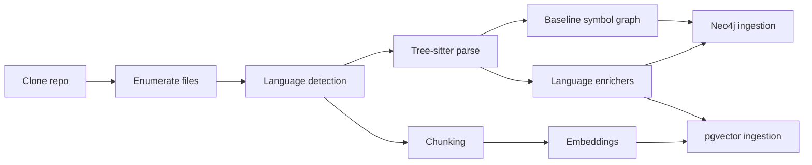

# Indexing and Storage

> **Current state vs design.** This document is partly aspirational. Today: embeddings are
> OpenAI-compatible and the **model/dimensions are configurable** (the live deployment uses a 4096-dim
> model over an internal gateway, not a 1536-dim one — [ADR-0018](adr/0018-openai-compatible-embeddings.md));
> the structural graph is extracted by **Graphify** and written by the control plane
> ([ADR-0019](adr/0019-graphify-cli-structural-graph.md)); pgvector currently runs **exact search (no
> ANN index)**; and a review **reuses the base index** rather than maintaining a PR overlay
> ([ADR-0025](adr/0025-review-reuses-base-index.md)) — the language enrichers, HNSW default, and
> incremental PR-overlay sections below are the intended direction, not all built yet.

## Indexing goals

The indexing pipeline builds two complementary views of the repository:

- a **structural graph** for symbols, containment, imports, calls, tests, and PR impact
- a **semantic chunk store** for natural-language and code retrieval

The baseline is Graphify + tree-sitter (syntax-aware parsing) with language enrichers layered on
top. See [ADR-0010](adr/0010-graphify-treesitter-indexing-baseline.md).

## Pipeline stages



## Tree-sitter baseline

Use tree-sitter for:
- file-level parseability
- symbol extraction
- syntax-aware chunk boundaries
- imports and declarations
- stable source ranges

Example query fragment:

```scheme
(
  function_item
    name: (identifier) @function.name
) @function.definition

(
  call_expression
    function: (identifier) @call.name
) @call.site
```

## Language enrichers

| Language | Enricher | Why |
|---|---|---|
| Rust | `cargo metadata`, rust-analyzer if available | crates, modules, traits, impls |
| TypeScript | tsserver / project graph | imports, symbols, references |
| Python | pyright or static import graph | rough symbol dependency resolution |
| Go | `gopls` | packages, references |
| Java | javac / LSP | types and call references |

## Chunking strategy

Chunk by semantic unit first, file windows second.

Preferred chunk order:
1. exported symbol body
2. internal symbol body
3. doc block adjacent to symbol
4. test block
5. config block
6. fallback windowed chunk for oversized files

Example metadata:

```json
{
  "chunk_type": "function",
  "path": "src/auth/session.rs",
  "symbol_name": "validate_session",
  "language": "rust",
  "start_line": 44,
  "end_line": 97,
  "tags": ["auth", "session", "validation"]
}
```

## Neo4j ingestion examples

```cypher
MERGE (r:Repository {repo_id: $repo_id})
  ON CREATE SET r.full_name = $full_name;

MERGE (f:File {repo_id: $repo_id, commit_sha: $commit_sha, path: $path})
  ON CREATE SET f.language = $language;

MERGE (s:Symbol {repo_id: $repo_id, commit_sha: $commit_sha, fqn: $fqn})
  ON CREATE SET s.kind = $kind, s.name = $name, s.start_line = $start_line, s.end_line = $end_line;

MERGE (f)-[:DEFINES]->(s);
```

```cypher
MATCH (caller:Symbol {repo_id: $repo_id, commit_sha: $commit_sha, fqn: $caller_fqn})
MATCH (callee:Symbol {repo_id: $repo_id, commit_sha: $commit_sha, fqn: $callee_fqn})
MERGE (caller)-[:CALLS]->(callee);
```

## Useful graph queries

```cypher
MATCH (s:Symbol {repo_id: $repo_id, commit_sha: $commit_sha, name: $name})
RETURN s
LIMIT 20;
```

```cypher
MATCH (s:Symbol {repo_id: $repo_id, commit_sha: $commit_sha, fqn: $fqn})<-[:CALLS]-(caller)
RETURN caller.fqn
LIMIT 100;
```

## pgvector ingestion

```sql
INSERT INTO code_chunks (
  repository_id,
  commit_sha,
  path,
  language,
  symbol_name,
  chunk_type,
  start_line,
  end_line,
  content,
  embedding,
  metadata_json
)
VALUES (
  $1, $2, $3, $4, $5, $6, $7, $8, $9, $10, $11::jsonb
);
```

## pgvector index choice

| Option | Best for | Tradeoff | Recommendation |
|---|---|---|---|
| Exact search | Small corpora, correctness-sensitive queries | Slower at scale | Keep for tests and debugging |
| HNSW | Read-heavy similarity search | Higher memory, slower build | Default |
| IVFFlat | Write-heavy or memory-sensitive workloads | Requires tuning and training-like setup | Secondary option |

Neo4j and pgvector are complementary, not interchangeable. See
[ADR-0003](adr/0003-dual-retrieval-neo4j-pgvector.md).

## pgvector query examples

```sql
SELECT id, path, start_line, end_line, 1 - (embedding <=> $1) AS score
FROM code_chunks
WHERE repository_id = $2
ORDER BY embedding <=> $1
LIMIT 10;
```

```sql
BEGIN;
SET LOCAL hnsw.ef_search = 100;

SELECT id, path, symbol_name
FROM code_chunks
WHERE repository_id = $1
  AND commit_sha = $2
ORDER BY embedding <=> $3
LIMIT 20;

COMMIT;
```

## Incremental indexing for PRs

Maintain:
- a stable default-branch baseline index
- a PR overlay index keyed by `base_sha` and `head_sha`

Overlay rules:
- parse changed files first
- compute touched symbols
- update graph edges only for affected files/symbols
- insert changed chunks under head SHA
- expire ephemeral overlays after merge or closure
