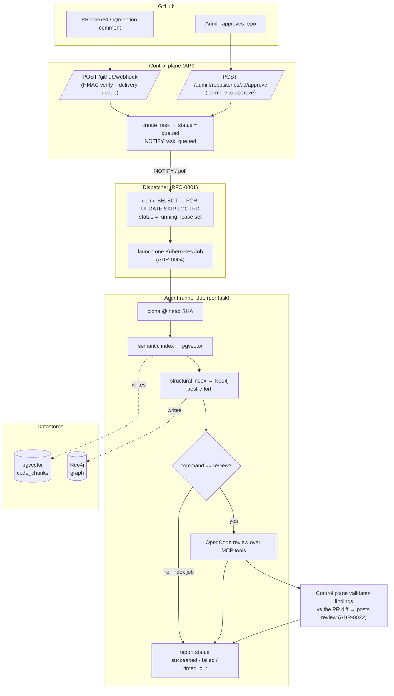
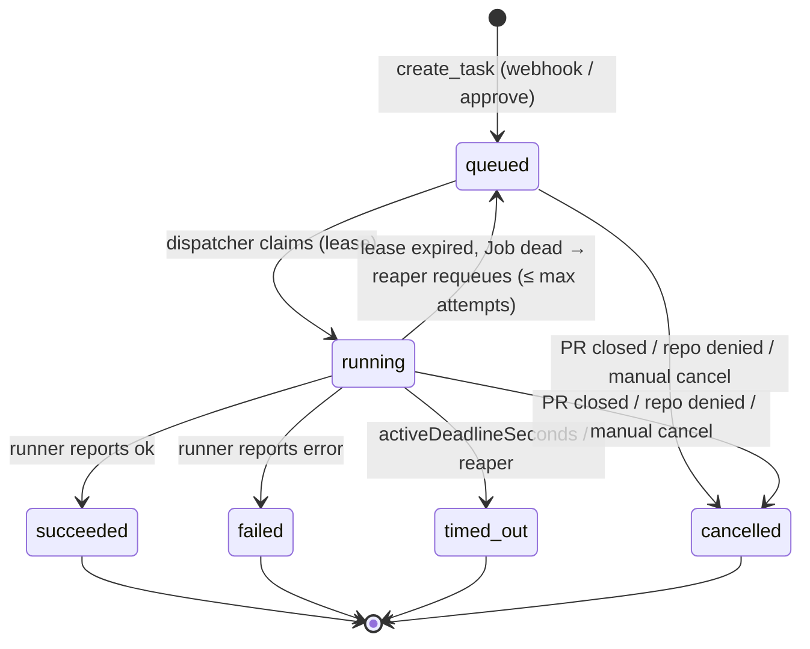
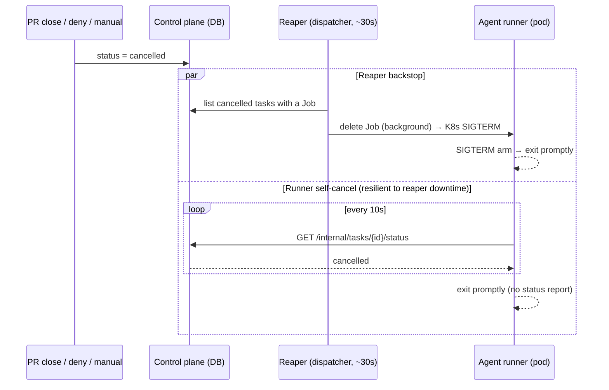

# Jobs and task lifecycle

How work flows through Lightbridge: what triggers a task, the two job kinds, the states a task moves
through, and how cancellation + data purge work. Diagrams are Mermaid (rendered by GitHub).

> Source of truth in code: `services/control-plane/src/{webhook,admin,dispatcher,reaper,lifecycle}.rs`
> and `services/agent-runner/src/main.rs`. ADR-0004 (one Job per task), RFC-0001 (queue + dispatcher
> + reaper), ADR-0023 (permission-based authz).

## The two job kinds

Every unit of work is a **task** the control plane records, the dispatcher claims, and a dedicated
**Kubernetes Job** executes (one Job per task, ADR-0004). There are two kinds, distinguished by the
task's `command` + `target_type`:

| Job | `command` | `target_type` | Triggered by |
|---|---|---|---|
| **Index** | `index` | `repository` | A repository is **approved** by an admin (`enqueue_index_on_approve`). Indexes the default branch. |
| **Review** | `review` | `pull_request` | A PR is **opened** (the automatic first review), or a PR comment **`@<app-handle> …`** requests a re-review. |

Other lifecycle events don't create tasks: PR `synchronize`/`reopened` do nothing (ask for a re-review
with an `@`-mention); PR `closed` **cancels** the PR's active tasks; repo removed/denied **purges** its
data (see below).

> ⚠️ **Both kinds run the same pipeline.** The agent runner's `run()` always does
> clone → semantic index (pgvector) → structural index (Neo4j) → *then* review. A **review job
> re-indexes the whole repo from scratch before reviewing** — the only thing an `index` job does
> differently is skip the final review step. This is why a review takes roughly as long as an index
> every time. See [Known inefficiency](#known-inefficiency-review-re-indexes-every-time).

## End-to-end flow

Notes:
- The runner holds **no GitHub App key**: it fetches a short-lived installation token + repo coords
  from `GET /internal/tasks/{id}` (shared-bearer `AGENT_RUNNER_TOKEN`), and the control plane is the
  only component that writes to GitHub (ADR-0002).
- Index/search go through the control plane's `/internal/tasks/{id}/{chunks,graph,search}` endpoints —
  the Job has no datastore credentials (ADR-0020).
- The review is **validated against the PR diff** by the control plane before write-back (ADR-0022);
  findings outside the diff are dropped or deferred.

## Task state machine

- Tasks are created directly as **`queued`**. (`received` and `waiting_for_index` exist in the model
  for the not-yet-built scheduler gate, RFC-0001 — not used by the current create path.)
- `posting_result` is a transient sub-state the runner may report while it writes the review back.
- The **reaper** (in the dispatcher, every ~30s) reconciles: it requeues a task whose lease expired
  but whose Job is dead (up to a max-attempts cap), and it deletes the Jobs of `cancelled` tasks.

## Cancellation

A task becomes `cancelled` three ways: a PR is **closed** (`cancel_active_tasks_for_pr`), a repo is
**removed/denied** (`cancel_active_tasks_for_repo`), or a user clicks **Cancel run** (manual,
`POST /tasks/{id}/cancel`, perm `task:cancel`). The DB row flips to `cancelled` immediately; stopping
the **pod** then happens two ways, belt-and-suspenders:

The self-cancel poll matters because the reaper lives in the dispatcher; if the dispatcher is
restarting (a deploy) the reaper can't send SIGTERM, so the runner stops itself instead. The runner
never reports a status on cancellation — the control plane already owns the `cancelled` row.

## Data purge (repo removed or denied)

When a repo is removed from the installation or denied, its indexed data is purged so we don't retain
code for repos nobody opted into (`lifecycle::purge_repository_data`): it cancels in-flight tasks and
deletes the **pgvector `code_chunks`**, the **`repo_index`** bookkeeping, and the **Neo4j graph**
(`neo4j::delete_repo_graph`). The repository row is kept (`disabled`) for audit. Purge is idempotent
and guarded against a re-approve racing ahead of it.

> Today purge runs as a best-effort async task in the control plane (`spawn_purge`); hardening it into
> a durable, observable Job/reconciler (survives a control-plane restart) is planned.

## Indexing strategy: review reuses the base index (ADR-0025)

Originally a review job re-ran the full semantic + structural index before reviewing (the pipeline
indexed unconditionally) — so a PR review cost ≈ a full repo index every time, re-embedding unchanged
files. **Fixed in [ADR-0025](adr/0025-review-reuses-base-index.md):** the control plane reports
`repo_indexed` in the task context, and the runner indexes only for an **`index`** task or a **cold
repo**. A review on an already-indexed repo **skips the re-index** and reviews against the base index
(searched via the MCP tools) + the PR diff. So in the flow diagram, the `semantic/graph index` steps
run for index jobs and cold-start reviews; warm reviews go straight to the review step.

Trade-off: the base index tracks the **default branch**, so it can go stale as that branch moves.
Follow-up (not yet built): a periodic/push-driven re-index of the default branch, or incremental
diff-only indexing for reviews, so search also covers brand-new PR symbols.
