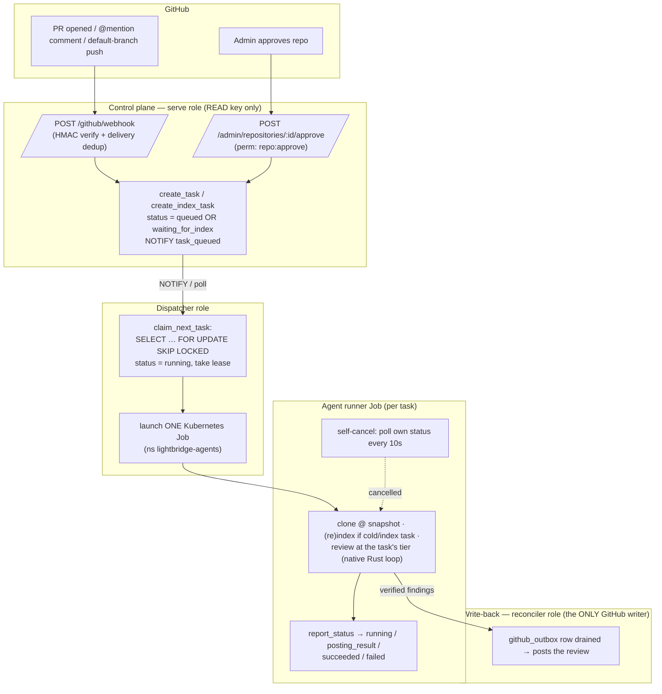
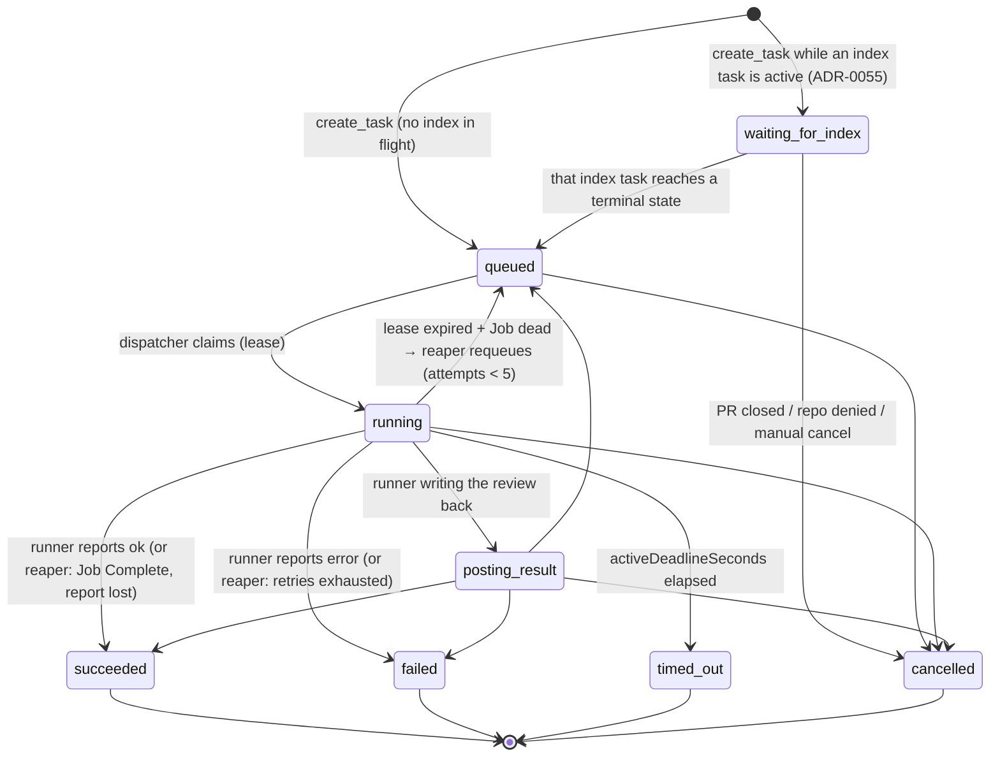
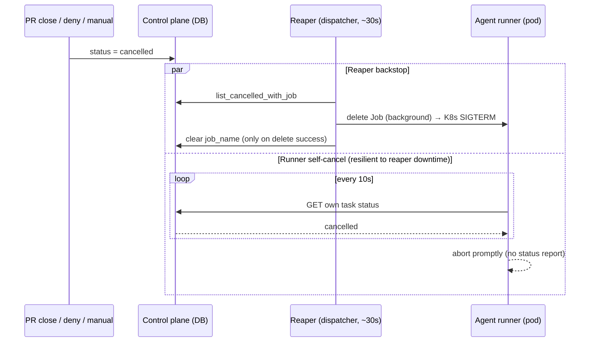

# Jobs and task lifecycle

How work flows through Lightbridge: what triggers a task, the two job kinds, the **tier** a review
runs at, the states a task moves through, how it's gated behind a fresh index, and how cancellation +
data purge work. Diagrams are Mermaid (rendered by GitHub).

> Source of truth in code:
> `services/control-plane/src/db.rs` (task status fns, idempotency, `create_task` /
> `create_index_task` / `create_explicit_task`),
> `services/control-plane/src/queue/{dispatcher,reaper,lifecycle,index_sweeper}.rs`,
> `services/control-plane/src/integrations/k8s.rs` (the Job manifest),
> `services/control-plane/src/http/webhook.rs` (event → task), and
> `services/agent-runner/src/main.rs` (the runner's self-cancel poll + status reports).
> Key ADRs: [ADR-0004](adr/0004-one-k8s-job-per-task.md) (one Job per task),
> [ADR-0033](adr/0033-inbound-command-parsing-and-run-kinds.md) (run kinds),
> [ADR-0055](adr/0055-review-waits-for-index-readiness.md) (the `waiting_for_index` gate),
> [ADR-0050](adr/0050-retrieval-pins-to-latest-indexed-snapshot.md) (review reuses the latest
> snapshot), [ADR-0052](adr/0052-index-snapshot-pruning.md) (snapshot pruning),
> [ADR-0062](adr/0062-two-tier-review-fast-auto-deep-on-demand.md) (two-tier review).

## The two job kinds

Every unit of work is a **task** the control plane records, the dispatcher claims, and a dedicated
**Kubernetes Job** executes — one Job per task ([ADR-0004](adr/0004-one-k8s-job-per-task.md)). The
kind is the task's `command_text` (stored on the `tasks` row):

| Job | `command_text` | `target_type` | Triggered by |
|---|---|---|---|
| **Index** | `index` | `repository` | A repo is **approved** by an admin, **or a push to the default branch** (e.g. a merged PR) keeps the base index fresh — both go through `create_index_task`. Indexes the default-branch HEAD; deduped against an in-flight index. |
| **Review / ask** | `review` (or the mention's text) | `pull_request` / `issue` | A PR is **opened** (the automatic first review, FAST tier), or a comment **`@<app-handle> …`** requests a review/answer (DEEP tier). |

Run **kind** is a second axis ([ADR-0033](adr/0033-inbound-command-parsing-and-run-kinds.md), the
`kind` column): `review` (diff-scoped findings) or `ask` (a conversational answer on a non-PR target).
The default is `review`.

Other lifecycle events do **not** create tasks: PR `synchronize`/`reopened` are ignored
(`handle_pull_request` only acts on `opened` and `closed`; ask for a re-review with an `@`-mention);
PR `closed` **cancels** the PR's active tasks; a repo removed/denied **purges** its data (see below).

## Distinct image + resources per kind

The dispatcher picks the container image and resource block by `command_text`
(`k8s.rs::image_for` / `resources_for`): **index** jobs run the *full* image (Python + Graphify, more
CPU/RAM — full tree-sitter parse + embeddings + structural graph); **review** jobs run a *leaner*
image and lighter resources (LLM/network-bound, reuse the latest snapshot). Each falls back to the
shared image/resources when its override is unset, so a chart that sets only `runner_image` keeps the
single-image behaviour.

> Cold-repo caveat: [ADR-0050](adr/0050-retrieval-pins-to-latest-indexed-snapshot.md) only makes
> **warm** reviews reuse the snapshot. A review of a repo that has never been indexed still
> self-indexes on the leaner image (the structural-graph step is best-effort and skips when Graphify
> is absent). In practice the approval-time index task indexes a repo before any review runs, so
> reviews are normally warm. Removing the residual cold self-index path is a later
> runner-differentiation slice.

## The review tier (ADR-0062)

A review task also carries a `tier` ([ADR-0062](adr/0062-two-tier-review-fast-auto-deep-on-demand.md),
the `tier` column), set when the task is created and read by the runner from the task context:

| Tier | Set when | Behaviour |
|---|---|---|
| **fast** | automatic `pull_request opened` (`handle_pull_request` hardcodes `tier: "fast"`) | a cheap model, deterministic SAST + a **lean diff-only LLM pass**, **no retrieval**, a small per-tier tool allowlist, a short turn cap (`max_turns` clamped to ≤5, not 1 — `FAST_TIER_MAX_TURNS`) |
| **deep** | any `@mention` (`create_explicit_task` sets `tier: "deep"`) | a strong model, full retrieval (graph + pgvector), multi-turn, a long timeout |

Index tasks don't set a tier (the column defaults to `deep` and is ignored). The model, tool
allowlist, prompt, and timeouts are per-tier **operator config** that lives in the agent's mounted
`agent.json` (and `ai-helm-values`); they churn — never assume a specific model name is permanent.

## End-to-end flow

Roles ([ADR-0058](adr/0058-rename-poller-role-to-reconciler.md) /
[ADR-0059](adr/0059-reconciler-owns-all-github-egress.md)): the **serve** role serves webhooks +
admin + the runner API and holds the GitHub App key **for reads only**; the **dispatcher** claims
tasks, launches Jobs, and hosts the reaper + sweepers; the **reconciler** drains the `github_outbox`
and is the *only* component that writes to GitHub. The runner holds no GitHub App key and no datastore
credentials — it calls the internal task API for a short-lived installation token and goes through the
control plane's internal endpoints for chunks/graph/search (trust boundary,
[ADR-0002](adr/0002-rust-control-plane-trust-boundary.md)).

## Task state machine

Statuses actually used by the code:

- **`waiting_for_index`** — the ADR-0055 readiness gate. A *non-index* task inserted while an `index`
  task for the same repo is active (`queued`/`running`/`posting_result`/`waiting_for_index`) starts
  here instead of `queued`, so it isn't claimed against a half-written snapshot
  (`INITIAL_TASK_STATUS_SQL` in `db.rs`). The claim query never selects this status, so a parked task
  just waits. (A column value `received` also exists for an older scheduler design but the create path
  never emits it.)
- **`queued`** — claimable. On insert the control plane `pg_notify`s the `task_queued` channel to wake
  a listening dispatcher (`notify_or_log_initial_status`); a waiting task is woken later instead.
- **`running`** — `claim_next_task` atomically flips `queued → running`, increments `attempts`, stamps
  `started_at`, and takes a short lease (`lease_owner` + `lease_expires_at`).
- **`posting_result`** — a transient sub-state the runner may report while it writes the review back;
  treated as "active" everywhere (claim guards, cancel guards, reaper).
- **terminal**: `succeeded` / `failed` / `timed_out` / `cancelled`. `set_task_status` stamps
  `completed_at` and clears the lease on any terminal transition.

When a terminal status lands, `set_task_status` calls `release_reviews_waiting_on_index`: if the
completed task was an **index** task, every `waiting_for_index` task for that repo flips back to
`queued` and the dispatcher is notified. This fires on **any** terminal status (including
`failed`/`cancelled`) so a failed index never strands reviews forever — a release failure is logged
loudly because the claim query would otherwise never pick them up again (ADR-0055).

## Idempotency: the natural key + `run_epoch`

Tasks are deduplicated by a unique index `tasks_idempotency_idx` over
`(repository_id, target_type, target_id, command_text, head_sha, run_epoch)`, declared
`NULLS NOT DISTINCT` so NULL `head_sha`s (an index task carries no SHA) still collide.

- **`create_task`** (automatic first review) is **content-idempotent**: it inserts with
  `run_epoch = 0` and `ON CONFLICT … DO NOTHING`, returning `None` when an equivalent task already
  exists. GitHub can deliver several events for one PR head (`opened` then `synchronize`); they
  collapse to one task. (Webhook *redeliveries* are already collapsed upstream by the
  `github_deliveries` primary key.)
- **`create_explicit_task`** (an `@mention`) must **always** land a task — never content-deduped. It
  computes the next epoch inside the INSERT as `COALESCE(MAX(run_epoch), -1) + 1` over the same
  columns (minus `run_epoch`). That subquery+insert isn't atomic under READ COMMITTED, so two
  simultaneous mentions can read the same `MAX` and collide on the unique index (`23505`); it
  **retries** (up to 5 times), and each loser just lands the next epoch.
- **`create_index_task`** uses the same `MAX+1` epoch trick **and** a `WHERE NOT EXISTS` guard against
  an already-active index for the repo, so a burst of pushes / a re-approve doesn't pile up
  duplicates. The epoch is **load-bearing**: an index task has a NULL `head_sha`, so every re-index
  shares the tuple `(repo, 'repository', repo, 'index', NULL, run_epoch)`. Hardcoding `run_epoch = 0`
  (the original bug) made the *second* index of a repo pass the active-guard but then collide on the
  unique index — so a repo was only ever indexed once. A benign concurrent epoch collision is
  swallowed as a dedup, not surfaced.

## Dispatch + the reaper

The **dispatcher** (`queue/dispatcher.rs`) loops: drain all due tasks, then block on a
`LISTEN/NOTIFY` wakeup, the reap tick (default 30s), the prune tick (default 600s), or a short poll
fallback (default 5s — covers a missed notification). `claim_next_task` uses
`FOR UPDATE SKIP LOCKED` ordered by `priority DESC, created_at`, so any number of dispatcher replicas
can run without ever claiming the same row. On a launch failure the task is requeued with backoff
(`release_task`), since the claim already moved it out of `queued`. Shutdown is graceful (stops
between iterations on SIGTERM so a task is never claimed-but-not-launched).

The **reaper** (`queue/reaper.rs`, on the dispatcher's reap tick) makes the queue self-healing. For
each `running`/`posting_result` task whose lease has expired, it reconciles against the Job's *real*
liveness (`job_liveness` reads the Job's `Complete`/`Failed` conditions; a missing Job = `Gone`):

| Job liveness | Action |
|---|---|
| **Active** | renew the lease (a reaper-driven heartbeat) — a legitimately long run is never reclaimed |
| **Succeeded** (Job Complete, task still running) | mark `succeeded` — the success report was lost; re-running would re-post the review |
| **Failed / Gone** (incl. `job_name` NULL = dispatcher died pre-launch) | delete the dead Job (its name is `lightbridge-agent-<task-id>`, must be freed before retry) then requeue with exponential-capped backoff while `attempts < 5`, else mark `failed` |

A transient Kubernetes API error skips that task for the cycle (never reclaim a possibly-live task).
On a final `failed`, a PR task enqueues an [ADR-0056](adr/0056-control-plane-owns-the-posted-output.md)
failure notice via the egress outbox. The same reaper pass deletes the Jobs of **cancelled** tasks and
clears their `job_name` (only on a successful delete, so a transient k8s error doesn't orphan a live
Job).

## The Job manifest

`k8s.rs::job_manifest` builds one Job per task in the `lightbridge-agents` namespace (default), with
`restartPolicy: Never`, `backoffLimit: 1`, `ttlSecondsAfterFinished: 900` (post-completion cleanup),
and `activeDeadlineSeconds` from `AGENT_JOB_DEADLINE_SECONDS` (default **3600 = 1h** — large repos can
legitimately index for tens of minutes; this is the `timed_out` boundary). The pod gets `TASK_ID`,
`CONTROL_PLANE_URL`, the shared bearer (`AGENT_RUNNER_TOKEN`), the optional CA secret, and the mounted
agent ConfigMap (`agent.json` + prompt templates). A 409 on create is treated as "adopt our own Job"
(the name is task-id-derived, so a 409 is a previous attempt we crashed before recording) rather than
erroring forever.

## Cancellation

A task becomes `cancelled` three ways: a PR is **closed** (`cancel_active_tasks_for_pr`), a repo is
**removed/denied** (`cancel_active_tasks_for_repo`), or a user clicks **Cancel run**
(`cancel_task_by_id`, perm `task:cancel`). The DB row flips to `cancelled` immediately (clearing the
lease and stamping `completed_at`); the **pod** then stops two ways, belt-and-suspenders:

The self-cancel poll (`cancelled_upstream` in `main.rs`, every 10s) matters because the reaper lives
in the dispatcher; if the dispatcher is restarting (a deploy) it can't send SIGTERM, so the runner
stops itself. The runner never reports a status on cancellation — the control plane already owns the
`cancelled` row, and reporting `failed` would clobber it. The cancel guards include
`waiting_for_index`, so a parked review can also be cancelled cleanly.

## Indexing strategy: review reuses the base index (ADR-0050)

A review of an already-indexed repo **skips the re-index** and reviews against the latest indexed
snapshot plus the PR diff. The anchor is `latest_indexed_commit(repo)` — the `commit_sha` of the most
recently written `code_chunks` snapshot — which the control plane reports to the runner; the runner
indexes only for an **`index`** task or a **cold repo** (`!repo_indexed`). All retrieval
(`search_code_chunks`, graph) is pinned to that same commit, so the skip decision and the search scope
always reference a commit that *provably has chunks*. (Pinning to the PR head — the previous behaviour
— made every new head look "not indexed" and triggered a full re-index per PR, while a repo-level
"any rows?" check returned zero hits at the head — a hollow index that starved the agent.)

The base index tracks the **default branch**, kept fresh by a **push-driven re-index**: a push to the
default branch (e.g. a merged PR) calls `create_index_task` (`handle_push`, deduped against an
in-flight index). Incremental diff-only indexing for reviews — so search also covers brand-new PR
symbols before merge — is future work (RFC-0002).

### Snapshot pruning (ADR-0052)

Every default-branch push writes a *full new* `(repository_id, commit_sha)` snapshot into
`code_chunks` (+ Neo4j) and nothing else reaps the old ones — reviews only read the latest. The
**index sweeper** (`queue/index_sweeper.rs`, on the dispatcher's prune tick) keeps the in-use
snapshots per repo and prunes the rest:

- `repos_with_stale_snapshots` finds only repos holding **more than one** distinct `commit_sha`, so a
  steady-state repo (one snapshot) costs a single grouped count, not a delete.
- The keep-set is the **latest** snapshot plus any commit a **non-terminal task** still pins
  (`in_use_commits` — a running review pinned to a PR head), so the sweeper never prunes a snapshot
  out from under an in-flight run. Deletes also skip rows newer than 10 minutes (a snapshot being
  written right now). The Neo4j half is `neo4j::prune_graph`.

The outbox sweeper (ADR-0059) shares the same prune tick, pruning terminal `github_outbox` rows past
their retention window (delivered ~7d, dead-lettered ~30d by default).

## Data purge (repo removed or denied)

When a repo is removed from the installation or denied, its indexed data is purged so we don't retain
code for repos nobody opted into (`queue/lifecycle.rs::purge_repository_data`): it cancels in-flight
tasks, deletes the **pgvector `code_chunks`**, the **`repo_index`** bookkeeping, and the **Neo4j
graph** (`neo4j::delete_repo_graph`). The repository row is kept (`disabled`) for audit. Purge is
best-effort across stores (one store down doesn't block the others), idempotent, and guarded against a
re-approve racing ahead of it (it aborts if the repo is no longer `disabled`).

Purge runs two ways: a **spawned** task on the remove/deny event (`spawn_purge`, so it never blocks a
webhook's ~10s budget), and a **durable reconciler** on the dispatcher loop (`reconcile_purges`, every
reap tick) that re-purges any `disabled` repo still carrying index data
(`list_disabled_repos_needing_purge`) — so a purge lost to a control-plane restart still completes. It
lives in the control plane (not a per-repo k8s Job) because purge writes to Postgres + Neo4j directly,
and only the control plane holds those credentials
([ADR-0002](adr/0002-rust-control-plane-trust-boundary.md)).
