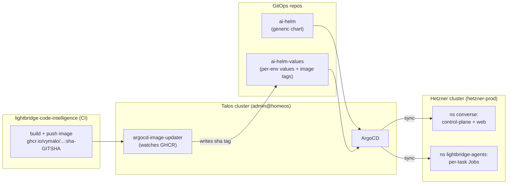

# Kubernetes and deployment

How Lightbridge runs in production: two physical clusters, GitOps continuous delivery from three
sibling repos, and one ephemeral Kubernetes Job per task. The grounding for the Job shape and the
mounted config lives in `services/control-plane/src/integrations/k8s.rs` and
`services/control-plane/src/config.rs`; the chart and per-env values live in the **ai-helm** and
**ai-helm-values** sibling repos.

## Two clusters

The platform runs across **two physical clusters**:

| Cluster | kube context | Role |
|---|---|---|
| Talos | `admin@homeos` | Runs **ArgoCD** (the GitOps controller) and `argocd-image-updater`. |
| Hetzner | `hetzner-prod` | Runs the **workloads**: control plane + web app in namespace `converse`; per-task agent Jobs in namespace `lightbridge-agents`. |

ArgoCD on the Talos cluster reconciles manifests **onto** the Hetzner cluster. For live workload logs
(control plane, agent Jobs) use the `hetzner-prod` context; for ArgoCD/sync state use `admin@homeos`.

## GitOps continuous delivery

Delivery is **GitOps, not `kubectl apply`**. There is no manual deploy step — **merge to ai-helm
`main` is the deploy.** Three repos cooperate:

1. **This repo** (`lightbridge-code-intelligence`) builds and publishes the container images
   (`ghcr.io/vymalo/lightbridge-agent-runner`, the control-plane image, the web image) on merge.
2. **ai-helm** — the generic Helm chart. Genericized so the chart holds *structure* only; anything
   environment- or product-specific is a value, not a template literal. Merging here changes the
   rendered manifests ArgoCD applies.
3. **ai-helm-values** — per-environment values (e.g.
   `environments/prod/values/lightbridge-code-intelligence.yaml`): image tags, replica counts,
   the per-tier review config, secrets wiring, resource blocks.

`argocd-image-updater` (on the Talos cluster) watches GHCR for new tags. On a fresh image it writes a
`sha-<gitsha>` tag back into the values repo (via an **image alias** declared on the Application), and
ArgoCD then syncs that change to the Hetzner cluster. So a code change flows:

```
merge code → CI builds + pushes ghcr image (sha-<gitsha>)
           → argocd-image-updater bumps the tag in ai-helm-values
           → ArgoCD syncs the new manifests onto hetzner-prod
```



## Control-plane roles (one binary, several roles)

The control-plane image is one binary; the `CONTROL_PLANE_ROLE` env (default `serve`) selects the
role — see the `match role` dispatch in `services/control-plane/src/main.rs`:

| Role | Replicas | Responsibility |
|---|---|---|
| `serve` | many | HTTP: webhooks in, the runner's internal API (context + status). Holds the GitHub App key for **reads** + token-mints only — it no longer posts content (ADR-0059). |
| `dispatcher` | one | Claims queued tasks and creates **one Kubernetes Job per task**; runs the reaper (Job GC + data purge) and the storage-GC sweepers (index snapshots, outbox). Keyless — has DB but no GitHub App key. |
| `reconciler` | one | The **sole GitHub egress**: drains the `github_outbox` and posts every review/reply/reaction/label/failure-notice; also reads inbound 👍/👎 reactions into `review_feedback`. |

`reconciler` was renamed from `poller` ([ADR-0058](adr/0058-rename-poller-role-to-reconciler.md)); the
binary still accepts `poller` as a legacy alias (the role string is a deploy contract, so an unknown
role `bail!`s — the alias lets the binary and the Deployment `args` roll over independently). All
outbound GitHub writes funnel through the reconciler's transactional outbox
([ADR-0059](adr/0059-reconciler-owns-all-github-egress.md)); the single-replica invariant is now
load-bearing because the drain preserves per-task `(created_at, id)` ordering.

> **Why the control plane doesn't scale freely yet.** The webhook handler holds delivery-dedup in
> process memory, so a second `serve` replica would double-process. The reconciler must stay single-
> replica for outbox ordering. [RFC-0001](rfc/0001-horizontally-scalable-control-plane.md) tracks
> moving dedup into Postgres so `serve` can scale horizontally like the web app.

## One Kubernetes Job per task (ADR-0004)

Each review/index/Q&A task runs as **its own** Kubernetes Job in `lightbridge-agents` — strong
isolation for untrusted fork content, TTL-based cleanup, and task-scoped wiring. The dispatcher owns
*which* task runs and *when*; the Job runs the (potentially untrusted) work. The manifest is built in
`job_manifest` (`services/control-plane/src/integrations/k8s.rs`). Verified shape:

- **Name** — `lightbridge-agent-<task-uuid>`. Derived from the unique task id, so a `create` 409 means
  *our own* Job already exists; the dispatcher adopts it instead of erroring (dispatch is
  at-least-once).
- **`restartPolicy: Never`**, **`backoffLimit: 1`**.
- **`activeDeadlineSeconds`** — operator-tunable hard runtime cap, default **3600s (1h)** via
  `agent.job_deadline_seconds` / `AGENT_JOB_DEADLINE_SECONDS`. A large repo can legitimately index for
  tens of minutes; the deep review tier accepts a long ceiling (ADR-0062).
- **`ttlSecondsAfterFinished: 900`** — finished Jobs self-delete after 15 min.
- **`ownerReference`** → the agent ServiceAccount (lazily resolved + cached, non-controlling) for k8s
  GC and traceability. Resolved on first launch and retried until the SA exists, so a Helm-install
  ordering race never permanently leaves Jobs un-owned.
- Labels: `app.kubernetes.io/{name=lightbridge,component=agent,part-of=lightbridge-platform,managed-by=control-plane}`
  plus `lightbridge.dev/task-id`.

### Task wiring (env)

The Job carries the task context and callback wiring as env (`job_manifest`):

- `TASK_ID`, `REPOSITORY_ID`, `INSTALLATION_ID`, `COMMAND`, `TARGET_TYPE`, `TARGET_ID`, `ATTEMPT`,
  and `BASE_SHA` / `HEAD_SHA` (each omitted when absent).
- `CONTROL_PLANE_URL` + `AGENT_RUNNER_TOKEN` — where the runner calls back and the shared bearer it
  presents to that internal API ([ADR-0017](adr/0017-agent-runner-control-plane-bootstrap.md)). The
  runner re-fetches full context from the internal API rather than trusting these for anything
  security-sensitive.
- **Embeddings (required)** — `EMBEDDINGS_BASE_URL` / `EMBEDDINGS_API_KEY` / `EMBEDDINGS_MODEL` from
  Secret `lightbridge-agent-secrets`. Required (no defaults) so a misconfigured Job fails loud rather
  than embedding with the wrong model ([ADR-0018](adr/0018-openai-compatible-embeddings.md)).
- **Review LLM (optional)** — `LLM_BASE_URL` / `LLM_API_KEY` / `LLM_MODEL`, same Secret but
  `optional: true`: absent these keys, the runner skips the review step (indexing-only). The operator
  enables review by populating them. **The model id churns** — it is operator-tuned in ai-helm-values;
  never treat a specific model name as permanent.

### Image selection (`image_for`)

The dispatcher picks the image per task kind:

- **`command_text == "index"`** → the **full** image (`indexer_runner_image`, falls back to
  `runner_image`) — bundles Python + Graphify for structural-graph extraction.
- **everything else (review/ask)** → the **leaner** image (`review_runner_image`, falls back to
  `runner_image`) — no Graphify venv; the review path is LLM/network-bound and reuses the indexed
  snapshot ([ADR-0050](adr/0050-retrieval-pins-to-latest-indexed-snapshot.md)).

A chart that sets only `runner_image` keeps single-image behaviour. (Caveat in the code: a *cold-repo*
review still self-indexes; on the lean image Graphify is best-effort/non-fatal, so a cold review
builds the pgvector index and defers the graph to the next `index` task.)

### Resources (`resources_for`)

Same shape: `indexer_resources` for index Jobs (the heavy path — more CPU/RAM), `review_resources` for
review Jobs (read-mostly, leaner), each falling back to the shared `resources` block, all passed
through verbatim. Unset → cluster defaults / LimitRange apply.

## Mounted config and secrets

Config is **file-based**: the operator mounts JSON + prompt templates from ConfigMaps rather than a
sprawl of env vars (`services/control-plane/src/config.rs`, `services/agent-runner/src/bootstrap/config.rs`).
`deny_unknown_fields` is set on every config section, which is what forces the strict deploy ordering
below.

### Control plane

- `control-plane.json` — mounted at `/etc/lightbridge/control-plane.json` (override via
  `CONTROL_PLANE_CONFIG`). Holds the `agent` Job knobs the dispatcher stamps into each Job, the
  `dispatcher` loop timings + sweeper intervals, the `review` reaction/label knobs, and the
  `embeddings` dimension-safety block. File-when-present, else env — an absent file keeps prod on its
  env defaults.

### Agent Job

The dispatcher mounts, into every agent Job (`job_manifest`):

- **`agent.json` + prompt templates** — from the ConfigMap named by `agent.config_configmap`
  (`AGENT_CONFIG_CONFIGMAP`), mounted **read-only at `/etc/lightbridge`**, with `AGENT_CONFIG` pointed
  at `/etc/lightbridge/agent.json`. This ConfigMap carries:
  - **`review-system.md`** — the deep-tier reviewer system prompt.
  - **`review-system-fast.md`** — the lean fast-tier prompt (diff-only; "review the diff directly,
    record findings, always `finish` with a verdict; raise only what the diff proves, phrase the
    unverifiable as a P2 question") — pointed at by `review.fast.system_prompt_file`
    ([ADR-0062](adr/0062-two-tier-review-fast-auto-deep-on-demand.md) amendment).
  - The per-tier review blocks (`review.fast` / `review.deep`): own model/gateway/prompt/reasoning
    budget/timeout, and the closed-enum tool allowlist `review.<tier>.tools` (fast =
    `[add_review_comment, finish, abort]`). An unknown tool name fails at config parse.
- **Internal CA** — when `agent.ca_secret` is set, the Secret's `ca.crt` mounts read-only at
  `/etc/internal-ca`, and `EMBEDDINGS_CA_CERT` points the runner's reqwest clients at it so they trust
  the eaig gateway's private-issuer HTTPS cert ([ADR-0018](adr/0018-openai-compatible-embeddings.md)).

### ExternalSecrets

Cluster Secrets (e.g. `lightbridge-agent-secrets` with the embeddings + review-LLM keys, the GitHub
App key, the internal CA) are projected from the external secret store via **ExternalSecrets** rather
than committed to the GitOps repos. The chart references Secret **names**; the values + ExternalSecret
definitions live in ai-helm-values.

### CNPG (Postgres)

Postgres is run in-cluster by **CloudNativePG (CNPG)**: a managed cluster with primary/replica,
backups, and connection routing. The control plane reaches it via `DATABASE_URL`. Postgres is the
backbone — task queue, `github_outbox`, `code_chunks` (pgvector), `review_feedback`, and the snapshot
state the review tiers read.

## Deploy ordering (the `deny_unknown_fields` 3-repo dance)

Because both the control-plane and agent configs set `deny_unknown_fields`, a values file that names a
field the running binary doesn't know **fails config parse and crash-loops**. So a change that adds a
new field must land **runner image → chart → values**, in that order:

1. **Runner / control-plane image** (this repo) — ship the binary that *understands* the new field.
2. **ai-helm** — render the field (and any new mounted file, e.g. the second prompt) into the
   manifests.
3. **ai-helm-values** — actually *set* the field.

Reversing this (set a value before the binary knows it) is the crash-loop. Example from ADR-0062's
fast-tier hardening: the `review.<tier>.tools` field needed the new runner image first; the fast
prompt alone needed no new runner (it rides the existing `system_prompt_file`). The role-string rename
([ADR-0058](adr/0058-rename-poller-role-to-reconciler.md)) follows the same logic in reverse — ship a
binary that accepts **both** `poller` and `reconciler`, flip the Deployment `args`, then drop the
alias.

## Two-tier review on the cluster (ADR-0062)

The trigger picks the tier, carried as a `tier` column to the runner:

- **`pull_request opened` → fast** — automatic. SAST (opengrep) as the backbone + a lean
  diff-only LLM pass, **no retrieval tools registered**, short turn cap (`max_turns` clamped to ≤5,
  not 1) + job timeout (≲ 2 min). The
  fast-tier framing ("🅵 quick pass — mention @handle for a deeper review") is rendered control-plane-
  side at `finalize_review` (`render_fast_body`), where the real `GITHUB_APP_HANDLE` lives.
- **`@mention` → deep** — manual. Full graph + vector retrieval, `read_file`, generous turns,
  streaming on, long job deadline (2h acceptable, since it is user-requested and async).

Both tiers post through the **single** review channel
([ADR-0056](adr/0056-control-plane-owns-the-posted-output.md)) via the egress outbox. SAST findings
ride the *same* buffer ([ADR-0061](adr/0061-sast-deterministic-finding-source.md)) — opengrep runs
inside the runner over the PR's changed files, best-effort/non-fatal, never a second poster.

## Reaping and cleanup

The dispatcher's **reaper** is the source of truth for liveness: it reads the Job's status conditions
via `job_liveness` (`Complete` → `Succeeded`, `Failed` → `Failed`, missing → `Gone`) rather than a
timer, marks `failed` tasks, and `delete_job`s (idempotent — a 404 is success). `ttlSecondsAfterFinished`
is the k8s-side backstop. For an **uncatchable** kill (OOM/SIGKILL/eviction) the keyless reaper can't
post, so it enqueues a `failure_notice` outbox intent that the reconciler drains
([ADR-0059](adr/0059-reconciler-owns-all-github-egress.md), superseding the
[ADR-0057](adr/0057-poller-posts-failure-notice-on-uncatchable-kill.md) dual-poster + settle buffer).
The dispatcher also runs the index-snapshot sweeper
([ADR-0052](adr/0052-index-snapshot-pruning.md)) and the outbox retention sweeper.

## Probe guidance

- **startup probe** on `serve` if migrations or cache warm-up delay readiness.
- **readiness probe** for API availability.
- **liveness probe** only where restart semantics are genuinely safe.

The `dispatcher` and `reconciler` roles run no main HTTP server; each stands up a tiny server for
`/metrics` (+ health) only.
