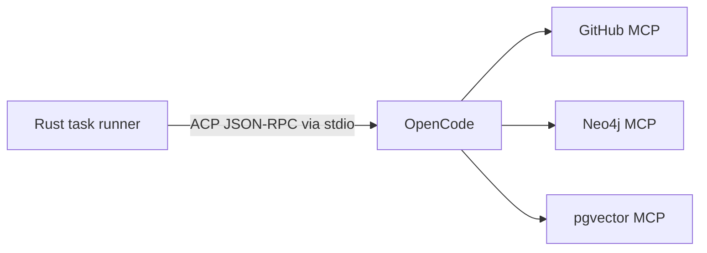

# OpenCode ACP and MCP Integration

> **Historical / superseded.** OpenCode (and the ACP-subprocess / standalone-MCP-server shape this
> document describes) has been **replaced by a native, in-process Rust review-agent loop** that calls
> the LLM with structured tool calls and acts only through control-plane-mediated tools
> ([ADR-0026](adr/0026-native-review-agent.md), [ADR-0037](adr/0037-agent-acts-via-mediated-tools.md)).
> The retrieval tools are thin clients of the control-plane API, not standalone MCP servers
> ([ADR-0020](adr/0020-mcp-servers-via-control-plane.md)). The current review subsystem is documented in
> **[review-pipeline.md](review-pipeline.md)**; this file is retained for historical background only —
> nothing below reflects the running system.

## Why OpenCode here

OpenCode is used as the task-time reasoning runtime. Lightbridge does not depend on it for system
state. It depends on it for controlled investigation using MCP tools.

## ACP integration shape

OpenCode is started by the task pod as an ACP-compatible subprocess. The Rust task runner acts as
the ACP client.



## Example OpenCode config

```json
{
  "$schema": "https://opencode.ai/config.json",
  "permission": {
    "bash": "ask",
    "edit": "deny",
    "webfetch": "deny",
    "lightbridge_github_*": "ask",
    "lightbridge_graph_*": "allow",
    "lightbridge_vector_*": "allow"
  },
  "mcp": {
    "lightbridge_graph": {
      "type": "local",
      "command": ["./bin/lightbridge-graph-mcp"],
      "enabled": true,
      "environment": {
        "NEO4J_URI": "{env:NEO4J_URI}",
        "NEO4J_USERNAME": "{env:NEO4J_USERNAME}",
        "NEO4J_PASSWORD": "{env:NEO4J_PASSWORD}"
      }
    },
    "lightbridge_vector": {
      "type": "local",
      "command": ["./bin/lightbridge-vector-mcp"],
      "enabled": true
    },
    "lightbridge_github": {
      "type": "local",
      "command": ["./bin/lightbridge-github-mcp"],
      "enabled": true
    }
  }
}
```

## Recommended MCP tool APIs

### Graph MCP

```json
[
  {
    "name": "lightbridge_graph_find_symbol",
    "description": "Find symbols by exact name, FQN, or path prefix",
    "input_schema": {
      "type": "object",
      "properties": {
        "name": { "type": "string" },
        "repo_id": { "type": "integer" },
        "commit_sha": { "type": "string" }
      },
      "required": ["repo_id", "commit_sha"]
    }
  },
  {
    "name": "lightbridge_graph_get_callers",
    "description": "Return caller symbols for a fully qualified symbol",
    "input_schema": {
      "type": "object",
      "properties": {
        "repo_id": { "type": "integer" },
        "commit_sha": { "type": "string" },
        "fqn": { "type": "string" }
      },
      "required": ["repo_id", "commit_sha", "fqn"]
    }
  }
]
```

### Vector MCP

```json
[
  {
    "name": "lightbridge_vector_semantic_search",
    "description": "Search code and docs chunks by embedding similarity",
    "input_schema": {
      "type": "object",
      "properties": {
        "query": { "type": "string" },
        "repo_id": { "type": "integer" },
        "commit_sha": { "type": "string" },
        "limit": { "type": "integer", "default": 10 }
      },
      "required": ["query", "repo_id", "commit_sha"]
    }
  }
]
```

### GitHub MCP

```json
[
  {
    "name": "lightbridge_github_get_pr",
    "description": "Fetch PR metadata and changed files",
    "input_schema": {
      "type": "object",
      "properties": {
        "owner": { "type": "string" },
        "repo": { "type": "string" },
        "number": { "type": "integer" }
      },
      "required": ["owner", "repo", "number"]
    }
  }
]
```

## Agent profiles

| Profile | Tools | Notes |
|---|---|---|
| `review-pr` | graph + vector + github-read | Default |
| `answer-issue` | vector + github-read | Lighter |
| `impact-analysis` | graph + vector | No write intent |
| `security-review` | graph + vector + optional scanner adapters | Tightest prompt guardrails |

## Structured review payload

```json
{
  "version": "1.0",
  "task_id": "uuid",
  "summary": "High-level assessment of the change",
  "findings": [
    {
      "severity": "major",
      "category": "correctness",
      "path": "src/auth/session.rs",
      "line": 73,
      "title": "Session refresh path bypasses expiry validation",
      "body": "The new fast path returns a cached session before the expiry check is applied.",
      "evidence": [
        "Function validate_session no longer guards refresh_session",
        "Existing tests cover expired primary tokens but not refreshed sessions"
      ],
      "suggested_fix": "Apply expiry validation before returning refreshed sessions."
    }
  ],
  "final_comment": "I found one major correctness issue and two informational notes.",
  "proposed_github_action": "comment"
}
```

## JSON Schema for review result

```json
{
  "$schema": "https://json-schema.org/draft/2020-12/schema",
  "type": "object",
  "required": ["version", "task_id", "summary", "findings", "final_comment"],
  "properties": {
    "version": { "type": "string" },
    "task_id": { "type": "string" },
    "summary": { "type": "string" },
    "findings": {
      "type": "array",
      "items": {
        "type": "object",
        "required": ["severity", "category", "path", "line", "title", "body"],
        "properties": {
          "severity": { "enum": ["info", "minor", "major", "critical"] },
          "category": { "type": "string" },
          "path": { "type": "string" },
          "line": { "type": "integer" },
          "title": { "type": "string" },
          "body": { "type": "string" },
          "evidence": { "type": "array", "items": { "type": "string" } },
          "suggested_fix": { "type": "string" }
        }
      }
    },
    "final_comment": { "type": "string" },
    "proposed_github_action": { "enum": ["comment", "review", "check_run"] }
  }
}
```

## Guardrail pattern

The agent may:
- read code
- query graph and vector stores
- prepare structured findings

The control plane must:
- validate line references
- deduplicate comments
- decide comment vs review vs check
- post to GitHub
- persist final audit records
