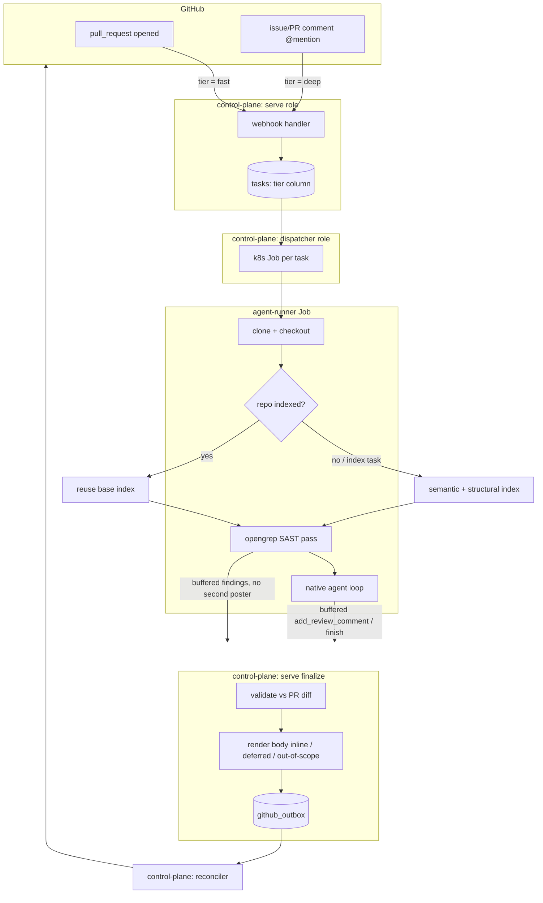

# Review pipeline (native agent, two-tier, SAST, verification)

This document describes the whole review subsystem end to end: from a GitHub event, through
tier selection, the deterministic SAST pass, the native agent loop, control-plane shaping of the
posted output, and finally egress to GitHub. It is the companion to
[github-app-and-control-plane.md](github-app-and-control-plane.md) (the App + trust boundary) and
[indexing-and-storage.md](indexing-and-storage.md) (the retrieval substrate the deep tier reads from).

The review agent is a **native, in-process Rust loop** ([ADR-0026](adr/0026-native-review-agent.md))
acting via **mediated write tools** through the control plane
([ADR-0037](adr/0037-agent-acts-via-mediated-tools.md)). There is no OpenCode/ACP/MCP subprocess and
no fallback model: a single model is wrapped in retry/backoff/circuit-breaker resilience
([ADR-0039](adr/0039-agent-llm-resilience-and-observability.md),
[ADR-0053](adr/0053-remove-review-fallback-model.md)).

## End-to-end shape



A task carries everything downstream needs in a single `tier` column (`fast` | `deep`); the runner
shapes its loop on it and the control plane shapes the posted body on it.

## 1. Trigger and tier selection (ADR-0062)

Tier is decided in the webhook handler, `services/control-plane/src/http/webhook.rs`:

- **`pull_request` `opened`** → an automatic **fast** review task (`tier: "fast"`). This is the only
  automatic review trigger; `synchronize`/`reopened` do nothing, and `closed` cancels the PR's active
  tasks (the reaper then stops their Jobs).
- **An `@mention`** of the App handle on a PR or issue comment → a **deep** task (`tier: "deep"`),
  whether the target is a PR (deep review) or an issue (conversational answer). The mention is matched
  against `state.app_handle` (`GITHUB_APP_HANDLE`).

The task `tier` defaults to `deep` (the full/safe behaviour) for any task that didn't set it
(`services/control-plane/src/http/internal.rs`, `TaskContext::tier`).

Why two tiers ([ADR-0062](adr/0062-two-tier-review-fast-auto-deep-on-demand.md)): the deep loop is a
multi-minute-to-~25-minute job whose cost is dominated by `reasoning_effort` + turn count + retrieval
depth (not the model id — [ADR-0060](adr/0060-capture-model-reasoning-and-glm-5-2-latency-finding.md)).
Running it on every opened PR over-taxes trivial changes. The lever is the **loop shape** (tools /
effort / turns / timeout), tuned per tier — plus the near-instant deterministic SAST source
([ADR-0061](adr/0061-sast-deterministic-finding-source.md)).

## 2. Per-tier configuration

The runner resolves **both** tiers up front (`ReviewConfig::resolve_tiers` in
`services/agent-runner/src/bootstrap/config.rs`) and `main.rs` picks one per task by
`context.tier` via `ReviewConfigs::for_tier`. Each tier is a **complete, independent** config block
(own model, gateway, prompt, reasoning budget, timeout, turn/read budgets) — `review.fast` and
`review.deep` in the mounted `agent.json`, **not** an overlay on the flat fields:

- `review.fast` / `review.deep` present → each tier uses its own block.
- Neither present (legacy shape) → both tiers fall back to the flat `review.*` block, transition-safe
  so the runner can deploy before the values are restructured.

The selected fast config carries a structural `fast: bool` flag (set in `resolve_tiers`/`main.rs` from
the task tier — a Job runs one task, so mutating it on the resolved config is sound). The model is
**operator-tuned in ai-helm-values and churns — read it live, never assume a model name**.

### Per-tier tool allowlist (`review.<tier>.tools`)

`review.<tier>.tools` declares the exact tool surface a tier offers the model. It deserializes to a
**closed `ReviewTool` enum**, so an unknown tool name **fails at config parse** (serde lists the valid
variants) rather than silently offering fewer tools; an empty list is also rejected (a tier with no
tools can't act). A drift guard test (`review_tool_enum_matches_the_dispatch_surface`) keeps the enum
in lockstep with the dispatch surface (`tools::known_tool_names`). The enum variants (serde names are
the exact dispatched tool names):

| Variant | Tool name | Kind |
|---|---|---|
| `VectorSemanticSearch` | `lightbridge_vector_semantic_search` | retrieval (pgvector) |
| `GraphFindSymbol` | `lightbridge_graph_find_symbol` | retrieval (Neo4j) |
| `GraphGetCallers` | `lightbridge_graph_get_callers` | retrieval (Neo4j) |
| `ReadFile` | `read_file` | read (checkout) |
| `AddReviewComment` | `add_review_comment` | write (inline finding) |
| `RetractFinding` | `retract_finding` | write (drop a finding) |
| `AddComment` | `add_comment` | write (plain reply) |
| `Finish` | `finish` | terminal (verdict) |
| `ReportProgress` | `report_progress` | control |
| `Abort` | `abort` | terminal |

A typical fast allowlist is `["add_review_comment", "finish", "abort"]` — diff-only, no retrieval.
When unset, the tier uses the built-in default (the full surface for deep; the wind-down
write/finish/abort set for fast).

### The two prompts

The reviewer's persona + guidance is **operator-owned config** ([ADR-0037](adr/0037-agent-acts-via-mediated-tools.md));
there is **no built-in default** — review fails closed without one. The system message is composed as
the operator prompt followed by a small, code-owned **tool-protocol** stanza (`TOOL_PROTOCOL` in
`services/agent-runner/src/review/native/agent.rs`, appended last so it is the final instruction).

- **Deep** uses the full `reviewSystemPrompt` (mounted from `review-system.md`): grounding +
  uncertainty discipline ([ADR-0047](adr/0047-review-prompt-grounding-and-uncertainty.md)), prompt
  structure/technique ([ADR-0048](adr/0048-review-prompt-structure-and-technique.md)), eval-driven
  iteration ([ADR-0049](adr/0049-eval-driven-reviewer-prompt-iteration.md)).
- **Fast** uses a lean `reviewSystemPromptFast` (mounted from `review-system-fast.md`): a diff-only
  pass that claims only what the diff proves, with anything unverifiable downgraded to a P2 question
  (it has no retrieval to confirm a deeper claim).

The diff itself, the SAST digest, prior reviews, repo memory, and repo instructions are all assembled
into the **user** message by `build_messages` (see below); the tool-protocol/persona in the system
message stays authoritative over that untrusted context.

## 3. Indexing decision (before review)

`main.rs` indexes only when the task is an `index` command or the repo has no base index yet. A review
on an already-indexed repo **reuses the base index**
([ADR-0025](adr/0025-review-reuses-base-index.md)) — it searches related code via the retrieval tools
and has the PR diff in its prompt — so the costly re-index is skipped. Retrieval pins to the latest
indexed snapshot ([ADR-0050](adr/0050-retrieval-pins-to-latest-indexed-snapshot.md)).

## 4. Deterministic SAST pass (ADR-0061)

`services/agent-runner/src/sast/mod.rs` runs **opengrep** (the LGPL Semgrep CE fork) over the PR's
**changed files only**, deterministically (same code + rules ⇒ same findings, no LLM, no tokens). It is
opt-in (`sast.enabled`, default off — rollout is image-then-config) and best-effort (a scan failure is
logged, never fatal).

Pipeline:

1. **Scope** to changed files that still exist on disk (deletions have no tree to scan), rejecting any
   absolute or `..`-escaping path (`is_safe_relative`).
2. **Language-scope the ruleset** for performance: pass one `--config` per language rule dir present in
   the changed files plus `generic` (language-agnostic secret/keyword rules). Pointing opengrep at the
   whole multi-language tree loaded every rule before matching (~4 min/scan even for one file, observed
   live); scoping yields the same per-file findings at a fraction of the load time.
3. **Run** `opengrep scan` writing SARIF to a private file in the system temp dir (outside the
   checkout). The runner forces `PYTHONUTF8=1` + `LANG`/`LC_ALL=C.UTF-8` — opengrep is frozen-CPython
   reading rule files with the locale codec, and the slim image's ASCII default crashed on any
   non-ASCII byte in a rule message (every scan silently failed). Version-check + metrics pings are
   disabled for hermeticity. A non-zero exit is **not** an error (opengrep exits non-zero on matches);
   success is judged by "the SARIF file was written and parses".
4. **Parse SARIF** (`parse_sarif`): map level → priority (`error` → **P1**, else → **P2** — SAST is
   never P0), drop below `min_severity` (default `error`), and cap at `max_findings` (default 25,
   excess logged, not silently dropped — [ADR-0033](adr/0033-inbound-command-parsing-and-run-kinds.md)).
   A finding that can't anchor to a `file:line` is dropped (not actionable on a PR).

The findings then take two paths (`main.rs`):

- **Buffered** into the *same* review buffer via the mediated `add_review_comment` action
  (`sast::buffer`) — category `security`, an attributed title (`🔍 opengrep: …`) and body
  (rule id, a "verify before acting / suppress with `opengrep-ignore`" note, and the rule's docs link).
  They ride the **existing review channel** — the control plane scopes/renders/posts them in the one
  grouped review; there is **no second poster** ([ADR-0059](adr/0059-reconciler-owns-all-github-egress.md)).
- A compact **digest** (`sast::digest`) is injected into the agent prompt so the agent is *aware* of
  what opengrep already flagged and doesn't re-report those lines (it may deepen a lead). The digest is
  advisory: it does **not** gate posting — SAST findings post regardless of what the agent does.

SAST is buffered *before* the agent runs, so a true `(file, line)` collision lets the agent's richer
finding win the upsert; the digest keeps such collisions rare.

## 5. The native agent loop

`run_native_agent` in `services/agent-runner/src/review/native/agent.rs` drives the chat client over
the eaig gateway. The loop: build messages → for each turn, offer a (per-turn) tool set → model replies
with tool calls → dispatch them → feed results back → repeat until `finish`/`abort` or the budget runs
out.

### Tool surface and dispatch

The full surface (`tool_defs` in `services/agent-runner/src/review/native/tools.rs`), in stable order:
retrieval (`lightbridge_vector_semantic_search`, `lightbridge_graph_find_symbol`,
`lightbridge_graph_get_callers`), `read_file`, write actions (`add_review_comment`, `retract_finding`,
`add_comment`, `finish`), and control (`report_progress`, `abort`).

- **Retrieval + `read_file`** are read-only and run **concurrently in batches** of up to
  `max_batch_size` ([ADR-0042](adr/0042-risk-first-review-and-parallel-batching.md)). `read_file` is
  sanitized to within the checkout root — absolute paths and `..` are rejected lexically, and the
  resolved path is canonicalized so an in-repo **symlink escape** (a planted symlink to `/etc/passwd`
  or the SA token) is caught; reads are capped at 64 KiB.
- An **empty retrieval** returns an explicit "no results — NOT evidence of absence" message
  (`EMPTY_RETRIEVAL_RESULT`), not a bare `[]`, grounding [ADR-0047](adr/0047-review-prompt-grounding-and-uncertainty.md)
  at the substrate (the #187 hallucination read `[]` as "feature removed").
- **Write actions buffer control-plane-side** and dedup by `(file, line)` (last-write-wins); nothing is
  posted until `finish`.
- A **tool/argument error is recoverable**: it comes back to the model as text so it can retry, never
  killing the loop. `finish` → `ToolOutcome::Finish`, `abort` → `ToolOutcome::Abort(reason)`.

`add_review_comment` is offered only when a diff is present (otherwise an inline finding has no line to
anchor and the model uses `add_comment`). It requires the **evidence** the finding rests on; the
evidence is folded into the rendered body so the claim is verifiable
([ADR-0043](adr/0043-review-finding-verification.md)).

### Per-turn offered tool set

The offered set is narrowed each turn from the base `defs`:

1. **Per-tier allowlist** restricts `defs` to `review.tools` (still subject to the rules below).
2. **Fast tier**: never offers retrieval/`read_file`. With an explicit allowlist, `defs` already *is*
   the reduced set; without one it falls back to the built-in wind-down write/finish/abort set. The
   fast tier additionally **enforces** the offered set — a call to a non-offered tool is **refused**
   (a synthetic steer), never dispatched, so the pass stays truly diff-only even if the shared prompt
   mentions retrieval.
3. **Read budgets** ([ADR-0042](adr/0042-risk-first-review-and-parallel-batching.md)): once
   `max_files_read` or `max_searches` is spent, just that tool category is dropped (with a one-time
   nudge); spending `max_batches` (investigation rounds) forces the wind-down.
4. **Wind-down** (see below): write/finish/abort only.
5. **Scratchpad-loop guard**: `add_review_comment` is dropped for one turn after repeated recordings on
   the same `(file, line)`.

### Turn budget and convergence

`max_turns` defaults to 40 for deep; for **fast** it is clamped to at most `FAST_TIER_MAX_TURNS = 5`
(the fast tier's cheapness is no-retrieval + a cheap model + short timeout, **not** a single turn — a
1-turn pass posted an empty review on a PR with changes, because the model's first action was also its
last and it couldn't both act and `finish`).

Convergence levers (deep tier; the fast tier skips the investigation-oriented nudges):

- **Wind-down** (`winddown_turn`): in the budget's tail (~`max_turns/10` reserved, min 2) the loop
  switches the model onto the reduced write/finish/abort set and announces it once — with no way to keep
  digging, the model must record any last findings and `finish`. Triggered by the turn budget **or** by
  spending the batch budget **or** by the context-window estimate nearing the window. The wind-down set
  is derived from the (allowlist-restricted) `defs`, so a per-tier allowlist is honoured in the tail too.
- **Halfway nudge** + a light **finish nudge** once ≥1 finding is recorded.
- **Full-diff coverage gate** ([ADR-0041](adr/0041-full-diff-coverage-gate.md)): the first early
  `finish` (before wind-down) with changed files the agent never opened or commented on is **bounced
  once** with the explicit uncovered-file list, so one run accounts for the whole change instead of
  finding one issue and stopping (two runs on the same PR each found a different real P1). Skipped for
  the fast tier (it would waste the single useful turn).
- **Refute pass** ([ADR-0043](adr/0043-review-finding-verification.md)): the first `finish` with any
  P0/P1 finding is **bounced once** to force the model to re-verify each against its cited evidence and
  `retract_finding` the ones that don't hold. A confidently-wrong blocker costs more trust than a missed
  nit. Skipped for the fast tier.

### Context-window budget (ADR-0045)

When `context_window` is set, the loop estimates the conversation size each turn (a conservative
chars/4 + per-message overhead). As it nears `WINDDOWN_TOKEN_FRACTION` (0.75) of the window it first
**trims the oldest `tool`-result bodies** to a stub (keeping the assistant↔tool pairing valid), then
winds down. A genuine **context-overflow error** is caught and treated as "finalize what we have"
rather than failing — buffered findings are never discarded on overflow.

### Resilience (ADR-0039)

Each turn is wrapped with a generous per-request timeout, bounded retry/backoff on transient failures
(connect/timeout, 429, 5xx), and a per-run circuit breaker (consecutive failures). A deterministic 4xx
(other than 429) fails the run fast with the response body folded into the error. Streaming (SSE) is
opt-in (`review.stream`) and bounds a long-but-progressing turn by a per-chunk idle timeout instead of
one whole-request timeout (useful for a heavy reasoner). The run races against a self-cancel poll, so a
cancelled task drops the in-flight future. Per-turn telemetry (model, tools, tokens, rate-limit budget,
latency) and the model's **reasoning_content** are logged
([ADR-0060](adr/0060-capture-model-reasoning-and-glm-5-2-latency-finding.md), bounded by
`REASONING_LOG_CHARS`) and recorded in the transcript ([ADR-0034](adr/0034-agent-run-transcript-and-observability.md)).

### Context injected into the prompt (`build_messages`)

The user message is assembled in this order (each `None` simply omits its block; all are **untrusted**
context — the tool-protocol stays authoritative):

1. The maintainer's request + the changed-file list + the unified diff (capped at `max_diff_chars`).
2. **SAST digest** (ADR-0061) — placed right after the diff because it's about the diff.
3. **Prior review** ([ADR-0040](adr/0040-re-review-reads-prior-findings.md)) — the agent's own most
   recent review of this target, so a re-review reconciles with rather than contradicts its past output.
4. **Repo feedback memory M1** ([ADR-0044](adr/0044-feedback-memory-m1.md)) — findings a human
   rejected (👎) here before, so the run doesn't re-raise known false positives.
5. **Repo-native agent instructions** ([ADR-0036](adr/0036-auto-read-agent-instruction-files.md)) — the
   repo's AGENTS.md/CLAUDE.md/… house rules.

Prior review and repo memory are formatted control-plane-side (`format_prior_review`,
`format_repo_memory` in `services/control-plane/src/review.rs`) and passed in via the task context.

### Outcome model (`ReviewOutcome`)

The loop returns a `ReviewOutcome`, distinct from `Err` (which is reserved for a true transport/chat
failure where nothing useful happened and nothing is posted):

| Outcome | Meaning | `main.rs` handling |
|---|---|---|
| `Finished` | the model called `finish` | finalize → flush the buffer; `finish` verdict becomes the summary |
| `Exhausted` | the budget ran out with findings possibly still buffered | finalize anyway (never discard the buffer); deep posts an honest truncation note, fast just finalizes (framed control-plane-side) |
| `Aborted(reason)` | the model called `abort` | **clear** the unverified buffered findings (they never went through the refute pass), then post only the honest note |

The net invariant ([ADR-0056](adr/0056-control-plane-owns-the-posted-output.md)): every review run
leaves a **visible artifact** unless the gateway was unreachable. `main.rs` finalizes on Finished **and**
Exhausted **and** Aborted (an earlier version bailed on exhaustion and lost 5 real findings at turn 16).
**Finalize failure is fatal** (unlike the rest of review, which is best-effort) so the task retries
rather than being marked succeeded with nothing posted. The transcript is submitted regardless of
outcome.

## 6. Control-plane finalize and shaping

`finalize_review` in `services/control-plane/src/http/internal.rs` is where the buffer becomes the
posted output. The control plane owns GitHub write access (trust boundary,
[ADR-0002](adr/0002-rust-control-plane-trust-boundary.md)); `serve` keeps the App key for **reads
only** ([ADR-0059](adr/0059-reconciler-owns-all-github-egress.md)) — it fetches the PR diff to shape the
output, but every write is enqueued to `github_outbox`.

### Single-channel policy (ADR-0056)

`posts_pr_review(target_type, has_inline, has_summary, buffer_empty)` is the policy gate: on a PR that
is posting a review (inline findings **or** a verdict summary **or** the empty-buffer backstop), the
verdict belongs solely in the grouped review, so the agent's buffered `add_comment` narration is
**dropped** (it leaks as a stray "Lightbridge answer" otherwise). A buffered reply is kept **only** when
the run posts no review on the PR — a pure `@mention` *question* whose answer *is* the `add_comment` — or
a non-PR (issue) target.

### Validation and scoping (`crate::review::validate`)

Findings are re-validated against the PR diff here (the authority). Each finding's path is normalized to
the repo-root-relative forward-slash form GitHub uses, deduped by `(file, line, title)`, and bucketed:

- **inline** — file in the diff and line is commentable (an added `+` or context ` ` line, per
  `commentable_lines`); carries a committable ```suggestion block when the finding proposes one.
- **deferred** — file in the diff but the line isn't anchorable → rendered into the body
  ("Notes on changed files").
- **out_of_scope** — file the PR doesn't touch → surfaced in a collapsed `<details>` section
  (informational, no severity badges — they're pre-existing, not findings on this change), counted not
  silently dropped (ADR-0033). Safety valve: an empty `commentable` map means the change set is unknown,
  so everything is deferred rather than dropped.

### Body rendering

- **Deep** → `render_body`: the `## Lightbridge review` heading + the verdict + the finding sections +
  the governance disclosure (AI output is untrusted; a human owns the decision).
- **Fast** → `render_fast_body`: a `> 🅵 **Fast automated pass**` blockquote banner naming the pass
  (SAST + a quick, diff-scoped look, no repo-wide retrieval) and pointing to the deep review by
  **mentioning the App's real handle** — `mention @<handle> on this PR`, from `state.app_handle`
  (`GITHUB_APP_HANDLE`). The handle lives only control-plane-side, which is **why the fast body is
  composed here, not in the runner** (the runner once hardcoded the wrong `@lightbridge`). The model's
  `finish` verdict follows the banner when present; an exhausted/clean fast pass shows the banner alone
  (no fabricated "no issues" verdict), and inline findings still post as review comments. No handle
  configured → a graceful generic `mention me on this PR`, never a dangling `@`.

Both paths share `append_finding_sections` (so the finding rendering can't drift) and the
`REVIEW_DISCLOSURE`. All posted text passes through `strip_model_artifacts`, which removes leaked
`<think>…</think>` reasoning and tool-call control tokens (e.g. deepseek's fullwidth-pipe tokens) so raw
reasoning never reaches a PR.

A finalize emits **one grouped review intent** (inline comments + body + summary + a `findings_json`
record + label flags) and at most one consolidated reply intent; the pending buffer rows are cleared as
each intent is durably queued, so a re-finalize is idempotent. An empty run still posts a default clean
review so an `@mention` is never silent.

## 7. Egress

The reconciler role drains `github_outbox` and performs the actual GitHub writes
([ADR-0058](adr/0058-rename-poller-role-to-reconciler.md),
[ADR-0059](adr/0059-reconciler-owns-all-github-egress.md)) — the single GitHub egress path. A terminal
task failure that never finalized gets a short fallback notice on the PR (`render_failure_notice`) so the
author isn't left in silence.

## Configuration summary

| Knob | Where | Notes |
|---|---|---|
| `tier` | task column (set in webhook) | `fast` on PR-opened, `deep` on @mention |
| `review.fast` / `review.deep` | `agent.json` | complete per-tier blocks; fall back to flat `review.*` |
| `review.<tier>.tools` | `agent.json` | closed `ReviewTool` enum; unknown/empty fails config |
| `reviewSystemPrompt` / `reviewSystemPromptFast` | ai-helm → `review-system.md` / `review-system-fast.md` | required (fail-closed), operator-owned |
| `review.max_turns` | `agent.json` | default 40; fast clamped to ≤5 |
| `review.max_batch_size` / `max_files_read` / `max_searches` / `max_batches` | `agent.json` | read budgets (ADR-0042) |
| `review.context_window` | `agent.json` | enables conversation budgeting (ADR-0045) |
| `review.extra` | `agent.json` | passthrough params, notably the reasoning budget |
| `review.stream` | `agent.json` / `LLM_STREAM` | SSE streaming |
| `sast.enabled` + `sast.*` | `agent.json` | opt-in opengrep pass (ADR-0061) |
| model + reasoning budget | ai-helm-values | **operator-tuned, churns — read live** |

> Per the strict `deny_unknown_fields` file config, a deploy that touches these fields must land in the
> 3-repo order: runner image → ai-helm chart → ai-helm-values.
