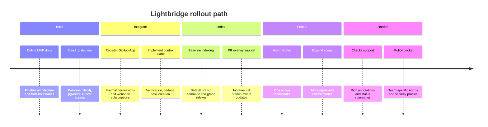

# Security, Observability, Testing, Rollout

## Security model

### Core principles
- GitHub App, not PAT
- minimum repository permissions
- webhook secret verification
- short-lived per-task installation tokens
- agent jobs get read-mostly credentials
- control plane validates all writes
- stricter sandbox for untrusted forks

### Authentication vs authorization

These are two separate planes, intentionally kept apart:

- **Authentication (authN)** — proving *who* a web user is. Login is owned by **Keycloak** (OIDC);
  the Next.js web app is an OIDC client and the Rust control plane is a resource server that
  validates bearer JWTs against Keycloak's JWKS (`iss` / `aud` / `exp`). See
  [ADR-0014](adr/0014-keycloak-oidc-resource-server.md).
- **Authorization (authZ)** — deciding *what* a caller may do at the gateway edge. Handled by
  **Envoy + Authorino** together with the separate
  [`ADORSYS-GIS/lightbridge-authz`](https://github.com/ADORSYS-GIS/lightbridge-authz) component.
  This is **not** our auth backend.

### Guardrails by layer

| Layer | Guardrail |
|---|---|
| GitHub ingress | Verify signature, store delivery UUID, reject malformed events |
| Gateway authZ | Envoy + Authorino + lightbridge-authz policy decisions |
| Control plane | Policy validation, dedupe, audit, write gating |
| Agent pod | No host mounts, least privilege SA, restricted egress |
| OpenCode | Specific MCP profile, deny file edits by default, ask-on-bash |
| Data stores | Read-only creds for retrieval from agent jobs |
| Kubernetes | Pod Security Admission, RBAC, NetworkPolicy, Secret scoping |

## Observability

### Metrics
- webhook deliveries received
- webhook verification failures
- duplicate deliveries
- tasks by status
- indexing duration
- agent run duration
- review findings by severity
- GitHub API rate-limit remaining
- vector query latency
- graph query latency

### Logs
- structured JSON logs
- include `delivery_id`, `task_id`, `repo_id`, `installation_id`, `head_sha`
- redact secrets and prompt contents where required

### Tracing
- one root span per webhook delivery
- child spans for task creation, GitHub API calls, Job creation, graph queries, vector queries,
  result validation, GitHub posting

## Testing strategy

Testing and security shift left: the quality gates run locally before push (`just lint`,
`just test`) and again in CI. See [engineering practices](ways-of-working/engineering-practices.md)
and [ADR-0011](adr/0011-engineering-practices-xp-lean-devops.md).

| Level | Scope | Examples | Tooling |
|---|---|---|---|
| Unit | pure logic | command parsing, state transitions, line-validation | `cargo nextest`, Vitest |
| Integration | service boundaries | webhook receiver + Postgres, Neo4j ingestion, pgvector search | `cargo nextest`, docker compose |
| Contract | stable interfaces | MCP schema tests, GitHub payload fixtures, JWT/JWKS resource-server validation | `wiremock`, fixtures |
| End-to-end | full flow | mention `@lightbridge`, receive comment back | e2e harness |
| Fuzz | parser and webhook robustness | malformed JSON, giant payloads, odd unicode | fuzz targets |
| Security tests | policy posture | prompt-injection fixtures, secret redaction tests | fixtures |

`wiremock` is used to mock outbound HTTP (e.g. GitHub) in Rust integration tests; `cargo-nextest`
is the test runner. See [ADR-0013](adr/0013-local-dev-and-build-tooling.md).

## Example e2e timeline

## Rollout and migration plan

### Phase one
- internal dev environment
- one trusted repository
- comment-only mode
- manual reindex endpoint
- no direct check-run integration yet

### Phase two
- multiple repositories
- baseline + PR overlay indexing
- structured review payloads
- duplicate suppression
- basic dashboards

### Phase three
- checks and annotations
- policy packs
- cost controls
- stricter untrusted-fork handling
- staged production rollout

## Cost and ops considerations

### Main cost drivers
- embedding generation
- Kubernetes pod startup frequency
- graph and vector storage
- GitHub API usage
- tracing and log retention

### Main operational levers
- cap concurrent Jobs per repo and installation
- cache baseline indexes by commit SHA
- use overlay indexes for PRs
- batch embedding writes
- prefer HNSW for read-heavy retrieval
- set Job TTLs for cleanup
- keep MCP profiles as small as possible

## Roadmap

### MVP
- GitHub App
- Rust control plane
- task queue
- isolated agent job
- "still indexing" response
- semantic retrieval
- basic structured comments

### Near-term
- tree-sitter graph
- PR overlays
- tests-owning-symbol insight
- check runs

### Longer-term
- repository policy packs
- cross-repo knowledge
- architecture drift detection
- team-level quality analytics
