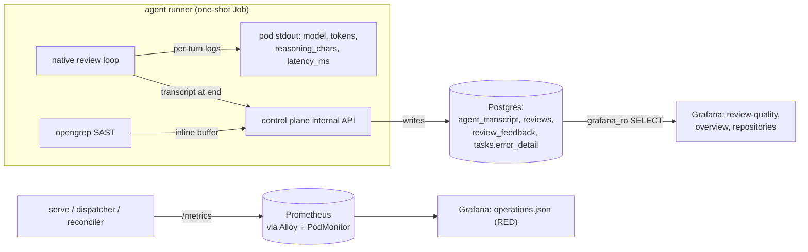

# Security, observability, testing, rollout

This page covers the cross-cutting concerns of Lightbridge Code Intelligence: who is allowed to do
what (auth), the trust boundary that keeps an LLM from acting directly, the deterministic security
signal layered into reviews, how a run is made legible (observability), how the system is tested, and
the deploy-ordering discipline that keeps a three-repo release safe.

For the request/data flow this sits on top of, see [architecture](architecture.md) and the
[review pipeline](review-pipeline.md) pages.

---

## 1. Security

### 1.1 Two planes: authentication vs authorization

Authentication and authorization are deliberately separate concerns, and neither is implemented by
us from scratch.

- **Authentication (who you are)** is owned by **Keycloak** as an OIDC provider
  ([ADR-0014](adr/0014-keycloak-oidc-resource-server.md)). The Next.js web app (`apps/web`) is an
  OIDC client running Authorization-Code + PKCE; the Rust control plane is a **pure OAuth2 resource
  server** — it issues no tokens and stores no credentials. It validates RS256 access tokens against
  the provider's published JWKS, checking issuer, audience, and expiry. The issuer is config
  (`OIDC_ISSUER`), so swapping Keycloak for any OIDC IdP — or federating to an enterprise IdP — is a
  configuration change, not code.

- **Authorization (what you may do)** is **permission-based, read straight from a token claim**
  ([ADR-0023](adr/0023-db-backed-rbac.md)). There is no role table and no policy UI on our side: the
  IdP/gateway maps roles→permissions upstream and emits a flat array of permission strings; the
  control plane simply enforces them, per capability.

The validator lives in `services/control-plane/src/jwt.rs`. It is genuinely small and worth
understanding directly:

- `JwtValidator` caches the JWKS in an `RwLock<HashMap<kid, DecodingKey>>` and **refreshes on an
  unknown `kid`** — so IdP key rotation is handled automatically (`decoding_key` → `refresh` →
  retry). `validate()` pins `Algorithm::RS256`, then `set_issuer` + `set_audience` on the
  `jsonwebtoken::Validation`, so a token with the wrong issuer or audience is rejected (covered by
  the `wrong_issuer_is_rejected` / `wrong_audience_is_rejected` tests).
- `warm()` ensures the JWKS has been fetched at least once; readiness uses it so a pod that cannot
  reach the IdP is never handed traffic it would only 503.
- Identity for audit (`Claims::identity`) prefers `preferred_username`, then `email`, then `sub`.

### 1.2 Permission enforcement (fail-closed)

`Claims::permissions(claim_path)` reads the caller's permissions from a **configurable, dotted**
claim path (`PERMISSIONS_CLAIM`, default `permissions`; e.g. `code_intelligence.permissions` for a
nested claim). Anything that is not a JSON array of strings — a missing claim, wrong type — yields an
**empty set**, i.e. fail-closed: a token with no permissions claim can do nothing on a protected
route.

The `Caller` axum extractor carries the verified `Claims` plus the parsed permission set and exposes
`require(perm) -> Result<(), AuthError>` (403 `Forbidden` on a miss). The enforced gates, verified in
`services/control-plane/src/queue/tasks.rs` and `services/control-plane/src/http/admin.rs`:

| Permission     | Gates (handler)                                                                    |
|----------------|-----------------------------------------------------------------------------------|
| `task:read`    | `GET /tasks`, `GET /tasks/{id}`                                                    |
| `task:cancel`  | `POST /tasks/{id}/cancel`                                                          |
| `review:read`  | `GET /tasks/{id}/review`, `GET /tasks/{id}/transcript`, `GET /tasks/{id}/feedback` |
| `repo:read`    | `GET /repositories`, `GET /admin/repositories`                                     |
| `repo:approve` | `POST /admin/repositories/{id}/approve`                                            |
| `repo:deny`    | `POST /admin/repositories/{id}/deny`                                               |

`GET /me` (`jwt::me`) returns the caller's verified claims plus the sorted effective permissions, so
the web can render capability-aware affordances — but the control plane is the real enforcement
point. The transcript route is gated on `review:read` because it contains repo code, file paths, and
tool results (see [§3.4](#34-the-run-transcript)).

### 1.3 The trust boundary: the control plane owns all writes

The review agent reasons over untrusted repository content and could be prompt-injected. The
governing rule ([ADR-0002](adr/0002-rust-control-plane-trust-boundary.md)) is that the agent may
**propose**, never **act**: it reads, queries the graph/vector stores, and prepares structured
findings, but it **never holds the GitHub App key and never writes to GitHub or persistent state**.
The Rust control plane is the single policy point that validates, deduplicates, mints credentials,
and performs every write.

Concretely, the agent runs as a **one-shot Kubernetes Job** with no GitHub credentials. It talks to
the control plane's **internal API** (`services/control-plane/src/http/internal.rs`), which is not
OIDC-protected (the caller is a pod, not a user) but authenticated by a **shared bearer**
(`AGENT_RUNNER_TOKEN`) compared in **constant time** (`subtle::ConstantTimeEq`) so a wrong token
cannot be recovered byte-by-byte via timing. Absent that secret in-process, the whole internal
surface fails closed (503), never open.

#### Mediated write tools

The agent does not return one terminal payload; it **acts through mediated tools during the loop**
([ADR-0037](adr/0037-agent-acts-via-mediated-tools.md)):

- **Read tools** — `lightbridge_vector_semantic_search`, `graph_find_symbol`, `graph_get_callers`,
  served by the internal API and scoped server-side to the task's repo snapshot.
- **Write actions** — `add_review_comment`, `add_comment`, `set_summary`, dispatched runner →
  control plane over the same callback path. The control plane validates each `add_review_comment`
  **against the PR diff at call time** and returns a recoverable error when the line isn't in the
  diff, so an off-diff finding is corrected, never silently dropped.

The control plane **buffers** everything for the task and **flushes nothing until clean loop
completion**, then posts one grouped PR review plus a single consolidated thread reply. A run that
aborts mid-way flushes nothing (crash-safe). The buffer is keyed by `(task, run_epoch)` and cleared
on (re)start; inline findings dedup by `(file, line)` last-write-wins. The "run kind" (review / ask)
is **emergent** from which tools fired — there is no up-front keyword classifier.

> The legacy OpenCode/ACP/MCP-subprocess agent and the dual-model review fallback are **removed**.
> The review agent is an in-process native Rust loop against a single model with
> retry/backoff/circuit-breaker resilience (see [§3.2](#32-llm-resilience)).

### 1.4 GitHub ingress and egress

- **Ingress:** GitHub webhooks are verified with **constant-time HMAC-SHA256** over
  `X-Hub-Signature-256` (`services/control-plane/src/http/webhook.rs`, `verify_signature`), then
  deduplicated by delivery UUID. Only `pull_request` `opened`/`closed` and addressed-to-us `@mention`
  comments produce tasks.
- **Egress:** every GitHub write flows through a single `github_outbox` table
  (`services/control-plane/migrations/0020_github_outbox.sql`) drained by the **reconciler** role
  (ADR-0058/0059). The `serve` role keeps the GitHub App key for **reads only**. One process owns all
  mutations, so writes are auditable and idempotent.

### 1.5 Guardrails by layer

| Layer                  | Guardrail                                                                       |
|------------------------|--------------------------------------------------------------------------------|
| GitHub ingress         | Constant-time HMAC-SHA256 signature verify, delivery-UUID dedupe               |
| Web → control plane    | OIDC bearer JWT (RS256/JWKS), per-capability permission gate, fail-closed      |
| Runner → control plane | Shared-bearer (`AGENT_RUNNER_TOKEN`) constant-time compare, fail-closed 503    |
| Control plane          | Diff validation of writes, dedupe, single-channel buffer, all writes mediated  |
| Agent pod              | One-shot Job, **no GitHub key**, read-mostly callbacks only                    |
| GitHub egress          | Single `github_outbox` drained by the lone reconciler replica                  |
| Security signal        | Deterministic SAST on the diff (see [§2](#2-sast-a-deterministic-security-signal)) |

---

## 2. SAST: a deterministic security signal

The LLM agent is *probabilistic* — a re-run can word a finding differently or miss one. SAST is the
deterministic complement ([ADR-0061](adr/0061-sast-deterministic-finding-source.md)): same code +
same pinned rules ⇒ same findings, every run, at CPU cost with no tokens.

Implementation in `services/agent-runner/src/sast/mod.rs`:

- **opengrep** (the LGPL fork of Semgrep CE) runs **in the runner** as a best-effort, non-fatal
  subprocess — the same pattern as Graphify. A missing binary, scan error, or timeout logs and
  continues; it never fails a review.
- **Scoped to the PR's changed files** (filtered to paths that still exist on disk), so findings land
  on the change rather than dumping every pre-existing repo finding into the out-of-scope section.
  The ruleset is **language-scoped** to the changed files (plus `generic` for secrets) as a perf
  lever.
- Each SARIF result is normalized to a `SastFinding` and **buffered through the same mediated
  `add_review_comment` channel** the agent uses (`POST /internal/tasks/{id}/review/inline`). The
  control plane validates against the diff and posts it as part of the **one** grouped review — **no
  second poster** (reviewdog is deliberately rejected for the product pipeline;
  [ADR-0056](adr/0056-control-plane-owns-the-posted-output.md)).
- **Deterministic, never LLM-gated:** the LLM does not decide whether a SAST finding is shown.
  Instead a compact digest is injected into the prompt so the agent (a) doesn't redundantly re-report
  a flagged line and (b) may deepen a SAST lead — awareness, not a gate.
- **Labeling:** a `🔍 opengrep:` title marker, `category = security` (red badge), and the rule's docs
  link, so a SAST finding never masquerades as the agent's own. SARIF `error`→P1, else→P2 — never P0.
- **Opt-in, hermetic:** `review.sast` config block, default **off**; rules are pinned and vendored
  into the runner image (no runtime registry fetch). Defaults in
  `services/agent-runner/src/bootstrap/config.rs`: bin `opengrep`, rules `/opt/opengrep-rules`,
  `min_severity = error`, `max_findings = 25`, `timeout = 300s`.

---

## 3. Observability

The design principle: **make a run legible from its own logs alone, and persist the proof-of-work we
already have in hand.** Three layers — Prometheus metrics, structured per-turn logs, and a persisted
DB transcript — plus the Grafana dashboards that mostly read Postgres.

### 3.1 Metrics

A single global Prometheus recorder is installed once and rendered at `/metrics` by the `serve` role
(`:8080`) and, for the roles without a main HTTP server (`dispatcher`/`reconciler`), via a minimal
metrics-only server (`services/control-plane/src/http/metrics.rs`). Scraping is via **`PodMonitor`
CRs** discovered by Alloy — not pod annotations — and that wiring lives in `ai-helm`, not in the
workload code ([ADR-0046](adr/0046-observability-dashboard-deployment.md)).

The control-plane counters/histograms actually emitted (grep `lci_` in `metrics.rs`):

| Metric                                         | Meaning                                |
|------------------------------------------------|----------------------------------------|
| `lci_webhook_deliveries_total{event}`          | webhooks received, by event            |
| `lci_webhook_signature_failures_total`         | HMAC verification failures             |
| `lci_webhook_duplicate_deliveries_total`       | dedupe hits                            |
| `lci_tasks_created_total`                       | tasks enqueued                         |
| `lci_dispatch_jobs_total{outcome}`             | Job launches by outcome                |
| `lci_dispatch_launch_seconds`                  | dispatch→launch latency (histogram)    |
| `lci_reaper_tasks_total{outcome}`              | reaper GC outcomes                     |
| `lci_index_prune_total{outcome}` + `_chunks_deleted_total` / `_graph_nodes_deleted_total` | snapshot pruning |
| `lci_outbox_prune_posted_deleted_total` / `_failed_deleted_total` | egress-outbox pruning      |

These power the **`operations.json` RED dashboard** only.

### 3.2 LLM resilience

The chat transport (`services/agent-runner/src/review/native/chat.rs`) and the loop
(`.../native/agent.rs`) carry the resilience layer from
[ADR-0039](adr/0039-agent-llm-resilience-and-observability.md):

- **Legible failures:** a non-2xx response **reads the body** (bounded to ~1 KB on a char boundary)
  and folds it into the error — a gateway rejection surfaces its message, not a bare status.
- **Per-request timeout**, default **180s** (`LLM_REQUEST_TIMEOUT_SECS` / `review.request_timeout_secs`)
  — deliberately generous because eaig can take ~2 minutes per turn; this only kills a *wedged*
  request. The streaming path adds an **inter-chunk idle timeout** so a long-but-progressing stream
  isn't killed.
- **Bounded retry with deterministic jittered backoff** on transient failures only (connect/timeout,
  HTTP 429, HTTP 5xx); a 4xx other than 429 is never retried. A 429's `Retry-After` is honoured. Cap
  2 retries (`LLM_MAX_RETRIES`).
- **Per-run circuit breaker:** after N (default 3, `LLM_CIRCUIT_BREAKER_THRESHOLD`) *consecutive*
  turn-failures the run fails fast rather than burning the turn budget against a down chain; it resets
  on the first turn that yields a reply. Per-process scope is correct for an ephemeral Job.

All knobs are optional with safe defaults — an existing deploy keeps working without an ai-helm
change.

### 3.3 Per-turn logs and reasoning capture

The loop logs proof-of-work without opening the DB:

- **At start:** model id, base-URL **host only** (path/key kept out of logs), the resilience policy,
  and the active `review.extra` (so a run proves which reasoning budget — e.g. `reasoning_effort:
  low` — was actually on the wire).
- **Per turn** (`"agent turn complete"`): turn index, the per-turn model id (the fallback model is
  removed — [ADR-0053](adr/0053-remove-review-fallback-model.md) — so this just records which single
  configured model actually answered), tool names
  called, prompt/completion tokens, `reasoning_chars`, and wall-clock `latency_ms`.

Reasoning capture ([ADR-0060](adr/0060-capture-model-reasoning-and-glm-5-2-latency-finding.md)) made
the model's chain-of-thought a first-class signal:

- `reasoning_content` (DeepSeek/GLM lineage) is reassembled from SSE deltas (streaming) or read off
  the message (non-stream) into `Completion::reasoning`. It is kept **off** `ChatMessage` on purpose
  — it is for logs/transcript only and is **not** echoed back to the model next turn. A `reasoning`
  serde **alias** handles gateways that stream the field under that name.
- `Usage::reasoning_tokens()` reads the OpenAI-style nested
  `completion_tokens_details.reasoning_tokens` **and** falls back to a top-level
  `usage.reasoning_tokens`, since some gateways report the slice at the top level (it was previously
  silently dropped). `reasoning_tokens` is a **subset** of `completion_tokens`, not additive — don't
  double-count.
- The chain-of-thought itself is logged on an `"agent reasoning"` line, bounded by
  `REASONING_LOG_CHARS` (default 4000; `0` = unbounded); the magnitude is always available via
  `reasoning_chars`.

> This was the instrumentation that proved GLM-5.2-on-DeepInfra was simply slow (~11–15 tok/s even at
> `low` effort, folding thinking into `completion_tokens`), which led the operator to revert prod to
> the faster/cheaper MiniMax model — a one-line `review.model` change in ai-helm-values, no rebuild.
> The model is operator-tuned and **churns**; never hardcode a model name as permanent.

### 3.4 The run transcript

Per [ADR-0034](adr/0034-agent-run-transcript-and-observability.md), the runner submits the whole
transcript once at run end (success or failure) to `POST /internal/tasks/{id}/transcript`; the
control plane stores it in `agent_transcript` ordered by `seq`
(`services/control-plane/migrations/0014_agent_transcript.sql`). A retry replaces the prior rows for
the task. Columns:

- `role` (`assistant` | `tool`), `content` (reasoning text / truncated tool result), `tool_calls`
  (JSONB), `tool_name`, and per-assistant-turn `prompt_tokens` / `completion_tokens`.
- `migrations/0017_transcript_model_and_reasoning.sql` adds `model` (the per-turn model id; the
  column predates [ADR-0053](adr/0053-remove-review-fallback-model.md) removing the fallback model, so
  today it records the single configured model per turn) and `reasoning_tokens` (nullable; a subset
  of `completion_tokens`).

Capture is best-effort and non-blocking — failing to persist a step never fails the review.
`GET /tasks/{id}/transcript` serves the turn-by-turn breakdown gated on `review:read`, since it
contains repo code and tool results. (Reasoning *text* is currently logs-only and not yet persisted
to the transcript — a noted follow-up in ADR-0060.)

Related observability data the dashboards read: `error_detail` on `tasks`
(`migrations/0016_task_error_detail.sql`) records *why* a review posted nothing — added after a live
audit found ~68% of "succeeded" PR-review tasks had posted nothing, swallowing failures as green —
and `review_feedback` (`migrations/0015_review_feedback.sql`) records reviewer reactions.

### 3.5 Dashboards-as-code (and why they read Postgres)

The Grafana dashboards ship as code under `deploy/observability/`, deployed by a dedicated ArgoCD
Application (`lightbridge-observability`) into the `observability` namespace, with deployment
specifics in `ai-helm-values` ([ADR-0046](adr/0046-observability-dashboard-deployment.md)).

The pinned design choice: **most dashboards read Postgres, not Prometheus.** The review agent is a
one-shot Job — it is gone before any scrape could reach it — but its output is already persisted
(findings with priority/category, token usage in `agent_transcript`, reactions in `review_feedback`).
So the `review-quality` dashboard and the `overview`/`repositories` enrichments query those tables
directly via a least-privilege `grafana_ro` **CNPG managed role** (login + `SELECT` only), reached
through the CNPG `*-rw` Service (no read replica exists yet; queries are read-only, infrequent, and
`LIMIT`-bounded). Only `operations.json` (RED metrics) reads Prometheus and depends on the PodMonitor
scrape wiring; the Postgres dashboards light up as soon as the datasource resolves.

---

## 4. Testing

The Rust services are tested with `cargo nextest`; the web app with Vitest. Quality gates run locally
before push and again in CI.

Concretely visible in this codebase:

- **Auth unit/contract tests** (`services/control-plane/src/jwt.rs`): a runtime-generated RSA keypair
  (no committed key material) mints tokens to assert valid-token acceptance and rejection of wrong
  issuer, wrong audience, expired, unknown `kid`, and **tampered signature** (it flips the *first*
  signature byte specifically, because the last base64url char often round-trips to identical bytes).
  The permissions-claim parser is tested for top-level, nested-dotted, missing, and wrong-typed
  claims — the fail-closed cases.
- **Permission-gate tests** exercise the `Caller::require` 403 path.
- **Metrics test** (`metrics.rs::recorded_metrics_appear_in_the_render`) asserts instrumentation
  surfaces in the `/metrics` text rendering.
- **Agent loop tests** (`services/agent-runner/src/review/native/agent.rs`) cover the circuit breaker
  tripping fast on a persistent 5xx and the retry/transient-classification logic, with the
  deterministic (seeded) backoff making schedules reproducible in tests.
- **HMAC verification** is constant-time and unit-covered in `webhook.rs`.

`wiremock` mocks outbound HTTP (e.g. the LLM gateway, GitHub) in Rust integration tests. SAST and
transcript capture are best-effort by design, so their failure modes are exercised as non-fatal.

---

## 5. Rollout and deploy-ordering discipline

Delivery is **GitOps continuous delivery** ([ADR-0055]): merging to `ai-helm` `main` goes live. The
chart is genericized ([ADR-0057]) with all deployment specifics in the sibling **ai-helm-values**
repo; `argocd-image-updater` writes `sha-<gitsha>` image tags.

**Two physical clusters:** ArgoCD runs on a Talos cluster (kube context `admin@homeos`); the LCI
workloads run on a Hetzner cluster (context `hetzner-prod`, namespace `converse`; agent Jobs in
`lightbridge-agents`).

**File-based config** mounts `control-plane.json`, `agent.json`, and the review system prompts
(`review-system.md` + `review-system-fast.md` for the fast tier) as ConfigMaps. Config structs use
`deny_unknown_fields`, which forces a **strict three-repo deploy order**:

1. **runner image** (introduces a new field) →
2. **chart** (renders it) →
3. **values** (sets it).

Get the order wrong and a config carrying a not-yet-known key is rejected — fail-closed. The same
discipline applies to safety-critical config: the **review system prompt is required operational
config with no code default** ([ADR-0037](adr/0037-agent-acts-via-mediated-tools.md)) — the runner
fails the review closed if it is unset, so the chart prompt must be live **before** the no-default
runner image. SAST and the fast tier follow image-then-config so a deploy without the new image is
unaffected.

### Two-tier review rollout (ADR-0062)

Review now has two tiers, keyed by the `tier` column on `tasks`
(`services/control-plane/migrations/0021_task_tier.sql`, default `deep`):

- **Fast** — set on `pull_request opened` (`webhook.rs`, `tier: "fast"`): the automatic first review.
  Cheap model, SAST + a lean diff-only LLM pass, **no retrieval**, a small per-tier tool allowlist
  (`review.fast.tools`), short turn cap.
- **Deep** — set on any addressed `@mention` (`tier: "deep"`): strong model, full retrieval,
  multi-turn, long timeout — whether the target is a PR (deep review) or an issue (conversational
  answer).

Each tier has an **independent config block** in ai-helm-values; both models are operator-tuned and
churn — read them live, never assume. The default `deep` means any pre-existing row, and any
non-review task (e.g. an `index` task, which ignores tier), gets the full/safe behavior.

---

## References

- Auth: [ADR-0002](adr/0002-rust-control-plane-trust-boundary.md),
  [ADR-0014](adr/0014-keycloak-oidc-resource-server.md),
  [ADR-0023](adr/0023-db-backed-rbac.md)
- Mediated tools: [ADR-0037](adr/0037-agent-acts-via-mediated-tools.md)
- Resilience & observability: [ADR-0034](adr/0034-agent-run-transcript-and-observability.md),
  [ADR-0039](adr/0039-agent-llm-resilience-and-observability.md),
  [ADR-0046](adr/0046-observability-dashboard-deployment.md),
  [ADR-0060](adr/0060-capture-model-reasoning-and-glm-5-2-latency-finding.md)
- SAST: [ADR-0061](adr/0061-sast-deterministic-finding-source.md)

[ADR-0055]: https://github.com/ADORSYS-GIS/ai-helm
[ADR-0057]: https://github.com/ADORSYS-GIS/ai-helm
